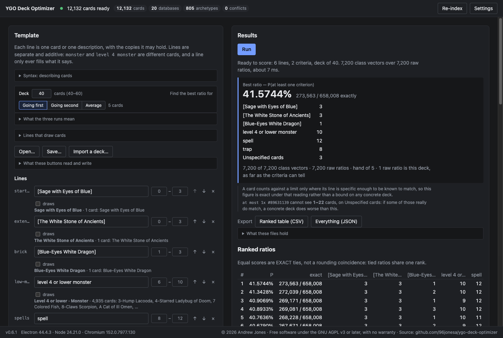

# YGO Deck Optimizer

Find the card counts that give a Yu-Gi-Oh! deck the best chance of opening a playable hand.

You describe the deck as a list of lines — a named card, or a description such as
`level 4 or lower monster` — each with the range of copies you would consider, and say
what a good opening hand looks like. The app tries **every** deck those ranges allow and
tells you which is best, with the **exact** probability for each: a fraction over every
possible hand, not a simulation.



It is a desktop app for macOS and Windows. It reads card data from your own
[EDOPro](https://projectignis.github.io/) install and never uploads anything.

## Download

Get the installer for your platform from the **[latest release](https://github.com/96jonesa/ygo-deck-optimizer/releases/latest)**:

| Platform | File |
| --- | --- |
| macOS, Apple Silicon | `YGO.Deck.Optimizer-<version>-arm64.dmg` — open it and drag the app to Applications |
| Windows, x64 | `YGO.Deck.Optimizer.Setup.<version>.exe` |

You also need **[EDOPro](https://projectignis.github.io/)** installed; the app asks for its
folder on first launch.

The builds are not signed by Apple or Microsoft, so each platform asks once on first launch:

- **macOS**: open the app, dismiss the warning, then go to **System Settings → Privacy & Security** and click **Open Anyway**.
- **Windows**: at *"Windows protected your PC"*, click **More info**, then **Run anyway**.

There is no Intel Mac build. [docs/INSTALL.md](docs/INSTALL.md) has the details, and what to do if something goes wrong.

## Quick start

The fastest way in is to open an example: **Open…** in the app, then a file from
[`examples/`](examples/). `brick.json` asks a real question — how many copies of a card you
*don't* want in your opening hand can a Blue-Eyes deck afford?

**1. Describe the deck.** Each line is one card or one description, with a copy range:

| Line | Copies |
| --- | --- |
| `[Sage with Eyes of Blue]` | 0–3 |
| `[The White Stone of Ancients]` | 0–3 |
| `[Blue-Eyes White Dragon]` | 1–3 |
| `level 4 or lower monster` | 6–10 |
| `spell` | 8–12 |
| `trap` | 3–8 |

Choose the deck size, and whether you are optimizing going first, going second, or the average
of the two. Or bring a deck you already have: **Import a deck…** reads an EDOPro `.ydk` file.

**2. Say what a good hand is.** A criterion lists what the hand needs:

```
1x [Sage with Eyes of Blue] and (1x [The White Stone of Ancients] or 1x spell) and at most 1x [Blue-Eyes White Dragon]
```

Add as many criteria as you like; a hand succeeds if it meets any of them.

**3. Run.** The answer here is **41.5744% (273,563 / 658,008)** with exactly one Blue-Eyes — and
the copies-vs-odds chart shows the odds falling with each extra copy.

Every panel has a collapsible syntax reference, and typing `[`, `{` or `"` completes card, group
and archetype names.

## What you can say

- **Cards and descriptions**: a named card (`[Ash Blossom & Joyous Spring]`), a description (`level 4 or lower DARK monster`, `trap`), or an archetype (`"Blue-Eyes" monster`).
- **Groups**: name a set of cards once and refer to it as `{Starter}`. A card picked from the card picker gets a checkbox per group under its line.
- **Requirements**: `2x monster`, a range such as `1-2x monster`, or `exactly 2x monster`, joined with `and`, `or` and parentheses.
- **Different cards**: `3 unique {Starter}` needs three *different* starters; copies of one card count once.
- **Limits**: `at most 1x trap`, `no [Ash Blossom & Joyous Spring]`.
- **Going first or second**: each criterion is tagged for the hand it is judged in. Going second, it can ask separately about the **opening 5**, the **drawn cards**, and the **whole hand**.
- **Draw cards**: mark a line as drawing *n* cards, optionally once per turn. Each criterion can then say whether you would **stop here** rather than play them.
- **Weights**: make some criteria worth more than others, and rank decks by expected value instead of probability.

## What you get

- **The best ratio**, with its exact probability, and how many copies of each line it uses.
- **Every ratio, ranked**; tied ratios share a rank because their scores are exactly equal.
- **The plateau**: every ratio within a small margin of the best, because "2 or 3 copies are equally fine" is a more useful answer than a single winner.
- **Copies vs odds**: for each line, the best score at each number of copies.
- **Exports** of the ranked table (CSV) or everything (JSON).

## Documentation

| | |
| --- | --- |
| [User guide](docs/GUIDE.md) | a tour of the app, the description and criteria languages, how matching works, the maths behind exact probabilities, and template files |
| [Installing](docs/INSTALL.md) | downloading, first launch, where settings live, troubleshooting |
| [Command-line tool](docs/CLI.md) | `estimate` and `optimize` without the window |
| [Development](docs/DEVELOPMENT.md) | building from source, tests, project layout |
| [PRD](docs/PRD.md) and [TDD](docs/TDD.md) | what the tool is for, and how it is built |

## Building from source

```sh
npm ci
npm run dev      # the app, with hot reload
npm test         # the test suite
```

Node 22. See [docs/DEVELOPMENT.md](docs/DEVELOPMENT.md) for the rest, including the tests that
run against a real EDOPro install.

## License

Copyright © 2026 Andrew Jones.

This program is free software: you can redistribute it and/or modify it under
the terms of the GNU Affero General Public License as published by the Free
Software Foundation, either version 3 of the License, or (at your option) any
later version. It is distributed in the hope that it will be useful, but
WITHOUT ANY WARRANTY; without even the implied warranty of MERCHANTABILITY or
FITNESS FOR A PARTICULAR PURPOSE. See [LICENSE](LICENSE) for the full text.

Yu-Gi-Oh! is a trademark of Konami. This is an unofficial fan tool, not affiliated with or
endorsed by Konami.
