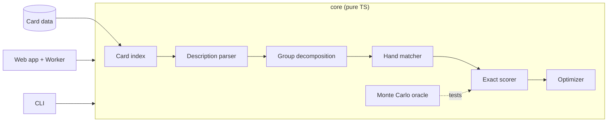

# PRD: ygo-deck-optimizer

| Status | Author | Date | Tracking | Related |
| --- | --- | --- | --- | --- |
| Draft — awaiting decisions D1–D7 (§13) | Andy (with Claude) | 2026-09-17 | TBD (Linear issue pending) | [ygo-combo-solver-gui](https://github.com/96jonesa/ygo-combo-solver-gui) (source of the `CardIndex` reader) |

## 1. Summary

Yu-Gi-Oh! theorycrafters tune deck ratios ("how many copies of this combo enabler — it bricks in multiples?") with generic hypergeometric calculators. Those calculators know nothing about the game: the user hand-partitions the deck into disjoint buckets, types bucket sizes as bare numbers, re-does it for every candidate ratio, and gets it wrong whenever one card can play two roles in a hand.

**ygo-deck-optimizer** is a concept-aware layer on top of hypergeometric calculation. The user writes a **deck template** once — lines that are either a literal card name or a Yu-Gi-Oh! description ("level 4 monster", "FIRE Beast-Warrior monster", "normal spell"), each with a min/max copy count — plus one or more opening-hand **success criteria**. The tool resolves every description against the card database, works out which lines overlap, enumerates every valid deck ratio totalling the deck size, and reports the ratios with the best probability that the opening hand satisfies at least one criterion.

It is a standalone tool: **no game engine, no replays, no combo solver** — combinatorial probability plus a card-database lookup layer. It is licensed **MIT** (§4.4).

## 2. Goals and non-goals

### Goals

1. Answer "what ratio maximizes my odds of opening a playable hand?" from a template written once, with no manual enumeration.
2. Be concept-aware: a line or criterion can be a card name or a description over real card fields, resolved against the EDOPro card database; the tool — not the user — works out which cards satisfy which descriptions.
3. Be **correct about overlap**, in both places it occurs: in the template (a card counted by several lines is never double-counted) and in the hand (one drawn card fills at most one requirement).
4. Report **exact** probabilities, so that ratios differing by a fraction of a percentage point are ranked by math, not by sampling noise (§4.3).
5. Make the semantics visible: the user can always see what a description matched, which lines overlap, and what a reported probability assumes.
6. Zero-friction delivery: usable without installing EDOPro or anything else, and templates shareable as a link (§7).

### Non-goals

- **Knowing what cards do.** The tool never reads effect text or decides what a combo is; success criteria are the user's statement of what a good hand looks like.
- Anything past the opening hand in v1: no draw phases, searchers, deck thinning, mulligans, or hand traps resolving (§9 lists the ones worth adding later).
- Extra Deck and Side Deck construction. Templates describe the Main Deck only; Extra Deck monsters and tokens are excluded from every description's population.
- A deck editor, collection manager, or card viewer. Import/export of `.ydk` is a convenience (§9), not a goal.
- Reusing or depending on the combo solver in any form.

## 3. Users

| User | Situation | Needs |
| --- | --- | --- |
| Theorycrafter (the originator) | Has an engine whose key card bricks in multiples; currently hand-guesses the count | One template, every ratio scored, the optimal count and how flat the optimum is |
| Competitive deck builder | Choosing between 2 vs 3 of several starters/extenders/hand traps within 40 | Ranked ratios, per-criterion breakdown, "copies of X vs odds" sweep |
| Content creator / community helper | Explaining a ratio choice to others | Exact numbers they can cite, a shareable link that reproduces the result |

Users are **not** assumed to have EDOPro installed — unlike the sibling tool's users, many play paper or Master Duel only.

## 4. Background: what we have to work with

### 4.1 The card database substrate

- EDOPro `.cdb` files are SQLite. The `datas` table carries exactly the queryable fields — `id, ot, alias, setcode, type, atk, def, level, race, attribute, category` — and `texts` carries the name. `type` is a bitmask (monster/spell/trap plus normal/effect/tuner/ritual/quick-play/continuous/…), `race` is the monster Type, `attribute` is FIRE/WATER/…, `setcode` packs up to four 16-bit archetype codes. This is the entire concept-aware substrate.
- The sibling project's [`CardIndex`](https://github.com/96jonesa/ygo-combo-solver-gui/blob/main/src/main/edopro/carddb.ts) (same author; relicensable here) already reads `.cdb` files on **sql.js** (wasm — no native module, so it runs in Node, Electron, and a browser alike), merges databases in load order, collapses artwork variants via `alias`, and provides diacritic/case-insensitive name search. Today it selects only `id, alias, type, name` and walks the filesystem with `node:fs`. Reuse means: split the filesystem walk (Node-only) from a load-from-bytes core (portable), and widen the `SELECT` to the predicate fields.
- Known encoding traps to handle in the TDD, not to be written from memory: the `level` column packs Pendulum scales into its high bits and holds the Link Rating for Link monsters; `atk`/`def` use a negative sentinel for "?"; `ot` distinguishes OCG/TCG/unofficial cards. **All constant tables (type bits, races, attributes, `ot` scopes) are transcribed whole from the ocgcore/EDOPro source, with pinned-literal tests** — a wrong bit is not visibly wrong, it just silently matches nothing.
- **Not in the `.cdb`**: archetype *names*. `setcode` values map to names via EDOPro's `strings.conf` (`!setname` lines), so "Sky Striker card" needs that table sourced alongside the database (§7.4).
- **Not available anywhere**: anything that depends on effect text — "can be Normal Summoned", "searchable by X", "is a starter". The escape hatch is user-defined groups (§5.2).

### 4.2 The motivating example

From the originating request, verbatim:

```
card A (by actual name)              [min 0, max 3]
card B (by actual name)              [min 0, max 3]
monster                              [min 5, max 5]
level 4 monster                      [min 2, max 3]
level 7 FIRE beast-warrior monster   [min 0, max 3]
spell                                [min 0, max 7]
normal spell                         [min 0, max 3]
```

Success if the opening hand satisfies any one of:

```
1x card A, 1x card B, 1x monster
1x card A, 1x card B, 1x level 4 or lower monster
```

Two observations that shape the design. First, the lines nest ("level 4 monster" is inside "monster") and a named card may itself be a monster — the overlap problem of §6. Second, **the lines cannot reach 40 under any reading** (at most 18 cards if overlapping lines share cards, at most 27 if every line is a separate bucket), so the model needs an explicit notion of the *remainder* of the deck (§5.1).

### 4.3 Exact computation is cheap — Monte Carlo is the check, not the engine

The original design brief (a local working note, not kept in this repo) proposed Monte Carlo as the baseline estimator. This PRD recommends the opposite, because of one structural fact: once the deck is decomposed into disjoint **groups** of interchangeable cards (§6), whether a hand succeeds depends only on *how many cards of each group* it holds — and that does not depend on the deck ratio at all.

For group counts $`n = (n_g)`$ with $`\sum_g n_g = N`$ and a hand composition $`h = (h_g)`$ with $`\sum_g h_g = H`$:

```math
\Pr(h \mid n) = \frac{\prod_{g} \binom{n_g}{h_g}}{\binom{N}{H}}
\qquad\qquad
P(n) = \sum_{h \in \mathcal{S}} \Pr(h \mid n)
```

where $`\mathcal{S}`$ is the set of successful hand compositions. There are only $`\binom{H + k - 1}{H}`$ compositions for $`k`$ groups (2,002 for $`k = 10,\ H = 5`$), so $`\mathcal{S}`$ is computed **once per problem** by running the hand matcher (§5.4) on each composition; scoring a candidate ratio is then a short sum of products of binomials.

Why this matters for the product, not just for speed: adjacent ratios typically differ by well under one percentage point, while a 10,000-sample Monte Carlo estimate near 50% carries a 95% interval of about ±1 point. Sampling would rank near-ties by noise. Exact scoring ranks them by math and needs no confidence intervals in the UI.

Monte Carlo still earns its place — as an **independent oracle** in the test suite (§10), and later as the estimator for features that break the hypergeometric model (draw effects, mulligans; §9).

### 4.4 License

**MIT** (confirmed by Andy). The tool bundles no AGPL code: it reads card data and does arithmetic. sql.js is MIT. Card names and stats are Konami's factual game data, handled as every fan tool handles them (§7.4, §11).

## 5. The model

Terminology used from here on: a template has **lines**; a criterion has **requirements** and **limits**; the tool decomposes lines into **groups**.

### 5.1 Deck template

- A **line** is a *description* (§5.2) plus a copy range `[min, max]`.
- The deck size $`N`$ is a parameter: default 40, allowed 40–60.
- The **remainder** — cards matching no line — is an implicit, always-visible computed row ("Other cards: 28–35"). It can be bounded by an explicit `any other card [min, max]` line.
- Game rules the tool enforces on its own: a named card's `max` is capped at 3; a description whose database population is $`m`$ cards cannot exceed $`3m`$ copies; a description matching zero cards is an error.
- What a line's count *means* when lines overlap is decision **D1** (§6).

### 5.2 Descriptions

A description is either a **card name** (chosen through autocomplete, stored as a passcode, so ambiguity is impossible) or a **qualified description** parsed into a predicate over card fields. The parsed predicate (an AST, serializable as JSON) is the source of truth; free text is just the input method, and the UI always echoes what it understood: `Level 4 · Monster — 1,912 cards`.

MVP vocabulary, bounded by what the `.cdb` can express:

| Dimension | Examples |
| --- | --- |
| Card kind | `monster`, `spell`, `trap` |
| Monster sub-kind | `normal`, `effect`, `tuner`, `ritual`, `pendulum`, `flip`, `gemini`, `union`, `spirit`, `toon` |
| Spell/Trap sub-kind | `normal spell`, `quick-play spell`, `continuous trap`, `equip`, `field`, `counter trap`, … |
| Attribute, Type | `FIRE`, `Beast-Warrior`, … |
| Level | `level 4`, `level 4 or lower`, `level 5 or higher`, `level 2-4` |
| ATK / DEF | `1500 or less ATK`, `DEF 200`, `ATK 2000 or more` |
| Archetype | `"Sky Striker" card`, `"Sky Striker" spell` (quoted; resolved via the setname table) |
| Combinators | adjacency = AND; `or` between descriptions; `non-` negation (`non-tuner`); `except <card name>` |
| **User-defined group** | `starter := Card X \| Card Y \| Card Z`, then usable anywhere a description is (`1x starter`) |

User-defined groups are in the MVP because they are how theorycrafters actually think — "starter", "extender", "brick" are roles, not database fields — and they cost nothing: a group is the predicate "passcode is in this set".

### 5.3 Success criteria

The hand is a success if it satisfies **at least one** criterion. A criterion is a boolean expression — `AND` / `OR`, nested freely with parentheses — over two kinds of leaf:

- **Requirements** — `n× description`, meaning at least $`n`$ *distinct drawn cards* are assigned to it. `1x card A, 1x card B, 1x monster` needs three different cards.
- **Limits** — `at most n× description` / `no description`, a census of the whole hand, not an assignment. This is how "bricks in multiples" becomes expressible: `1x starter, at most 1x Brick Card`.

**Nested OR** (requested by Andy, 2026-09-17) lets alternatives carry different counts without retyping the shared part:

```
1x card A AND 1x card B AND (1x card C OR 2x card D)
```

Its meaning is defined by expansion to the flat form: the hand satisfies the expression iff, for *some* choice of one branch at every `OR`, the resulting flat list of requirements has a joint assignment of distinct cards (§5.4) and every limit on that branch holds. The example is therefore exactly `(1x A, 1x B, 1x C) OR (1x A, 1x B, 2x D)` — and the list of criteria itself is just an `OR` at the root. **Nesting is surface syntax; the engine only ever sees an OR of flat criteria**, so nothing in §4.3 changes. Expansion is exponential in the number of `OR`s in principle and tiny in practice; the tool caps the expanded size with a clear error.

Two different "or"s exist and the UI keeps them apart: a *description-level* `or` (`1x (card C or card E)`) is one slot that either card can fill; a *criterion-level* `OR` chooses between whole sub-expressions, which is what differing counts (`1x C` vs `2x D`) need.

Limits are recommended for the MVP (decision **D5**): the originating use case is precisely a card that is bad in multiples, and with pure "at least" requirements a second copy is never *directly* bad — only indirectly, by displacing another card.

### 5.4 Hand matching

Whether a hand meets a criterion's requirements is a **bipartite matching**: assign distinct drawn cards to requirement slots such that each card satisfies its slot's description. This is what makes hand-side overlap fall out automatically:

- If card B is a monster, the hand `{A, B, B}` satisfies `1x A, 1x B, 1x monster` (the second B is the monster), while `{A, B}` plus two spells does not (B cannot be both "card B" and "the monster").

Instances are tiny (hand ≤ 6 cards, a handful of slots), so matching is exact and instant, and per §4.3 it runs once per hand *composition*, never per deck.

### 5.5 Probability and hand size

Exact multivariate hypergeometric (§4.3). Hand size $`H`$ is 5 (going first, default) or 6 (going second); a blend $`P = w P_5 + (1 - w) P_6`$ for a user-set coin-flip weight is cheap and scheduled for M3.

### 5.6 Optimizer and output

- **Objective (MVP):** maximize $`P(\text{at least one criterion satisfied})`$. With limits (§5.3), brick-avoidance is already expressible inside that single objective. Weighted criteria and multi-objective frontiers are later (§9; decision **D6**).
- **Search:** exhaustive over all valid ratios when the space is small enough (it is, for templates like the example), with two exact reductions: lines no criterion can see are *irrelevant* — every valid count of them ties, so they are collapsed out of the search and reported as such ("`spell`, `normal spell` do not affect these criteria") — and ratios are scored on criterion-relevant group counts only. Heuristic search for very large spaces is M4 and must be labeled as non-exhaustive when used.
- **Output:**
  - a ranked table: ratio → exact $`P`$, with per-criterion probabilities;
  - the **plateau**: every ratio within $`\delta`$ (default 0.5 percentage points) of the best, because "2 or 3 copies are equally fine" is a more useful answer than a single winner;
  - a **sweep view**: $`P`$ against copies of one chosen line (others re-optimized, or held fixed) — the direct answer to "how many copies of X?";
  - one fully expanded example decklist per ratio, so the user sees a concrete 40.
- Long runs report progress (done / total, percent, elapsed, ETA) and are cancellable; the CLI prints the same to stderr.

## 6. Decision D1 — overlap semantics of the template

### 6.1 The problem

`monster [5,5]` and `level 4 monster [2,3]` nest; `card A [0,3]` may itself be a Level 4 monster. When overlapping lines each carry a range, two questions need one answer: *which decks are valid*, and *how is a card that satisfies several lines counted exactly once in the probability*.

The second question has the same answer under every option: decompose the deck into disjoint **groups** — one per realizable combination of lines (evaluated against the actual database, so impossible combinations like "spell and monster" never appear) — make each group's count a variable, and express every line as a sum over groups. Draws are then well-defined and nothing is double-counted. **The options below differ only in what the user's lines *mean*; all of them compile to the same group/linear-constraint engine**, which keeps this decision low-regret.

For the worked comparisons, suppose card A is a Level 4 monster and card B is a Normal Spell.

### 6.2 Option A — census constraints (recommended)

Every line is a constraint on a **census of the whole deck**: "the number of cards in the deck satisfying this description is within `[min, max]`". A card counts toward every line it satisfies.

```
monster            :  A + L4other + L7FBW + otherMonster          = 5
level 4 monster    :  A + L4other                           in [2,3]
spell              :  B + normalSpellOther + otherSpell     in [0,7]
normal spell       :  B + normalSpellOther                  in [0,3]
remainder          :  40 - monsters - spells                in [28,35]
```

Running 3× card A saturates "level 4 monster": no other Level 4 monsters fit. Total monsters are exactly 5, which is what "monster [5,5]" says.

- **For:** one uniform, order-independent rule; handles nesting *and* partial overlap (`FIRE monster` vs `level 4 monster`); expresses the aggregate caps deck builders actually state ("exactly 5 monsters", "at most 7 spells"); it is the natural reading of the verbatim example, where "monster [5,5]" next to "level 4 monster [2,3]" only makes sense as a total. Strictly the most expressive: Options B and C are rewritable into it, not vice versa.
- **Against:** validity is a constraint system, so templates can be infeasible (`monster [5,5]` with two 3-of monsters forced) and the tool owes the user a diagnosis of *which lines conflict*. The "in addition to" intent ("2–3 Level 4 monsters *besides* card A") must be said explicitly: `level 4 monster except card A`. In theory $`k`$ lines yield $`2^k`$ groups; in practice descriptions nest or are disjoint and only database-realizable groups exist.
- **What makes it safe in the UI:** each line is annotated from the database — "inside `monster`", "includes Card A", "partially overlaps `FIRE monster`" — so the census reading is visible, not assumed.

### 6.3 Option B — disjoint slots, most-specific-wins

Every line is a **separate physical bucket**; each card belongs to exactly one line — the most specific one that matches (named card > qualified description > bare kind; ties by line order). "monster [5,5]" silently means "5 monsters *not covered by any more specific line*". Hand matching still uses real card properties, so overlap is still handled correctly on the criteria side.

In the example: seven independent counts; total monsters = A + 5 + L4 + L7FBW, anywhere from 7 to 14.

- **For:** the simplest mental model (reads like a decklist: every physical card listed once); counts are independent, so no infeasibility beyond "cannot sum to 40"; trivially enumerable.
- **Against:** "monster [5,5]" does not mean five monsters in the deck, and nothing on screen says so; aggregate caps ("at most 12 monsters total") are inexpressible; "most specific" is undefined for partial overlaps, so meaning becomes dependent on line order; the hidden subtraction is exactly the kind of implicit rule that produces confident wrong answers.

### 6.4 Option C — hybrid: slots plus limits

Two kinds of line. **Slots** are disjoint buckets whose counts the optimizer chooses (as in B); **limits** are census constraints over the whole deck (as in A). The example becomes slots `A, B, level 4 monster, L7 FIRE Beast-Warrior, normal spell` plus limits `monster = 5`, `spell ≤ 7`.

- **For:** intent is explicit per line; results read as a decklist; limits are pure filters.
- **Against:** two concepts to learn and the originator's flat list does not distinguish them, so every line needs classifying; slots must still be pairwise disjoint, which re-imports B's specificity rules; limits imply hidden slots ("the other monsters that make up the 5") that must be auto-derived anyway — at which point the engine is doing Option A with extra ceremony.

### 6.5 Comparison and recommendation

| | A: census | B: disjoint slots | C: slots + limits |
| --- | --- | --- | --- |
| "monster [5,5]" means | exactly 5 monsters in the deck | 5 *other* monsters | whichever kind the user marks it |
| Named card that is a monster | counts toward `monster` | its own bucket only | its own slot; counts toward limits |
| Partial overlap (FIRE vs Level 4) | handled | order-dependent | slots rejected, limits handled |
| Aggregate caps | yes | no | yes |
| Infeasible templates possible | yes (needs diagnosis) | barely | yes |
| Order-independent | yes | no | mostly |
| Concepts to learn | 1 | 1 + a hidden rule | 2 |

**Recommendation: Option A**, with `except` for the "in addition to" intent, database-derived overlap annotations on every line, and a conflict diagnosis for infeasible templates. Slot-style sugar can be layered on later without touching the engine, because B and C are rewrites into A.

### 6.6 Sub-decision D2 — cards the template leaves under-determined

A criterion can cut across a group: the template says `monster [5,5]` and `level 4 monster [2,3]`, the criterion asks for a `level 4 or lower monster` — are the *other* monsters Level 3, or Level 8? The template does not say. Three ways to resolve it:

| | Rule | Reported number is | Failure mode |
| --- | --- | --- | --- |
| **Floor (recommended)** | A group satisfies a requirement only if **every** database card in the group does; it counts against a limit if **any** card in it could | a guaranteed lower bound — whatever concrete cards later fill a generic line, true odds are at least this | conservative: undescribed cards never help |
| Best case | The split is a decision variable; the optimizer picks the favorable one | achievable by *some* concrete choice | degenerate optima — with no bounding line, "fill the remainder with 30 FIRE monsters" |
| Strict | Refuse to run until the user adds a line | unambiguous | friction on the first run |

**Recommendation: floor**, with a warning chip that names the cut and offers a one-click fix ("add a line for `level 3 or lower monster`"). Once that line exists, the optimizer *does* choose the split — so floor-plus-explicit-line recovers best-case behavior deliberately, while the default never inflates a number. The same rule covers a criterion naming a card the template lacks: it can never be satisfied, and the tool says so.

## 7. Decision D3 — delivery shape

### 7.1 What the tool actually needs

No subprocess, no native binary, no filesystem beyond reading card data. sql.js is wasm and runs in a browser unchanged. The compute is pure TypeScript. Nothing here *requires* a desktop shell.

### 7.2 Options

| | Electron | Static web app | CLI |
| --- | --- | --- | --- |
| Install | ~100 MB installer per OS | none — open a URL | Node + terminal |
| Signing / notarization / auto-update | required (the sibling's most painful work) | none | none |
| Platforms | macOS, Windows | anything with a browser, incl. phones | anywhere Node runs |
| Card data | local EDOPro install, automatic | bundled index + optional `.cdb` file input | `--cdb` path |
| Card picker with autocomplete | yes (lift from sibling) | yes (same React component, minus IPC) | no — name ambiguity returns as an error class |
| Sharing a template | send a file | **send a link** (template encoded in the URL) | send a file |
| Reuse of sibling scaffold | wholesale | toolchain (Vite, React 18, strict TS, vitest) minus main/preload/IPC/packaging | toolchain only |
| Offline | yes | yes, as a PWA (M3) | yes |
| Hosting cost | release artifacts | static hosting (GitHub Pages), no backend | npm |

### 7.3 Recommendation: static web app over a platform-neutral core, with a thin CLI

- **`core/`** — pure TypeScript, no DOM and no `node:` imports: card index (load-from-bytes), description parser, group decomposition, hand matcher, exact scorer, optimizer, Monte Carlo oracle. Everything that can be wrong lives here and is tested headlessly.
- **Web app** — Vite + React 18 + strict TypeScript + vitest, the sibling's toolchain without the Electron half. The optimizer runs in a Web Worker so the UI stays responsive and runs are cancellable. Deployed as static files to GitHub Pages from `main`.
- **CLI** — a thin Node wrapper over `core/` (`optimize template.json --cdb cards.cdb`). It is the harness for the M0 de-risk spike and the differential tests, and a free power-user/batch tool; it is not the product.
- **Electron is deferred, not excluded.** Its one real advantage — auto-discovering a local EDOPro install's `expansions/` and `repositories/` — is covered by a multi-file/directory input. If a desktop build is ever wanted, wrapping the same SPA is a packaging exercise, not a rewrite.

The deciding arguments: the audience is theorycrafters sharing results in Discord, where a link beats an installer; and every hour not spent on signing, notarization, and per-OS CI is spent on the part that is actually novel.



### 7.4 Card data sourcing (decision D4)

| Option | For | Against |
| --- | --- | --- |
| **Bundle a derived index (recommended)** — CI builds a compact, text-free index (passcode, name, the predicate fields, setname table) from a **pinned** [BabelCDB](https://github.com/ProjectIgnis/BabelCDB) commit, recorded in a lock file as the sibling pins its solver; a scheduled job opens a refresh PR | works offline and instantly; deterministic and versioned — a shared link reproduces the same numbers; no sql.js download on the common path | we redistribute card names and stats (no card text, no art) — the same posture as every fan calculator, but it is a choice |
| Fetch BabelCDB at runtime | nothing redistributed; always current | needs network on first use, CORS and availability outside our control (to verify), results drift silently between sessions |
| User-supplied `.cdb` only | zero data in the repo | reintroduces "install EDOPro first" — the exact friction the web app removes |

Whichever is chosen, **user-supplied `.cdb` files remain supported as an override** (pre-release and custom cards), loaded client-side through sql.js, lazily. The archetype setname table (`strings.conf`, from the Project Ignis distribution) is sourced and pinned the same way; its exact location and format are a TDD item.

## 8. Feature requirements (MVP)

### 8.1 Template editor

- Add/remove/reorder lines; each line is a card (autocomplete picker, passcode-backed) or a free-text description with live parse echo, match count, and a peek at sample matches.
- Per-line overlap annotations derived from the database (D1); computed remainder row; running "valid decks: 1,284" count; conflict diagnosis naming the lines involved when no valid deck exists.
- User-defined groups (§5.2): create, name, edit membership via the picker.
- Deck size and hand size controls.

### 8.2 Criteria editor

- One or more criteria, each built from requirements (`n×` description) and limits (`at most n×` / `no`), using the same description input as the template. A criterion is a flat `AND` list by default; any entry can be turned into a nested `OR` group (§5.3), and the editor shows the expanded flat alternatives so the user can confirm what will be scored.
- Warnings, never silent behavior: a criterion that cuts across a group (D2), names a card absent from the template, is subsumed by another criterion (as the example's second criterion is by its first), or can never be satisfied.

### 8.3 Run and results

- Run in a Worker with progress and cancel (§5.6); results as ranked table, plateau, sweep chart, per-criterion breakdown, example decklist per ratio.
- Irrelevant lines called out explicitly rather than appearing as thousands of tied rows.
- Export results as CSV/JSON; save/load the template as a JSON file. (Link sharing is M3.)

### 8.4 Card data

- Bundled index loads with the app (D4); "card database: BabelCDB @ `<commit>`, `<date>`" is always visible; optional user `.cdb` override.
- Population defaults: Main Deck cards only, official OCG/TCG cards only (no anime/Rush/unofficial `ot` scopes), artwork variants collapsed.

## 9. Later (explicitly out of scope for v1)

- Link sharing, `.ydk` import (seed a template from an existing list: one line per card at its current count) and export, PWA/offline, going-first/second blend — scheduled for M3.
- Banlist awareness: cap named cards by a chosen Forbidden/Limited list (`lflist.conf`).
- Deck size as a range (is 41 ever right?), heuristic search for very large templates.
- Non-hypergeometric effects via the Monte Carlo path: draw/excavate cards, deck thinning, mulligan rules, "going second draws for turn".
- Weighted criteria, brick-probability as a separate objective, Pareto frontier.
- A structured (form-based) description builder alongside free text.

## 10. Verification strategy

The check is built before the thing it checks; each novel layer gets an independent oracle.

| Layer | Oracle |
| --- | --- |
| Constant tables | Transcribed whole from source; pinned-literal tests; every description's match count is visible in the UI, so a dead bit shows up as "0 cards" |
| Description parser | Golden tests: description → predicate → matched set, against a small fixture `.cdb` built in the test suite |
| Group decomposition | Invariants on a synthetic database: groups partition the population; every line equals the sum of its groups; brute-force enumeration of valid decks agrees |
| Hand matcher | Brute-force permutation assignment on every small instance |
| Nested criteria | Expansion to flat criteria vs a direct recursive evaluator of the expression tree (tries every branch choice and assignment), on random expressions and hands |
| Exact scorer | (1) closed-form anchors, e.g. 3 copies in 40, 5 drawn: $`1 - \binom{37}{5}/\binom{40}{5} \approx 33.76\%`$; (2) **differential test against the Monte Carlo oracle**, which draws concrete cards from a concrete expanded deck and shares no code with the scorer, across randomized templates, agreeing within its binomial interval |
| Floor semantics (D2) | Property test: for random concrete fillings of generic lines, true $`P`$ is never below the reported floor |
| Optimizer | Exhaustive search vs naive score-every-deck on small templates; reductions (irrelevant lines, relevant-count scoring) must not change any score |

## 11. Risks

| Risk | Impact | Mitigation |
| --- | --- | --- |
| User misreads what a line means (D1) and trusts a wrong optimum | The tool's whole value is a number people act on | Census annotations, remainder row, valid-deck count, example decklist per ratio, warnings instead of silent rules |
| Wrong constant / field decoding (type bits, packed `level`, ATK sentinel) | Descriptions silently match nothing or the wrong cards | Whole-table transcription, pin tests, visible match counts (§10) |
| Valid-deck space explodes for large templates | Exhaustive search stalls | Exact reductions (§5.6); progress + cancel; labeled heuristic search in M4 |
| Group count explodes ($`2^k`$) | Hand-composition table too large | Only database-realizable groups; criterion-irrelevant groups merged for scoring; hard cap with a clear error |
| Exact scorer subtly wrong | Confidently wrong numbers, invisible by inspection | Independent Monte Carlo differential gate in CI (§10) |
| Redistributing card data | IP posture | Names and stats only — no text, no art; user-`.cdb`-only mode is a fallback if Andy prefers (D4) |
| Archetype names live outside the `.cdb` | "Sky Striker card" unparseable | Pin and bundle the setname table with the index; degrade to "archetype descriptions unavailable" on user databases lacking it |
| Card database goes stale | New cards missing from picker | Scheduled refresh PR; database commit/date always shown; user `.cdb` override |

## 12. Milestones

One PR per slice (M0a, M0b, …) as in the sibling project, stacked where slices touch the same files; README kept current in the PR that makes it stale. The TDD (`docs/TDD.md`) follows this PRD's sign-off and precedes M0.

| # | Milestone | Contents | Exit criterion |
| --- | --- | --- | --- |
| M0 | De-risk spike (headless) | Scaffold (strict TS, vitest, CI, MIT `LICENSE`, README); `CardIndex` port: load-from-bytes + predicate fields + transcribed constant tables; description parser for the §5.2 vocabulary; criterion parser with nested `AND`/`OR` and its expansion (§5.3); hand matcher; Monte Carlo loop over one hand-built deck, driven from the CLI | The motivating example parses against a real BabelCDB and yields a plausible probability; parser and matcher oracles green |
| M1 | Exact engine + optimizer (headless) | Group decomposition under the chosen D1/D2 semantics; feasibility + conflict diagnosis; exact scorer; exhaustive optimizer with reductions and progress; `optimize template.json` CLI; differential gate vs Monte Carlo in CI | CLI reproduces the motivating example end to end with exact numbers; all §10 oracles green |
| M2 | Web app MVP | Vite/React app over `core/`; bundled card index + build pipeline (D4); card picker; template and criteria editors with parse echo, annotations, warnings; Worker runs with progress/cancel; ranked table, plateau, sweep chart; JSON/CSV export; GitHub Pages deploy | The originator can answer their real "how many copies?" question in the browser without help |
| M3 | Share and polish | Template-in-URL links; `.ydk` import/export; user `.cdb` override; first/second blend; PWA offline; `docs/GUIDE.md` | A shared link reproduces a result exactly on another machine |
| M4 | Scale and depth | Heuristic search for large spaces; banlist caps; deck-size range; Monte Carlo path for draw/thinning effects; weighted/multi-objective | Driven by what M2–M3 users actually ask for |

## 13. Decisions needed

| # | Decision | Recommendation |
| --- | --- | --- |
| **D1** | Template overlap semantics (§6) | **Option A — census constraints**, with `except`, overlap annotations, conflict diagnosis |
| **D2** | Under-determined cards (§6.6) | **Floor** — reported odds are a guaranteed lower bound; warning + one-click "add a line" |
| **D3** | Delivery shape (§7) | **Static web app** over a pure-TS core, thin CLI as harness; Electron deferred |
| **D4** | Card data sourcing (§7.4) | **Bundle a derived, text-free index** from a pinned BabelCDB commit; user `.cdb` override always available |
| **D5** | Limits (`at most n×`) and user-defined groups in the MVP (§5.2, §5.3) | **Yes to both** — limits are the "bricks in multiples" use case; groups are how users think |
| **D6** | Objective (§5.6) | **Single objective** $`P(\text{success})`$ + plateau + sweep for v1; multi-objective in M4 |
| **D7** | Exact scoring as the engine, Monte Carlo as the test oracle — a deliberate departure from the original design brief (§4.3) | **Yes** |

Resolved: license is **MIT** (Andy, 2026-09-17).

## 14. Success criteria

- The motivating example, entered as written plus a remainder, produces a ranked list of exact probabilities in the browser in seconds, with the example's overlaps (nested lines; a named card that is a monster) handled without the user doing anything.
- The originator's real question — the optimal count of a card that bricks in multiples — is answered by one template and one sweep chart, and the answer matches an independent hand calculation on a simplified case.
- Every probability the tool reports agrees with the independent Monte Carlo oracle within its sampling interval, enforced in CI.
- A user can tell, from the screen alone, what every description matched and which lines overlap — no semantics are silent.
- A template shared as a link reproduces the same numbers on someone else's machine.
