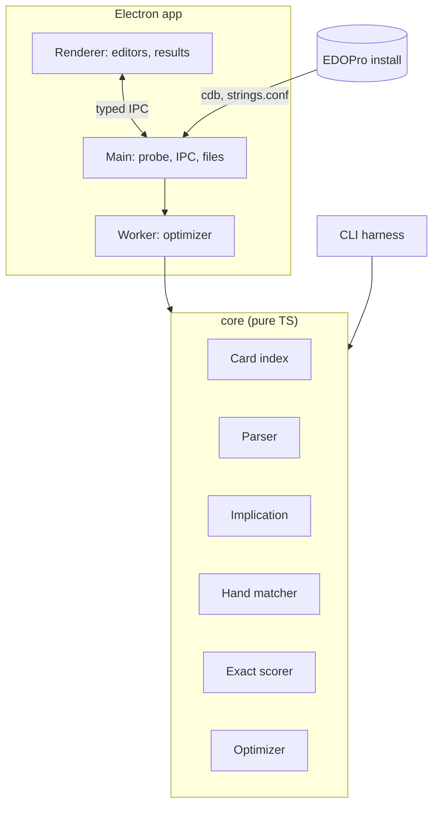

# PRD: ygo-deck-optimizer

| Status | Author | Date | Tracking | Related |
| --- | --- | --- | --- | --- |
| Living — decisions D1–D7 and F1 resolved (amended 2026-09-18); follow-up F2 open (§13) | Andy (with Claude) | 2026-09-17 | [YGO-5](https://linear.app/ygo-deck-optimizer/issue/YGO-5/write-prd-for-the-concept-aware-deck-ratio-optimizer), [YGO-7](https://linear.app/ygo-deck-optimizer/issue/YGO-7/prd-resolve-f1-limits-count-only-cards-known-to-match) | [ygo-combo-solver-gui](https://github.com/96jonesa/ygo-combo-solver-gui) (source of the app scaffold and the `CardIndex` reader) |

## 1. Summary

Yu-Gi-Oh! theorycrafters tune deck ratios ("how many copies of this combo enabler — it bricks in multiples?") with generic hypergeometric calculators. Those calculators know nothing about the game: the user hand-partitions the deck into buckets, types bucket sizes as bare numbers, re-does it for every candidate ratio, and gets it wrong whenever one card can play two roles in a hand.

**ygo-deck-optimizer** is a concept-aware layer on top of hypergeometric calculation. The user writes a **deck template** once — lines that are either a literal card name or a Yu-Gi-Oh! description ("level 4 monster", "FIRE Beast-Warrior monster", "normal spell"), each with a min/max copy count — plus one or more opening-hand **success criteria**. The tool looks up what every named card actually is, works out which lines can satisfy which requirements, enumerates every valid deck ratio totalling the deck size, and reports the ratios with the best probability that the opening hand satisfies at least one criterion.

It is a standalone desktop app (Electron, macOS and Windows) that reads card data from the user's EDOPro install: **no game engine, no replays, no combo solver** — combinatorial probability plus a card-database lookup layer. It is **proprietary** for now (§4.4).

## 2. Goals and non-goals

### Goals

1. Answer "what ratio maximizes my odds of opening a playable hand?" from a template written once, with no manual enumeration.
2. Be concept-aware: a line or criterion can be a card name or a description over real card fields; a named card's properties come from the card database, so the tool — not the user — knows that card B is a monster.
3. Be **correct about overlap**: one drawn card fills at most one requirement, and a card that *could* fill several is assigned wherever it makes the hand succeed.
4. **Never assume what the user did not say.** A template line is known exactly to the specificity it states (§6): a card matches a description — in a requirement or a limit — only if its line is specific enough to be *known* to match.
5. Report **exact** probabilities, so that ratios differing by a fraction of a percentage point are ranked by math, not by sampling noise (§4.3).
6. Make the semantics visible: the user can always see which lines count toward which requirement, and why one does not.

### Non-goals

- **Knowing what cards do.** The tool never reads effect text or decides what a combo is; success criteria are the user's statement of what a good hand looks like.
- Anything past the opening hand in v1: no draw phases, searchers, deck thinning, mulligans, or hand traps resolving (§9 lists the ones worth adding later).
- Extra Deck and Side Deck construction. Templates describe the Main Deck only; Extra Deck monsters and tokens are excluded from the picker and from every description.
- A deck editor, collection manager, or card viewer. Import/export of `.ydk` is a convenience (§9), not a goal.
- Web or mobile deployment, and working without an EDOPro install (decided, §7).
- Reusing or depending on the combo solver in any form.

## 3. Users

| User | Situation | Needs |
| --- | --- | --- |
| Theorycrafter (the originator) | Has an engine whose key card bricks in multiples; currently hand-guesses the count | One template, every ratio scored, the optimal count and how flat the optimum is |
| Competitive deck builder | Choosing between 2 vs 3 of several starters/extenders/hand traps within 40 | Ranked ratios, per-criterion breakdown, "copies of X vs odds" sweep |
| Content creator / community helper | Explaining a ratio choice to others | Exact numbers they can cite, a template file that reproduces the result |

All users are assumed to have **EDOPro (Project Ignis) installed**, as with the sibling tool: the app reads its card databases and archetype names from that install.

## 4. Background: what we have to work with

### 4.1 The card database substrate

- EDOPro `.cdb` files are SQLite. The `datas` table carries exactly the queryable fields — `id, ot, alias, setcode, type, atk, def, level, race, attribute, category` — and `texts` carries the name. `type` is a bitmask (monster/spell/trap plus normal/effect/tuner/ritual/quick-play/continuous/…), `race` is the monster Type, `attribute` is FIRE/WATER/…, `setcode` packs up to four 16-bit archetype codes. This is the entire concept-aware substrate.
- The sibling project's [`CardIndex`](https://github.com/96jonesa/ygo-combo-solver-gui/blob/main/src/main/edopro/carddb.ts) already reads `.cdb` files on **sql.js** (wasm — no native module, so it behaves identically under Electron and vitest), collects them in EDOPro's order (non-empty `cards.cdb`, then recursive `expansions/` and `repositories/`), collapses artwork variants via `alias`, and provides diacritic/case-insensitive name search. Today it selects only `id, alias, type, name`; reuse means widening the `SELECT` to the predicate fields and keeping the filesystem walk separate from a load-from-bytes core so the core stays unit-testable.
- The sibling also already has the EDOPro install probe, settings store, sandboxed renderer, typed IPC bridge, card picker, and packaging setup — lifted wholesale (§7).
- Known encoding traps to handle in the TDD, not to be written from memory: the `level` column packs Pendulum scales into its high bits and holds the Link Rating for Link monsters; `atk`/`def` use a negative sentinel for "?"; `ot` distinguishes OCG/TCG/unofficial cards. **All constant tables (type bits, races, attributes, `ot` scopes) are transcribed whole from the ocgcore/EDOPro source, with pinned-literal tests** — a wrong bit is not visibly wrong, it just silently matches nothing.
- **Not in the `.cdb`**: archetype *names*. `setcode` values map to names via EDOPro's `strings.conf` (`!setname` lines), read from the same install; its exact location(s) and override order are a TDD item.
- **Not available anywhere**: anything that depends on effect text — "can be Normal Summoned", "searchable by X", "is a starter". The escape hatch is user-defined groups (§5.2).

### 4.2 The motivating example

From the originating request, verbatim:

```
card A (by actual name)              [min 0, max 3]
card B (by actual name)              [min 0, max 3]
monster                              [min 5, max 5]
level 4 monster                      [min 2, max 3]
level 7 FIRE beast-warrior monster   [min 0, max 3]
spell                                [min 0, max 7]
normal spell                         [min 0, max 3]
```

Success if the opening hand satisfies any one of:

```
1x card A, 1x card B, 1x monster
1x card A, 1x card B, 1x level 4 or lower monster
```

One thing the card database shows about the example as written: **no Level 7 FIRE Beast-Warrior monster exists** (the Main Deck ones are Levels 1–6, 8 and 9). That is fine, and the line stands verbatim: a generic line states what its cards are *known to be*, not which cards exist (§5.1), so it needs no matching card — the originator may be planning around a card not yet printed, or sketching. The tool says so in a notice and carries on.

Two observations. First, the lines look nested ("level 4 monster" inside "monster") and a named card may itself be a monster — how that is read is §6. Second, the lines sum to at most 27, so the model needs an explicit notion of the *remainder* of the deck (§5.1).

### 4.3 Exact computation is cheap — Monte Carlo is the check, not the engine

The original design brief (a local working note, not kept in this repo) proposed Monte Carlo as the baseline estimator. This PRD does the opposite (decision D7), because of one structural fact: under §6 the deck is a disjoint sum of lines whose cards are interchangeable, so whether a hand succeeds depends only on *how many cards of each line* it holds — and that does not depend on the deck ratio at all.

For line counts $`n = (n_g)`$ with $`\sum_g n_g = N`$ and a hand composition $`h = (h_g)`$ with $`\sum_g h_g = H`$:

```math
\Pr(h \mid n) = \frac{\prod_{g} \binom{n_g}{h_g}}{\binom{N}{H}}
\qquad\qquad
P(n) = \sum_{h \in \mathcal{S}} \Pr(h \mid n)
```

where $`\mathcal{S}`$ is the set of successful hand compositions. There are only $`\binom{H + k - 1}{H}`$ compositions for $`k`$ lines (2,002 for $`k = 10,\ H = 5`$), so $`\mathcal{S}`$ is computed **once per problem** by running the hand matcher (§5.4) on each composition; scoring a candidate ratio is then a short sum of products of binomials.

Why this matters for the product, not just for speed: adjacent ratios typically differ by well under one percentage point, while a 10,000-sample Monte Carlo estimate near 50% carries a 95% interval of about ±1 point. Sampling would rank near-ties by noise. Exact scoring ranks them by math and needs no confidence intervals in the UI.

Monte Carlo still earns its place — as an **independent oracle** in the test suite (§10), and later as the estimator for features that break the hypergeometric model (draw effects, mulligans; §9).

### 4.4 License

**Proprietary — all rights reserved, for now** (Andy, 2026-09-17), conditional on no dependency forcing otherwise. None does:

- The sibling toolchain's full installed tree (390 packages) was scanned: MIT, ISC, BSD-2/3-Clause, Apache-2.0, BlueOak-1.0.0, 0BSD, WTFPL, Python-2.0, CC-BY-4.0 — **no GPL/AGPL/LGPL/MPL or other copyleft**. The runtime dependencies that actually ship (`react`, `react-dom`, `sql.js`, `zustand`) are all MIT, as is Electron.
- The only obligation permissive licenses impose is **attribution**: distributed builds carry a generated third-party-notices file for bundled npm packages, alongside the Electron/Chromium notices electron-builder already ships.
- The code lifted from the sibling repo is AGPL *there*, but every commit in that repo — including `carddb.ts` — is Andy's, so as sole copyright holder he can reuse it here under any terms. The AGPL solver binary is not used.
- Card data is read from the user's own EDOPro install and never redistributed (§7), so it raises no licensing question.
- In practice: `"private": true` and `"license": "UNLICENSED"` in `package.json`, a short all-rights-reserved `LICENSE`, and a CI license check that fails on any copyleft dependency so the condition stays true.

## 5. The model

Terminology used from here on: a template has **lines**; a criterion has **requirements** and **limits**.

### 5.1 Deck template

- A **line** is a *description* (§5.2) plus a copy range `[min, max]`.
- Lines are **disjoint and additive**: every physical card in the deck belongs to exactly one line, and the line counts sum to the deck size. What a line's cards are *known to be* is §6.
- The deck size $`N`$ is a parameter: default 40, allowed 40–60.
- The **remainder** — the cards no line accounts for — is an always-visible computed row ("Unspecified cards: 13–33"). It behaves as a line with the empty description: cards about which nothing is known. It can be bounded with an explicit `any card [min, max]` line.
- Game rules the tool enforces on its own: a named card's `max` is capped at 3. A **named** card must exist in the database; a **generic** line need not match any existing card (decided by Andy, 2026-09-19) — it is an abstract statement of what the line's cards are known to be, consistent with §6. A description that matches nothing is reported as a notice, because it is sometimes a slip; an unknown *word* is still a parse error, which is what catches typos.

### 5.2 Descriptions

A description is either a **card name** (chosen through autocomplete, stored as a passcode, so ambiguity is impossible) or a **qualified description** parsed into a predicate over card fields. The parsed predicate (an AST, serializable as JSON) is the source of truth; free text is just the input method, and the UI always echoes what it understood: `Level 4 · Monster — 1,912 cards`.

MVP vocabulary, bounded by what the `.cdb` can express:

| Dimension | Examples |
| --- | --- |
| Card kind | `monster`, `spell`, `trap` |
| Monster sub-kind | `normal`, `effect`, `tuner`, `ritual`, `pendulum`, `flip`, `gemini`, `union`, `spirit`, `toon` |
| Spell/Trap sub-kind | `normal spell`, `quick-play spell`, `continuous trap`, `equip`, `field`, `counter trap`, … |
| Attribute, Type | `FIRE`, `Beast-Warrior`, … |
| Level | `level 4`, `level 4 or lower`, `level 5 or higher`, `level 2-4` |
| ATK / DEF | `1500 or less ATK`, `DEF 200`, `ATK 2000 or more` |
| Archetype | `"Sky Striker" card`, `"Sky Striker" spell` (quoted; resolved via the setname table) |
| Combinators | adjacency = AND; `or` between descriptions; `non-` negation (`non-tuner`) |
| **User-defined group** | `starter := Card X \| Card Y \| Card Z`, then usable anywhere a description is (`1x starter`) |

User-defined groups are in the MVP (decision D5) because they are how theorycrafters actually think — "starter", "extender", "brick" are roles, not database fields — and they cost nothing: a group is the predicate "passcode is in this set".

### 5.3 Success criteria

The hand is a success if it satisfies **at least one** criterion. A criterion is a boolean expression — `AND` / `OR`, nested freely with parentheses — over two kinds of leaf:

- **Requirements** — `n× description`, meaning at least $`n`$ *distinct drawn cards* are assigned to it. `1x card A, 1x card B, 1x monster` needs three different cards.
- **Limits** — `at most n× description` / `no description`, a count over the whole hand, not an assignment. This is how "bricks in multiples" becomes expressible: `1x starter, at most 1x Brick Card`. In the MVP per decision D5: the originating use case is precisely a card that is bad in multiples, and with pure "at least" requirements a second copy is never *directly* bad — only indirectly, by displacing another card.

**Nested OR** (requested by Andy, 2026-09-17) lets alternatives carry different counts without retyping the shared part:

```
1x card A AND 1x card B AND (1x card C OR 2x card D)
```

Its meaning is defined by expansion to the flat form: the hand satisfies the expression iff, for *some* choice of one branch at every `OR`, the resulting flat list of requirements has a joint assignment of distinct cards (§5.4) and every limit on that branch holds. The example is therefore exactly `(1x A, 1x B, 1x C) OR (1x A, 1x B, 2x D)` — and the list of criteria itself is just an `OR` at the root. **Nesting is surface syntax; the engine only ever sees an OR of flat criteria**, so nothing in §4.3 changes. Expansion is exponential in the number of `OR`s in principle and tiny in practice; the tool caps the expanded size with a clear error.

Two different "or"s exist and the UI keeps them apart: a *description-level* `or` (`1x (card C or card E)`) is one slot that either card can fill; a *criterion-level* `OR` chooses between whole sub-expressions, which is what differing counts (`1x C` vs `2x D`) need.

### 5.4 Hand matching

Whether a hand meets a criterion's requirements is a **bipartite matching**: assign distinct drawn cards to requirement slots such that each card's line can fill its slot (§6.2). This is what makes overlap fall out automatically:

- If card B is a monster, the hand `{A, B, B}` satisfies `1x A, 1x B, 1x monster` (the second B is the monster), while `{A, B}` plus two spells does not (B cannot be both "card B" and "the monster").

Instances are tiny (hand ≤ 6 cards, a handful of slots), so matching is exact and instant, and per §4.3 it runs once per hand *composition*, never per deck.

### 5.5 Probability and hand size

Exact multivariate hypergeometric (§4.3). Hand size $`H`$ is 5 (going first, default) or 6 (going second); a blend $`P = w P_5 + (1 - w) P_6`$ for a user-set coin-flip weight is cheap and scheduled for M3.

### 5.6 Optimizer and output

- **Objective (decision D6):** maximize $`P(\text{at least one criterion satisfied})`$. With limits (§5.3), brick-avoidance is already expressible inside that single objective. Weighted criteria and multi-objective frontiers are later (§9).
- **Search:** exhaustive over all valid ratios when the space is small enough (it is, for templates like the example), with two exact reductions: lines no criterion can see are *irrelevant* — they only trade copies with the remainder, so they are collapsed out of the search and reported as such. (Their counts tie only while the rest of the deck can absorb them: an irrelevant card still takes a slot, so past that point it crowds out cards that matter, and the results show that as a sweep rather than calling the line free) ("`spell`, `normal spell` do not affect these criteria") — and lines that fill exactly the same requirements and limits are merged for scoring. Heuristic search for very large spaces is later (§9) and must be labeled as non-exhaustive when used.
- **Output:**
  - a ranked table: ratio → exact $`P`$, with per-criterion probabilities;
  - the **plateau**: every ratio within $`\delta`$ (default 0.5 percentage points) of the best, because "2 or 3 copies are equally fine" is a more useful answer than a single winner;
  - a **sweep view**: $`P`$ against copies of one chosen line (others re-optimized, or held fixed) — the direct answer to "how many copies of X?".
- Long runs report progress (done / total, percent, elapsed, ETA) and are cancellable; the CLI harness prints the same to stderr.

## 6. Template semantics (decision D1 — resolved)

### 6.1 The rule: disjoint lines, known exactly to their stated specificity

Decided by Andy, 2026-09-17. It settles both the overlap question and what to do with under-specified cards (the former D2) in one stroke:

1. **Lines are separate and additive.** `monster [2,3]` and `level 4 FIRE monster [1,2]` mean 2–3 cards known to be monsters, and — totally separately, in addition — 1–2 cards known to be Level 4 FIRE monsters: 3–5 monsters in all. No line is "inside" another, no card is counted by two lines, and line order never matters.
2. **A line's cards are known exactly to the specificity the line states — no more.** A card on the `monster` line might be Level 4 or Level 8; the tool does not know and never guesses. There is no hidden subtraction either: `monster` does not mean "monsters that are not Level 4", it means "monsters of unstated Level".
3. **Under-specificity is total ambiguity, and an ambiguous card never matches.** A `monster` line cannot satisfy any requirement more specific than `monster` — a requirement that mentions Level *at all* is out of its reach. The same holds for limits (§6.3).
4. **Named cards are fully known.** Their properties come from the card database, which is where concept-awareness does its work: if card B is a Level 4 FIRE monster, its line fills `monster`, `FIRE monster`, and `level 4 or lower monster` requirements without the user saying so. All copies of a named card live on its own line; generic lines mean cards *other than* the template's named cards, and a requirement that names a card is filled only by that card's line.

### 6.2 Which line fills which requirement

A card from line $`L`$ can fill a requirement $`q`$ iff $`L`$'s description **logically implies** $`q`$'s. For the motivating example, supposing card A is a Level 4 monster and card B a Normal Spell:

| Requirement | Filled by lines |
| --- | --- |
| `1x card A` | `card A` |
| `1x card B` | `card B` |
| `1x monster` | `card A`, `monster`, `level 4 monster`, `level 7 FIRE beast-warrior monster` |
| `1x level 4 or lower monster` | `card A`, `level 4 monster` — **not** `monster` (Level unstated) |
| `1x spell` | `card B`, `spell`, `normal spell` |

The deck is A + B + 5 + (2–3) + (0–3) + (0–7) + (0–3) = 7 to 27 cards from lines, so 13–33 unspecified; known monsters total 7–14.

**Implication is logical, never statistical.** It uses the description's own content plus game-rule axioms — anything with a Level, ATK, Attribute or Type is a monster; `quick-play` is a spell; `level 4` implies `level 4 or lower` — and never "what happens to be true of today's card pool". If every Level 12 LIGHT Fairy printed so far has 3000+ ATK, a `level 12 LIGHT Fairy monster` line still does not fill `ATK 3000 or more`: ATK was not mentioned. This keeps results predictable and independent of the database version. (The database still validates vocabulary and catches typos, and supplies every named card's properties.)

### 6.3 Limits use the same rule (follow-up F1 — resolved)

Decided by Andy, 2026-09-18: **a line's cards count toward `at most n× q` only if the line is specific enough to be known to match $`q`$** — exactly the implication test of §6.2. `at most 1x trap` counts cards from a `trap` or `counter trap` line (and from any named card that is a trap); it does **not** count a generic `card`, the unspecified remainder, or any other line that never says "trap". Limits on a named card or a user-defined group of named cards — the common case, `at most 1x Brick Card` — count only those cards' own lines.

So the whole tool has **one matching relation**: a card matches a description, in a requirement or in a limit, iff its line's description logically implies it. Nothing is ever matched "because it might be".

What the reported number means, precisely:

- For criteria **without limits** it is a guaranteed lower bound: whatever concrete cards later fill a generic line, they can only match *more* requirements, so true odds are at least this.
- For criteria **with limits** it is exact under the stated reading — cards not known to match a limit do not match it. If the user's under-specified cards would in fact match (13 unspecified cards that are really traps, under `at most 1x trap`), true odds are lower than reported. The fix is the user's to make, by stating those cards as a `trap` line; the tool's job is to point at the gap (§6.4), not to guess.

### 6.4 What the user sees

- Each requirement shows the lines that fill it, and — more importantly — the near misses: "`monster` is not specific enough to count toward `level 4 or lower monster` (Level unstated)", with a one-click "split off a `level 4 or lower monster` line".
- Read-only derived totals, since lines are additive and nothing states a total: "Known monsters: 7–14 · Known spells: 0–13 · Unspecified: 13–33".
- The same readout for limits: the lines a limit counts, and a notice — not a rule change — when under-specified lines could be hiding matches from it: "`at most 1x trap` ignores 13–33 unspecified cards; if some are traps, give them a `trap` line".
- Warnings for a criterion naming a card the template lacks, or a requirement nothing can fill.

### 6.5 Consequences

- The engine is simple: lines *are* the groups of §4.3. There is no constraint system and no infeasible template beyond "the ranges cannot sum to $`N`$".
- Aggregate caps ("at most 12 monsters in total") are not expressible in v1; listed in §9.
- The user controls precision by being specific: a line only ever earns what its description states.

### 6.6 Alternatives considered

| Alternative | Idea | Why not |
| --- | --- | --- |
| Census constraints (Claude's original recommendation) | Each line bounds a count over the whole deck; a card counts toward every line it matches; "monster [5,5]" = exactly 5 monsters in total | Not what the template means to its author: lines are separate buckets, not overlapping totals. Also brings a constraint system and infeasible templates |
| Disjoint slots, most-specific-wins | Each card belongs to the most specific matching line; `monster` silently means "monsters not covered elsewhere" | Hidden subtraction and order-dependence; the chosen rule needs neither |
| Slots plus aggregate limits | Two kinds of line | Two concepts to learn; aggregate caps can be added later without it (§9) |
| Best-case resolution of ambiguity | Optimizer assumes unstated properties favorably | Inflates odds and produces degenerate optima; contradicts "an ambiguous card never matches" |
| Conservative limits (Claude's F1 recommendation) | A line counts against `at most n× q` unless it *rules $`q`$ out*, so unspecified cards count against `at most 1x trap` | Makes every number a lower bound, but at the price of a second matching relation and of limits that fire on cards the user never said anything about. Rejected: a card not known to be a trap is not counted as one |

## 7. Delivery shape (decisions D3, D4 — resolved)

**Electron desktop app for macOS and Windows; EDOPro install required; card data read from that install** (Andy, 2026-09-17).

### 7.1 What this buys

- The sibling project's scaffold is lifted wholesale: Electron + electron-vite + React 18 + strict TypeScript + vitest + electron-builder, sandboxed renderer behind a typed IPC bridge, EDOPro install probe and settings store, card picker, packaging setup. (The sibling builds **unsigned** — signing and notarization are new work here, in M4; see TDD §17.)
- Card data needs no pipeline at all: `cards.cdb` plus `expansions/` and `repositories/` are read in place, exactly as the sibling does, so the picker always matches what the user sees in EDOPro — including pre-release and custom cards — and archetype names come from the same install's `strings.conf`. Nothing is bundled, pinned, refreshed, or redistributed.
- Fully offline.

### 7.2 Architecture

| Layer | Contents | Rules |
| --- | --- | --- |
| `core/` | Card index (load-from-bytes), description parser, implication, hand matcher, exact scorer, optimizer, Monte Carlo oracle | Pure TypeScript: no Electron, no DOM. Everything that can be *wrong* lives here and is tested headlessly |
| Main process | EDOPro probe + settings, filesystem walk for `.cdb` / `strings.conf`, IPC handlers, template file open/save | The only layer that touches the filesystem |
| Worker | Runs the optimizer off both the main and renderer threads; streams progress; cancellable | Mechanism (`worker_threads` vs `utilityProcess`) is a TDD item |
| Renderer | Template editor, criteria editor, results | Sandboxed; talks only through the typed IPC bridge |
| CLI harness | `optimize template.json --workdir <EDOPro>` over `core/` | Development and differential-test harness for M0–M1; not shipped |



### 7.3 Alternatives considered

| Alternative | Why not |
| --- | --- |
| Static web app with a bundled card index (Claude's original recommendation) | Zero-install and link sharing, but requires building, pinning, refreshing and redistributing a card index; Andy prefers reading the user's own EDOPro data and reusing the proven desktop scaffold |
| CLI only | No card picker, so name ambiguity returns as an error class; wrong audience. Kept as a dev harness |

## 8. Feature requirements (MVP)

### 8.1 First-run setup

- Detect or ask for the EDOPro install directory; validate it (non-empty `cards.cdb`) and store it in settings — lifted from the sibling.
- Show what was loaded: number of databases and cards, and whether archetype names were found. Re-index on demand.
- Population defaults: Main Deck cards only; official cards only — OCG, TCG, and (by default, with a setting to exclude them) official pre-release cards, which is EDOPro's own definition of "official"; no anime/Rush/unofficial `ot` scopes; artwork variants collapsed (TDD §4.2–4.3).

### 8.2 Template editor

- Add/remove/reorder lines; each line is a card (autocomplete picker, passcode-backed) or a free-text description with live parse echo and match count.
- Computed remainder row, derived totals (§6.4), and a running count of valid ratios; a clear error when the ranges cannot sum to the deck size.
- User-defined groups (§5.2): create, name, edit membership via the picker.
- Deck size and hand size controls.
- Save/load the template (lines, groups, criteria, settings) as a JSON file — the unit of sharing.

### 8.3 Criteria editor

- One or more criteria, each built from requirements (`n×` description) and limits (`at most n×` / `no`), using the same description input as the template. A criterion is a flat `AND` list by default; any entry can be turned into a nested `OR` group (§5.3), and the editor shows the expanded flat alternatives so the user can confirm what will be scored.
- Per requirement: the lines that fill it and the near misses (§6.4).
- Warnings, never silent behavior: a criterion that names a card absent from the template, is subsumed by another criterion (as the example's second criterion is by its first), or can never be satisfied.

### 8.4 Run and results

- Run in a worker with progress and cancel (§5.6); results as ranked table, plateau, sweep chart, per-criterion breakdown.
- Irrelevant lines called out explicitly rather than appearing as thousands of tied rows.
- Export results as CSV/JSON.

## 9. Later (explicitly out of scope for v1)

- `.ydk` import (seed a template from an existing list: one line per card at its current count) and export; going-first/second blend — scheduled for M3.
- Aggregate caps across lines ("at most 12 known monsters in total").
- Banlist awareness: cap named cards by a Forbidden/Limited list from the EDOPro install.
- Deck size as a range (is 41 ever right?), heuristic search for very large templates.
- Non-hypergeometric effects via the Monte Carlo path: draw/excavate cards, deck thinning, mulligan rules, "going second draws for turn".
- Weighted criteria, brick-probability as a separate objective, Pareto frontier.
- A structured (form-based) description builder alongside free text.

## 10. Verification strategy

The check is built before the thing it checks; each novel layer gets an independent oracle.

| Layer | Oracle |
| --- | --- |
| Constant tables | Transcribed whole from source; pinned-literal tests; every description's match count is visible in the UI, so a dead bit shows up as "0 cards" |
| Description parser | Golden tests: description → predicate → matched set, against a small fixture `.cdb` built in the test suite |
| Implication (§6.2) | **Soundness against the database**: whenever the logic says $`L \Rightarrow q`$, every fixture-database card matching $`L`$ must match $`q`$ — a logical implication the card pool contradicts is a bug. Plus hand-written cases for what must *not* be implied ("monster" ⇏ "level 4 or lower monster") |
| Hand matcher | Brute-force permutation assignment on every small instance |
| Nested criteria | Expansion to flat criteria vs a direct recursive evaluator of the expression tree (tries every branch choice and assignment), on random expressions and hands |
| Exact scorer | (1) closed-form anchors, e.g. 3 copies in 40, 5 drawn: $`1 - \binom{37}{5}/\binom{40}{5} \approx 33.76\%`$; (2) **differential test against the Monte Carlo oracle**, which draws concrete cards from a concrete expanded deck and shares no code with the scorer, across randomized templates, agreeing within its binomial interval |
| Lower-bound guarantee (§6.3) | Property test, for criteria **without limits**: fill every generic line with random concrete database cards matching it; the true $`P`$ of that concrete deck is never below the reported one. For criteria **with limits**: the same holds whenever the concrete fill adds no limit matches beyond those the lines already imply — and a deliberately adversarial fill (unspecified cards that are all traps, under `at most 1x trap`) must come out *lower*, pinning the documented gap rather than hiding it |
| Optimizer | Exhaustive search vs naive score-every-deck on small templates; reductions (irrelevant lines, merged lines) must not change any score |
| Licensing condition (§4.4) | CI license check fails on any copyleft dependency |

## 11. Risks

| Risk | Impact | Mitigation |
| --- | --- | --- |
| User expects `monster [5,5]` to mean "5 monsters in total", or expects a `monster` line to count toward a Level requirement | The tool's whole value is a number people act on | Derived totals, per-requirement "filled by" and near-miss readouts with one-click line splitting (§6.4); warnings instead of silent rules |
| Wrong constant / field decoding (type bits, packed `level`, ATK sentinel) | Named cards get wrong properties; descriptions validate against the wrong cards | Whole-table transcription, pin tests, visible match counts (§10) |
| Implication logic too weak or too strong for combinators (`or`, `non-`, ranges) | Too weak: valid lines fail to count — odds understated for requirements, *overstated* for limits. Too strong: a line matches what it never stated. Neither direction is a safe default now that limits share the relation | Soundness oracle against the database; explicit must-imply *and* must-not-imply cases covering every §5.2 dimension and combinator, so completeness is tested as deliberately as soundness |
| A limit silently ignores under-specified cards that really do match it (§6.3) | Reported odds higher than the user's real deck | By design (F1), so the mitigation is visibility: per-limit "counts these lines" readout and the "ignores N unspecified cards" notice (§6.4) |
| Valid-ratio space explodes for large templates | Exhaustive search stalls | Exact reductions (§5.6); progress + cancel; labeled heuristic search later |
| Exact scorer subtly wrong | Confidently wrong numbers, invisible by inspection | Independent Monte Carlo differential gate in CI (§10) |
| EDOPro requirement excludes paper / Master Duel-only players | Smaller audience | Accepted (D3/D4); EDOPro is free and the setup step is one folder pick |
| `strings.conf` missing or in an unexpected place | Archetype descriptions unavailable | Degrade gracefully with a visible "archetype names not found" state; everything else works |
| Proprietary app in a private repo has no obvious download/update channel | Users cannot get builds; the sibling's update flow assumes public releases | Follow-up F2 — decide before M4 |

## 12. Milestones

One PR per slice (M0a, M0b, …) as in the sibling project, stacked where slices touch the same files; README kept current in the PR that makes it stale. The TDD (`docs/TDD.md`) follows this PRD and precedes M0.

| # | Milestone | Contents | Exit criterion |
| --- | --- | --- | --- |
| M0 | De-risk spike (headless) | Scaffold lifted from the sibling (electron-vite, strict TS, vitest, CI incl. license check, `LICENSE`, README); `CardIndex` port with predicate fields and transcribed constant tables; description parser for the §5.2 vocabulary; criterion parser with nested `AND`/`OR` and its expansion; implication; hand matcher; Monte Carlo loop over one hand-built deck, driven from the CLI harness | The motivating example parses against a real EDOPro install and yields a plausible probability; parser, implication and matcher oracles green |
| M1 | Exact engine + optimizer (headless) | Exact scorer; exhaustive optimizer with reductions, progress and cancel; `optimize template.json` in the harness; differential gate vs Monte Carlo and the lower-bound property test in CI | The harness reproduces the motivating example end to end with exact numbers; all §10 oracles green |
| M2 | App MVP | EDOPro first-run setup; typed IPC + worker; card picker; template and criteria editors with parse echo, "filled by" / near-miss readouts, warnings; ranked table, plateau, sweep chart; template save/load; CSV/JSON export | The originator can answer their real "how many copies?" question in the app without help |
| M3 | Polish | `.ydk` import/export; going-first/second blend; `docs/GUIDE.md` | A template file reproduces a result exactly on another machine |
| M4 | Release | macOS DMG + Windows installer, signing/notarization (new work — the sibling ships unsigned), third-party notices, distribution/update channel per F2, `docs/INSTALL.md` | A user outside the project can install and run it |
| Later | Scale and depth | §9, driven by what M2–M3 users actually ask for | — |

## 13. Decisions

| # | Decision | Outcome |
| --- | --- | --- |
| **D1** | Template overlap semantics | **Resolved (Andy, 2026-09-17): disjoint, additive lines, each known exactly to its stated specificity** (§6). Claude's census recommendation rejected |
| **D2** | Under-determined cards | **Resolved with D1**: a line fills a requirement only if its description logically implies it; an ambiguous card never matches |
| **F1** | Limits under ambiguity (§6.3) | **Resolved (Andy, 2026-09-18): limits use the same rule** — `at most n× q` counts only cards known to match $`q`$; a generic `card` never counts toward `at most 1x trap`. Claude's conservative "counts unless ruled out" recommendation rejected |
| **D3** | Delivery shape | **Resolved: Electron, macOS + Windows** (§7). Claude's web-app recommendation rejected |
| **D4** | Card data sourcing | **Resolved: require EDOPro; read its databases in place.** Nothing bundled |
| **D5** | Limits (`at most n×`) and user-defined groups in the MVP | **Resolved: yes to both** |
| **D6** | Objective | **Resolved: single objective** $`P(\text{success})`$ + plateau + sweep; multi-objective later |
| **D7** | Exact scoring as the engine, Monte Carlo as the test oracle | **Resolved: yes** |
| — | License | **Resolved: proprietary for now** (§4.4); no dependency forces otherwise |

Open follow-up:

| # | Question | Recommendation |
| --- | --- | --- |
| **F2** | How do users get builds and updates of a proprietary app from a private repo? | Decide before M4. Options: a separate public releases-only repo, or direct distribution of signed builds with update checks disabled |

## 14. Success criteria

- The motivating example, entered as written, produces a ranked list of exact probabilities in seconds, with a named card that is a monster filling `monster` requirements without the user doing anything — and the `monster` line visibly *not* filling `level 4 or lower monster`.
- The originator's real question — the optimal count of a card that bricks in multiples — is answered by one template and one sweep chart, and the answer matches an independent hand calculation on a simplified case.
- Every probability the tool reports agrees with the independent Monte Carlo oracle within its sampling interval, and — for criteria without limits — is never above the true odds of any concrete deck fitting the template; both enforced in CI.
- A user can tell, from the screen alone, which lines count toward which requirement and why the others do not — no semantics are silent.
- A template file reproduces the same numbers on someone else's machine.
