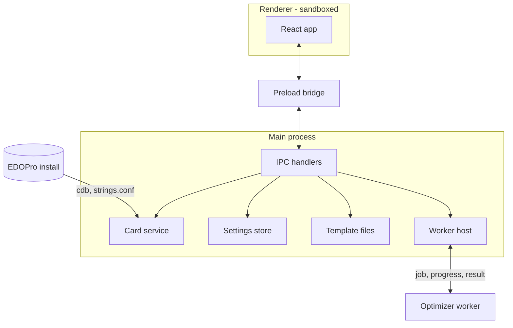
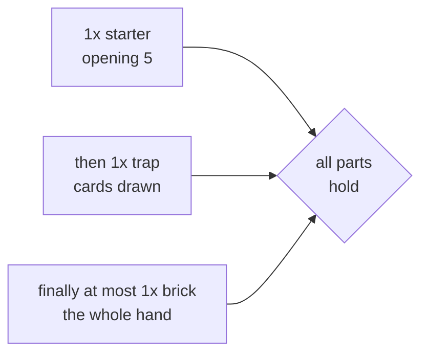

# TDD: ygo-deck-optimizer

| Status | Author | Date | Tracking | Related |
| --- | --- | --- | --- | --- |
| Draft | Andy (with Claude) | 2026-09-18 | [YGO-6](https://linear.app/ygo-deck-optimizer/issue/YGO-6/write-tdd-for-the-deck-ratio-optimizer) | [PRD](./PRD.md) |

## 1. Overview

This document specifies the technical design for the tool described in the [PRD](./PRD.md): the card-data layer, the description and criterion languages, the implication engine that is the tool's single matching relation, the hand matcher, the exact scorer, the optimizer, the Electron process architecture, storage, project layout, and testing. It is detailed for milestones M0–M2, design-level for M3, and gives pointers for M4.

Design principles, restated from the PRD:

1. **One matching relation.** A card matches a description — in a requirement or a limit — iff its line's description *logically implies* it (PRD §6). Nothing matches "because it might".
2. **Exact, not sampled.** Probabilities are exact rationals; Monte Carlo exists only as an independent test oracle (PRD §4.3).
3. **Everything that can be wrong lives in `core/`** — pure TypeScript with no Electron, Node, or DOM dependency — and is tested headlessly. The app around it is plumbing.
4. **No silent semantics.** Every rule the engine applies is surfaced by the analysis API (§9) so the UI can show it.
5. **The check is built before the thing it checks** (§15).

## 2. Stack

Lifted from [ygo-combo-solver-gui](https://github.com/96jonesa/ygo-combo-solver-gui) at the versions it runs today, minus everything that exists to drive a subprocess.

| Layer | Choice | Notes |
| --- | --- | --- |
| Shell | Electron 44 | macOS arm64 + Windows x64 |
| Language | TypeScript 7, `strict` + `noUncheckedIndexedAccess`, ESM (`"type": "module"`) | Node 22 pinned in CI (`import.meta.dirname`) |
| Build | electron-vite 5 / Vite 7 | Preload is forced to CommonJS (`format: 'cjs'`, `index.cjs`): a sandboxed preload emitted as `.mjs` fails to load *silently* — the sibling's rollup override and its `'../preload/index.cjs'` path are a pair and are lifted together |
| UI | React 18 + zustand 5, hand-written CSS | No component or CSS framework, as in the sibling |
| SQLite | sql.js (wasm) | No native module: `npmRebuild: false`, identical behavior under Electron and vitest, ubuntu-only CI for both platforms. It works with a bare `initSqlJs()` **only because it stays unbundled in the main process** (`externalizeDepsPlugin`); it is never imported from the renderer or a bundled worker |
| Tests | vitest 4, `environment: 'node'` | No jsdom; renderer logic worth testing lives in pure functions |
| Lint/format | Biome (lint + format in one), **run in CI** | The sibling promised eslint + prettier and never wired them — for a reason found in M0a: typescript-eslint's peer range stops below TypeScript 6.1, so it cannot be installed beside TypeScript 7. Biome has no dependency on the TypeScript API; its `noRestrictedImports` override also enforces `core/` purity (§16) |
| CLI harness | `tsx` | Dev dependency only; not shipped |
| Packaging | electron-builder 26 | §17 |

No ORM, no app database, no telemetry, no network access at all in v1.

## 3. Process architecture



- **Renderer**: UI only — `contextIsolation: true`, `nodeIntegration: false`, `sandbox: true`, `setWindowOpenHandler` denying everything. It never touches the filesystem and never parses, compiles, or scores: every edit is sent to main and the returned `Analysis` (§9) is rendered. That it imports nothing from `core/`, `main/` or `worker/` is enforced by a Biome override, not by convention (M2c: `core/` *was* importable and is no longer).

  Its shape: a status bar over a two-column workspace — **template** and **criteria** stacked left, **results** right, collapsing to one column under 1000px. The tool's whole point is "change a ratio, see the odds", so inputs and numbers have to be on screen together; results takes the wider column because the ranked table and the sweep chart land there. One rule is easy to get wrong and was found only by driving the app: **once there has been an index, a re-index must not take the workspace away** — a 68 ms reload otherwise throws the editors off screen mid-edit. A reload that *fails* does return to setup, since only the user can resolve that.

  All logic worth testing lives in pure functions under `renderer/src/model/` with unit tests; components are markup plus `window.api` calls. Every template transform lives in `model/template-edit.ts`, so the store holds no logic of its own; a text field keeps a local draft reconciled against the external value (`model/field.ts`) so typing is never blocked by an in-flight analysis, which is debounced ~150 ms behind a `LatestOnly`.

  **A finished run's readout is a pure function of its result.** Results stay on screen while the template is edited, so anything the readout shows about a run — a line's name, whether its criteria carried limits, a criterion's title — must be captured *when the run is compiled* and travel with the result, never read from the live analysis. Main decorates the worker's result with that display data (the worker stays card-data-free); `RunResultReadout` then takes no `Analysis` at all, which makes the rule checkable rather than a convention. M2f got this wrong three times in one slice — chart labels, the §6.3 limits footnote, and the per-criterion fallback label — each harmless until someone edits a line after a run, and each invisible to a green test suite.

  **The renderer decides no semantics.** What a line matched, what fills a requirement, the near misses, the totals, the remainder range and every issue all come from `template:analyze`; the renderer only arranges them. It is worth restating because the temptation is constant and the failure is silent: a total computed in the UI would drift from the one the optimizer scores. There is no jsdom, so a component's *behaviour* is proven by its model's tests plus a CDP run against the built app. The card picker is the one component the editors reuse: controlled, single-select (`value: CardHit | null`, `onPick`), with multi-select composed by the caller, a mandatory `id` because listbox option ids must be unique across many pickers, and `cardState` rather than a bare `disabled` so it can *say why* it cannot search. It is a real ARIA combobox — options are not focusable, focus stays in the textbox, `aria-activedescendant` names the active row — which is why three Biome accessibility rules are suppressed there with a reason each.
- **Main** owns all Node capabilities, but `electron` itself is imported in exactly two files — `src/main/index.ts` and `src/preload/index.ts` — enforced by a Biome `noRestrictedImports` override. The wiring lives in an Electron-free `MainApp` (`src/main/app.ts`) that takes `ipcMain`, the user-data directory, the candidate install paths, the loader, and `createWindow` / `broadcast` / `pickDirectory` by injection, which is what makes "handlers are registered once" a *tested* property (a fake `ipcMain` that throws on a duplicate `handle`) rather than a convention. The **card service** holds the `CardIndex` and the setname table; parse, analyze and compile run here, synchronously — they are microseconds-to-milliseconds (no enumeration), so they do not need a worker.
- **Optimizer worker**: a Node `worker_threads` worker, created per run through electron-vite's `?nodeWorker` import. It receives a compiled `Problem` (§8) — plain numbers, no card data, no sql.js — runs §10–11, posts progress, and posts the result. Cancel is `worker.terminate()` for an abandoned run; for a *graceful* stop that keeps partial results, `optimize` is synchronous and cannot receive a message mid-run, so `shouldCancel` reads an `Atomics` flag on a `SharedArrayBuffer` that main sets — polled at the progress cadence, and **verified end to end** (a real run stopped 115 ms after the click with `partial: true`, 102,546 of 5,758,374 vectors scored and its best-so-far intact). A graceful cancel carries a 5 s deadline, after which the thread is abandoned, so the UI can never stick on "Stopping…". Every started run ends in exactly one terminal event — `result`, `cancelled` or `error` — a superseded run included; `needs-confirmation` is not terminal, and neither superseding nor cancelling a run that is *waiting* to be confirmed costs the warm thread. The worker calibrates the scorer once at startup and passes `cost` to every run; a `needs-confirmation` result goes to the renderer, which re-runs with `force` once the user agrees. One run at a time; a new run cancels the previous one.

**Why `worker_threads` and not the alternatives.** A renderer Web Worker needs `worker-src`/`blob:` CSP exceptions that only fail in packaged builds, and would put engine code in the renderer; `utilityProcess` buys crash isolation that a pure-arithmetic job does not need. The worker bundle imports only `core/`, so it has no unbundled-dependency problem — confirmed on the built output, whose worker chunk imports nothing but `node:worker_threads` and one shared `core/` chunk.

The thread is **three files, not one**: `worker/session.ts` is the message handler (pure, `core/`-only, drivable directly in tests), `worker/optimizer.worker.ts` is the thread entry that binds it to `parentPort`, and `worker/protocol.ts` the message types. A single file with a top-level `parentPort.on` could not be imported under vitest at all — in the `threads` pool it would hijack vitest's own port. `main/worker-spawn.ts` is the only file that knows the thread is real, and the only user of electron-vite's `?nodeWorker`.

Deliberate departures from the sibling, each fixing something the survey found:

| Sibling behavior | Here |
| --- | --- |
| CSP applied only when `app.isPackaged`, so violations never show in `npm run dev` | CSP always applied; the dev variant adds only what Vite's react-refresh preamble needs (`script-src 'self' 'unsafe-inline'`), so every other violation fails in dev too |
| `registerIpc` runs per window with no `removeHandler`; a second window throws | Handlers registered once at app start |
| Card-index status is polled by the renderer | Pushed (`cards:status` event) whenever it changes |
| `search()` scans all ~14k entries per keystroke (its early exit counts prefix hits only) | Same ranking; prefix hits come from a binary-searched range of a name-sorted array, and the substring scan stops at `limit` |
| macOS auto-detect misses `~/Applications/ProjectIgnis` | Added to the candidates (it is where this machine's install lives) |

## 4. Card data

All facts in this section were read from pinned primary sources, not recalled: EDOPro client `edo9300/edopro@30935e8`, core `edo9300/ygopro-core@46779fb`, `ProjectIgnis/CardScripts@9d1d010` (`constant.lua`), `ProjectIgnis/BabelCDB@47fc046`, and a real install. Appendix A reproduces the constant tables, generated mechanically from those headers.

### 4.1 Reading a row

Schema (identical across every database examined): `datas(id, ot, alias, setcode, type, atk, def, level, race, attribute, category)` and `texts(id, name, desc, str1..str16)`, no constraints beyond the primary keys. EDOPro reads them with an **inner join** and silently skips anything malformed; so do we.

Three columns do not fit JavaScript's 32-bit bitwise operators — `setcode` (four 16-bit codes in an int64, values up to `0x1953008004110a4`), `race` (`uint64_t`; `RACE_YOKAI` is bit 62), and `type` (`TYPE_ARMOR` is bit 31). Rather than thread BigInt through the engine, **the unpacking is done in SQL**, where integers are 64-bit:

```sql
SELECT d.id, d.ot, d.alias, d.type & 0xffffffff, d.atk, d.def,
       d.level & 0xff, (d.level >> 24) & 0xff, (d.level >> 16) & 0xff,   -- level, lscale, rscale
       d.race & 0xffffffff, d.race >> 32, d.attribute,
       d.setcode & 0xffff, (d.setcode >> 16) & 0xffff, (d.setcode >> 32) & 0xffff, (d.setcode >> 48) & 0xffff,
       t.name
FROM datas d JOIN texts t ON t.id = d.id
```

Every value that reaches JavaScript is below $`2^{32}`$; bit tests are written `(x & BIT) !== 0` and masks are normalized with `>>> 0`.

| Field | Decoding | Source |
| --- | --- | --- |
| Level | `level & 0xff`; left scale `(level >> 24) & 0xff`, right scale `(level >> 16) & 0xff`; a negative raw value means `-(level & 0xff)` (code path exists, no real rows). Real data cannot catch a left/right swap — all 397 Pendulum rows are symmetric — so the byte order is pinned by a **synthetic** fixture row | `gframe/data_manager.cpp:137-153` |
| Rank / Link Rating | The same `level` column, distinguished only by `TYPE_XYZ` / `TYPE_LINK`. `evaluate` treats Level as undefined for those types even though they are outside the Main Deck population | `ocgcore/card.cpp:876-996` |
| Link `def` | Holds the link-marker mask, not DEF (EDOPro zeroes it). `evaluate` treats DEF as undefined for `TYPE_LINK` | `gframe/data_manager.cpp:140-144` |
| `?` ATK/DEF | Stored as `-2`; there is no named constant. EDOPro's numeric filters reject every negative, and so do ours — otherwise `ATK 1500 or less` returns Tragoedia | `gframe/deck_con.cpp:1204-1211` |
| Setcodes | Up to four non-zero 16-bit codes; zero slots are skipped, not terminators. **Read from the alias target when `alias != 0`**, as both client and core do — 31 alternate-art rows carry `setcode = 0`. The faithful consequence: a "treated as" card's *own* setcode is ignored (Cyber Harpie Lady `80316585` reports Harpie's `0x64`, not its own `0x93`) — the only such row in BabelCDB | `gframe/data_manager.cpp:127-136`, `gframe/deck_con.cpp:1325-1331`, `ocgcore/card.cpp:333` |
| Archetype match | `(q & 0xfff) == (c & 0xfff) && (q & c) == q` for query `q`, card code `c`: low 12 bits equal and the card's high nibble a **superset** of the query's — the nibble is a bitmask, not an enumerated sub-type. The rule is **asymmetric**: a card coded `0x3066` ("Magnet Warrior") is matched by the queries `0x1066` and `0x2066`, but a card coded `0x1066` is *not* matched by the query `0x3066`. Note the core's parameter order: `match_setcode(set_code, to_match)` takes the *query* first. EDOPro's own deck-editor search uses exact equality and therefore disagrees with the core; we follow the core | `ocgcore/card.h:185-187`, `ocgcore/libcard.cpp:641-645` |

### 4.2 Which rows are cards you can put in a Main Deck

A row is in the population iff all of:

- exactly one of `TYPE_MONSTER`, `TYPE_SPELL`, `TYPE_TRAP` is set (three real rows have none);
- none of `TYPE_TOKEN`, `TYPE_SKILL`, `TYPE_ACTION`;
- not Extra Deck: no `TYPE_FUSION | TYPE_SYNCHRO | TYPE_XYZ`, and not (`TYPE_LINK` and `TYPE_MONSTER`) — the source gates Link on Monster but not the others (`gframe/deck_manager.cpp:220,335-348`). Pendulum and Ritual monsters are Main Deck;
- scope: `ot != 0 && (ot & SCOPE_OFFICIAL) == ot`, where `SCOPE_OFFICIAL = OCG | TCG | PRERELEASE` is EDOPro's own definition. `ot` is a bitmask with gaps, and pre-release cards are `0x101`/`0x102`. **Pre-release cards are included by default** (a setting turns them off): theorycrafting new sets is a core use, and this is what EDOPro itself calls official. This refines the PRD's "official OCG/TCG only".

On BabelCDB@47fc046 this yields 12,252 rows before alias handling.

### 4.3 `alias` means three different things

| Kind | Real examples | Handling |
| --- | --- | --- |
| Alternate artwork | 372 non-token rows within ±10 of the target, plus **2 far ones the ±10 rule misses** (Dark Magician `36996508`, Polymerization `27847700`) | **Collapsed** onto the target. Rule: `alias != 0` and the target exists and (`\|id − alias\| < 10` — EDOPro's `CARD_ARTWORK_VERSIONS_OFFSET` — **or** same normalized name *and* identical `type/atk/def/level/race/attribute`). Checked against BabelCDB: both far rows are field-identical to their targets, and no near row differs from its target |
| Same name, different card | Black Luster Soldier `10000100`: Normal Monster, `ot = 1`, aliasing the Ritual `5405694` | **Kept** as its own record (it fails the identical-fields test), shown with a disambiguating typeline |
| "Always treated as" | 18 rows: Harpie Lady 1/2/3 and Cyber Harpie Lady → Harpie Lady; A Legendary Ocean → Umi; … | **Kept** as distinct cards with their own stats, but with `limitCode = alias`: EDOPro's 3-copy rule is `alias ? alias : code` with *no* threshold (`gframe/deck_manager.cpp:192-196`). The tool itself enforces no copy limit (PRD §5.1), so `limitCode` is recorded but no longer checked |

`CardRecord.limitCode` is `alias || code`. `analyze` once **rejected** a template in which lines sharing a `limitCode` had a combined `max` above 3 — the game's copy limit, which lines as independent ranges cannot express jointly. **No copy limit is enforced any more** (PRD §5.1, 2026-09-22), per line or across lines, so that check is gone; `limitCode` stays on the record because the index uses it to describe aliases, and two lines naming the very same passcode still draw a `duplicate-card` warning. An alias whose target is missing keeps the row under its own code, as the sibling does.

**`CardIndex.resolve(code)`** (M2g) reads the **first row of that table only** back the other way — alternate artwork is the one meaning of the three where the index drops a code. Kinds 2 and 3 keep records of their own, so `get` already answers for them, and `resolve` must hand back *that* record rather than the alias target: a deck holding Harpie Lady 1 holds Harpie Lady 1, and `limitCode` is what makes the three share a copy limit in the game (the tool enforces none, PRD §5.1). Redirecting a "treated as" card would silently substitute a different card with different stats.

It is `byCode.get(code) ?? byCode.get(collapsed.get(code))` — own record first, so kinds 2 and 3 cannot be redirected *by construction*, and `collapsed` holds only what `isAlternateArtwork` decided. For a code that is not an alias at all this is exactly `get`. One hop, as the client and core resolve setcodes; a target the population filter dropped resolves to nothing, since there is no record to hand back. This is what makes `.ydk` import work, because a decklist carries whichever printing the player owns.

The guarantee is "the same card under another number" **only for rows a deck can hold**, and BabelCDB holds one row proving the qualifier is needed. Of its 276 collapsed-and-resolvable ids — 273 near reprints, the 2 far ones above, and one more — that one more is `9995767` "**TBR - Imperial Custom**", a TOKEN (`ot = 0`, `TYPE_TOKEN`) sitting one below the Main Deck card `9995766` "Imperial Custom", so the ±10 window collapses it although the two are not the same card and do not even share a name. It resolves because collapse is decided *before* the population filter — deliberately, since deciding it after would make "this row is the same card as its target" depend on the pre-release setting. No decklist carries a token, so it costs nothing, but it is why the rule above is stated the way it is. (The whole 20-database install has 279 such ids; 276 is BabelCDB alone, which is what the pinned test reads.)

### 4.4 Load order and layering

Databases are collected as the sibling does — non-empty `cards.cdb`, then `expansions/` and `repositories/` recursively, sorted — and later rows **replace** earlier rows with the same id. This matters more than it looks: one `cards.cdb` is not the card pool. On the examined install the base database is from 2025-04 and `cards.delta.cdb` replaces 879 of its rows and adds 1,027.

One documented deviation: EDOPro loads repositories in the order of its `configs.json`, we load them in sorted path order. The two orders can only disagree about which of **two different repositories** wins an id, so that — and only that — is a *conflict*: each database source carries the name of the repository it came from (none for `cards.cdb` and `expansions/`), and `status.conflicts` counts ids on which two differently-named repositories carry differing rows. A base row replaced by a repository row is the system working as designed and is reported separately as `status.replacedRows` (821 on the examined install, all from `cards.delta.cdb`); counting those as conflicts, as the first draft of this section did, would make the figure permanently alarming and therefore useless.

### 4.5 Archetype names

`strings.conf` is layered in the same order and by the same rule as EDOPro — `config/strings.conf`, then `expansions/strings.conf`, then each repository's — with later files overriding same-key entries (`gframe/data_handler.cpp:130-131`, `gframe/game.cpp:2652`). Layering is **required for correctness**, not polish: the delta repository reassigns `0x1066` from "Symphonic Warrior" to "Magnet" and `0x2066` from "Magnet Warrior" to "Warrior", so a base-only table resolves `"Magnet Warrior"` to the wrong code.

Line format, per the client's parser (`gframe/data_manager.cpp:229-266`): lines not starting with `!` are ignored; `!setname <hex> <rest of line>`, single-space delimited, name may contain spaces; malformed lines are skipped silently. A name may hold `|`-separated alternates (`!setname 0x46 Polymerization|Fusion`), each of which resolves to the code. A quoted archetype in a description resolves by normalized exact match over all alternates; no match, or a match to several codes, is a parse error listing the candidates with their codes. Ambiguity is real, not hypothetical — on the examined install `"Warrior"` maps to `0x66` and `0x2066`, and `"Magnet"` to `0x534` and `0x1066` — so the grammar lets a code disambiguate: `"Warrior":0x2066`. Template files always store the code (§19), so ambiguity can only arise while typing. If no `strings.conf` is found, archetype descriptions are unavailable and the status says so (PRD §11).

`SetnameTable.search(query, limit)` backs inline completion (§5.4) and reuses `CardIndex.search`'s ranking verbatim — prefix matches first, a query ending on a word boundary ahead of one that cuts a word, then shorter names, then alphabetical, then substring matches. One row per matching **alternate**, not per entry, since either spelling of `Polymerization|Fusion` is a name the parser resolves and either may be the one being typed. Each row carries `ambiguous`, which is what lets the caller write the name back correctly. Measured on the examined install: 805 entries, 810 searchable spellings, 27 normalized names ambiguous. The shared ranking has a consequence worth knowing: `"War` offers **War Rock** (`0x161`) above **Warrior**, because "war" ends a word in the first and cuts one in the second. An exact query can never lose, though — a name containing the query is at least as long as it, so equal length means equal name.

### 4.6 `CardRecord` and `CardIndex`

```ts
// src/core/cards/record.ts
export interface CardRecord {
  code: number; name: string; limitCode: number;
  ot: number; type: number;
  atk: number; def: number;            // -2 = "?"
  level: number; lscale: number; rscale: number;
  race: number; raceHi: number; attribute: number;
  setcodes: number[];                  // already resolved through the alias
}
```

`CardIndex.fromDatabases(SQL, bytes: Uint8Array[], opts)` lives in `core/` and takes an injected sql.js instance and raw file contents; the filesystem walk stays in main (`src/main/edopro/loader.ts`) and the CLI. It exposes `get(code)`, `search(query, limit)` (the sibling's diacritic/case-insensitive prefix-then-substring ranking), `findByName(name)`, `count(pred)` / `sample(pred, n)` for the parse echo (they take a predicate — `matcher(desc, groups)` from `core/desc` — because `core/desc` imports `core/cards` and the reverse import would be a cycle), and `status`.

Vocabulary tables (English names for Types, Attributes, sub-kinds, with synonyms) are hand-written beside the transcribed constants and tested for **totality**: every official `RACE_*` (bits 0–25, per `constant.lua`'s `RACE_ALL = 0x3ffffff`) and every `ATTRIBUTE_*` has exactly one canonical name. `race` is not a Type for `TYPE_SKILL` rows; those are outside the population.

## 5. Descriptions

### 5.1 Text grammar

Free text is an input method; the AST (§5.2) is the source of truth. Lexing is case-insensitive and treats hyphens and runs of spaces alike (`beast warrior` = `Beast-Warrior`, `quickplay` = `quick-play`). Multi-word vocabulary is matched longest-first (`Winged Beast` before `Beast`; `or lower` before `or`).

```
description := alternative ( "or" alternative )*
alternative := "(" description ")" | cardRef | groupRef | clause
clause      := ( qualifier | kindList )+          -- kindList at most once, anywhere
kindList    := KIND ( "/" KIND )*                 -- monster | spell | trap | card; plurals accepted
qualifier   := ["non-"] monsterFlag
             | ["non-"] valueList                 -- attributes or Types
             | stSubkind ( "/" stSubkind )*
             | "level" levelSpec
             | statSpec
             | QUOTED ( ":" HEXCODE )?            -- archetype: "Sky Striker", "Warrior":0x2066, "?":0x155a
valueList   := VALUE ( "/" VALUE )*               -- FIRE/WATER, Warrior/Beast-Warrior
levelSpec   := INT ( "or lower" | "or higher" | "-" INT | ( "/" INT )+ )?
statSpec    := ("ATK"|"DEF") ( INT ( "or less" | "or more" | "-" INT )? | "?" )
             | INT ( "or less" | "or more" | "-" INT )? ("ATK"|"DEF")
cardRef     := "[" card name "]" | "#" PASSCODE
groupRef    := "{" group name "}"
```

Decisions:

- **`or` separates whole descriptions; `/` separates values inside one dimension.** `FIRE/WATER monster` is one clause; `level 4 or level 3 FIRE monster` is two clauses, the first of which says nothing about Attribute — and the parse echo shows exactly that. This removes the classic ambiguity without precedence rules.
- **Card names are always delimited.** Real names contain `or`, `and`, commas and digits (`Nibiru, the Primal Being`), so bare names are not parseable. In the app, cards and groups are inserted as chips through the picker and carry a passcode; the bracket forms exist for the CLI harness, tests, and pasted text. `[Name]` resolves by exact normalized-name match; zero or several matches is an error listing candidates.
- **Contextual words are exactly `normal` and `ritual`** — the two words that are both a monster flag and a Spell/Trap sub-kind. A kind word resolves them (`normal spell` = a Spell with none of the six sub-kind bits; `normal monster` = the Normal flag); so does any *positive* monster-only qualifier in the clause (`level 4 normal` is a monster). A negative one does not — `non-tuner normal` still errors with "normal what?", because a Spell is a non-Tuner too. Inside a `/` list of sub-kinds they are necessarily sub-kinds (`normal/field spell`).
- **Sub-kinds imply their kinds by one rule**: the implied kinds are the kinds the listed sub-kinds exist for — `quick-play` ⇒ Spell, `counter` ⇒ Trap, `continuous` ⇒ Spell or Trap. A sub-kind none of the written kinds has is an error (`counter spell`), as is any sub-kind beside `monster`.
- **Negation is atomic only** — `non-tuner`, `non-FIRE`, `non-Warrior/Dragon` (none of them). `non-normal` / `non-ritual` always mean the monster flag and are an error beside Spell/Trap-only kinds, where they would silently be true of everything; `non-` on a sub-kind is an error suggesting the positive list. There is no negation of whole descriptions, which keeps every description a finite union of boxes (§6.1).
- **One statement per dimension.** `FIRE WATER` is an error suggesting `FIRE/WATER`; several negations merge; a positive and a negative list in one dimension, a flag both required and negated, or Level/ATK/DEF/kind given twice are errors.
- **A lexer hazard that follows from "hyphens are spaces":** `DIVINE Beast` lexes as the Type *Divine-Beast*. The echo shows what was understood, and the printer orders Types before Attributes in the one clause shape where its own output would otherwise fuse.
- **The printer is canonical, not minimal.** Cards print as `#passcode` (names are not unique — two distinct records are called "Black Luster Soldier"); archetypes always as `"Name":0xCODE`, or `"?":0xCODE` when the code has no writable name (one real setname contains quotes) — which the parser accepts even with a table loaded, so files survive `strings.conf` changes. Every clause closes with its kind word or `card`, so the ` or ` between alternatives can never fuse into `or lower`. `canonicalize` sorts and de-duplicates *within* a clause but keeps alternatives in written order, so the echo reads back the way the user wrote it; descriptions are therefore compared with `implies` in both directions, never structurally.
- Robustness: the parser never throws — nesting is capped at 32 and numerals are length-capped so they stay exact — and unknown words get an edit-distance suggestion.
- Not in the MVP vocabulary: Pendulum Scale, Link/Xyz/Synchro/Fusion anything (Extra Deck, out of scope), effect-text properties (unavailable; use groups).

### 5.2 AST

```ts
// src/core/desc/ast.ts
export type Description = { anyOf: Alternative[] };           // ≥ 1
export type Alternative =
  | { t: 'card'; passcode: number }
  | { t: 'group'; groupId: string }
  | { t: 'clause'; clause: Clause };

export interface Clause {
  kinds?: Kind[];                         // omitted = any
  flags?: Partial<Record<MonsterFlag, boolean>>; // true = required, false = "non-"
  stSubkinds?: StSubkind[];               // normal | quick-play | continuous | equip | field | ritual | counter
  attributes?: { in: Attribute[] } | { notIn: Attribute[] };
  races?: { in: Race[] } | { notIn: Race[] };
  level?: IntSet;                         // explicit set within 0..13
  atk?: Stat; def?: Stat;                 // { min, max } inclusive, or '?'; "?" (-2) never satisfies a range
  archetypes?: number[];                  // setcodes, all required
}
```

`print(parse(text))` is canonical; `parse(print(ast))` must equal `ast` (property test, §15). Template files store the AST plus the user's original text (§14).

### 5.3 Evaluating a description against a concrete card

`evaluate(desc, card: CardRecord, groups): boolean` is the obvious field test and is used for exactly three things: named-card lines (§6.3), the match count and samples shown in the parse echo, and the test oracles. Archetype membership uses the engine's own set-card comparison (§4). It is never used to decide what a *generic* line matches.

### 5.4 Inline name completion

The three delimited forms — `[card name]`, `{group name}`, `"archetype"` — are the only places a name is typed, and the only places completion offers anything. `completionSiteAt(text, caret)` in `src/core/desc/completion.ts` answers where the caret is; `desc:complete` (§12) answers what could go there. Both editors use it, through one `CompletingInput`.

**The scan is the lexer's.** `completionSiteAt` walks `lexOne` **forward** from the start of the text rather than scanning backwards from the caret, so "inside a name" means exactly what the lexer means by it. This is not fastidiousness: a backwards scan gets `"Harpie]s` (a `]` inside a quoted archetype), `[Ash [Blossom` (a second `[` inside a card name) and `[Say "Hi` (a quote inside a card name) all wrong, and each is text someone types on the way to something valid. One deliberate departure from the lexer: a character it cannot read at all is **stepped over** rather than ending the scan, because text is unparseable while it is being typed and that is precisely when completion is wanted.

Two corrections to the obvious design, both found while building it:

- **The trigger is not "an unclosed delimiter".** Select the name inside `[Ash Blossom]`, delete it, and the caret sits in `[]` — closed, and a narrower rule would offer nothing there. Sites are read for closed delimiters too; `end` then points *past* the closing delimiter, so a pick replaces it instead of doubling it.
- **There are no escapes to worry about.** The description lexer scans from the opening character to the first closing one, full stop. A test asserting escape handling would assert a fiction.

**The governing rule: every option inserts text that resolves back to the row picked.** This decides the cases the naive rule gets wrong. A card name shared by two records cannot be written as `[Name]` — the parser answers "names 2 different cards; write the passcode instead" — so such a row inserts `#passcode`. On the examined install exactly one name of 12,132 is shared (`Black Luster Soldier`, `5405694` and `10000100`). The same rule makes archetypes the feature's biggest win: `"Warrior"` is a parse error naming two setcodes, and completion turns that dead end into two rows inserting `"Warrior":0x66` and `"Warrior":0x2066`. An **unambiguous** archetype inserts the bare `"Sky Striker"`, since the code adds nothing a reader wants and the file stores the setcode regardless (§19).

**All three kinds go over one IPC call**, including groups, which the renderer already holds. Two reasons: the trigger comes from the lexer, so a keystroke inside a name is making that round trip anyway, and a renderer-local path would only add a second code path with different staleness behaviour; and *which* group matches, and whether `{name}` can be written back at all (a group name containing `}` cannot), is a semantic decision, which TDD §3 keeps out of the renderer. Empty prefixes differ by kind: `{` lists every group, because a template's groups are a handful of names the user invented and worth recalling, while `[` and `"` list nothing — 12,132 cards and 805 archetypes are not a list.

`src/renderer/src/model/listbox.ts` is the keyboard model the card picker (§16) and the completion share; the picker's public API is unchanged. The popup's own state is a pure reducer in `model/completion.ts`, so the component holds only the markup, the keys, the one `window.api` call, and the two measurements — caret position and text width — that only the DOM can answer.

Four behaviours that are not obvious from the above, each one a decision:

- **Escape dismisses until the TEXT changes, not until the name does.** Keying dismissal on the typed name looks right and is wrong: the prefix is what has been typed *up to the caret*, so one ArrowLeft inside a name changes the prefix and the popup springs back. `close` records the field text instead, and the popup reopens on the next keystroke and on nothing else. Found by the CDP run, not by a unit test.
- **A stale site refuses the pick rather than misapplying it** (`completionFits`). Between a keystroke and main's reply the site is one keystroke old and its offsets would cut the new text in the wrong place. The reply lands in well under a millisecond, so the cost is a keypress nobody notices, and `desc:complete` is sequenced like `desc:parse` so an overtaken answer is dropped rather than drawn.
- **The popup anchors at the start of the name, not at the caret** — anchored at the caret it creeps right with every character — and is clamped against the window rather than the field, so it may be wider than the field, as the card picker's is.
- **No trailing space is inserted after a pick**, which keeps `applyCompletion` a pure span replacement and keeps stored template text free of trailing whitespace. The cost is that ` spell` after `[Some Card]` is typed by hand.

Completion marks two groups sharing a display name `ambiguous`, which is currently **the only place in the app that says so**: `validateTemplate` checks group *ids* for duplicates (`duplicates('groups', …)`) but not names, so two groups both called `starter` validate with no issue at all and `{starter}` silently resolves to whichever comes first. That is a template-model gap, not a completion one, and is tracked separately.

## 6. Implication

`implies(L, q)` is the single matching relation (principle 1). It is **logical** — a function of the two descriptions and fixed game-rule axioms, never of the card pool (PRD §6.2).

### 6.1 The model: a disjoint union of three product spaces

A Main Deck card is exactly one of:

| Kind | Dimensions |
| --- | --- |
| Monster | each `MonsterFlag` (bool) × Attribute × Type × Level × ATK × DEF × one bool per archetype mentioned in the problem |
| Spell | Spell sub-kind × archetype bools |
| Trap | Trap sub-kind × archetype bools |

Three domains carry one value beyond what the vocabulary can name — Attribute has **NONE**, Type has **OTHER**, and Level has **OTHER** (a level outside 0–13, or none). They exist so that the model never claims more than is true: without them `non-FIRE monster ⇒ EARTH/WATER/WIND/LIGHT/DARK/DIVINE monster` and `monster ⇒ level 0 or higher monster` would both be asserted, and the second is *false* of a card whose stored level is negative. They cost only implications nobody writes. The model also assumes at most one Attribute bit and one official Type bit per card, ATK/DEF negative only as `?`, and that every Spell or Trap has one of its own kind's sub-kinds — all asserted against the real card pool by an opt-in test (0 offenders).

A **box** is a product of per-dimension allowed sets within one kind. Every clause normalizes to at most three boxes (one per kind it admits), and every description to a finite union of boxes. Normalization is where the game-rule axioms live, and they are the *only* axioms:

1. A **positive** constraint on a monster-only dimension (flag required, Attribute, Type, Level, ATK, DEF) empties the clause's Spell and Trap boxes — "anything with a Level is a monster".
2. A **negative** constraint on a monster-only dimension (`non-tuner`, `non-FIRE`) leaves Spell and Trap boxes full — a Spell is trivially a non-Tuner.
3. A Spell/Trap sub-kind constraint empties the Monster box and the box of the other kind where the sub-kind does not exist (`counter` ⇒ Trap, `quick-play` ⇒ Spell).
4. Requiring an archetype also requires every archetype it refines, per the set-card comparison of §4.1: query $`q'`$ refines $`q`$ when their low 12 bits agree and $`q`$'s bits are a subset of $`q'`$'s. The archetype dimensions of a comparison are the setcodes mentioned by *either* description, and **$`L`$'s boxes are saturated with this rule before subtraction** — otherwise `"Magnet Warrior":0x3066` fails to imply `"Magnet":0x1066`, because subtraction manufactures a "has 0x3066 but not 0x1066" slice that no card can occupy. Saturating $`L`$ alone is sufficient *and* complete: $`q`$ only ever *requires* archetypes, so the least point of a saturated $`L`$ box is a realizable card that escapes $`q`$ whenever any point does. (The model ignores the four-setcode limit of a card row; that is sound and loses only implications from a description requiring five unrelated archetypes at once.)
5. ATK and DEF domains are the non-negative integers plus the distinguished value `?`; a numeric range never contains `?`.

Modeling the universe as a *union* of kind-specific spaces, rather than one flat product, is what makes `spell ⇒ non-tuner` hold without a special case, and is the reason the relation is complete as well as sound for this vocabulary.

### 6.2 The algorithm: box subtraction

$`L \Rightarrow q`$ iff $`\mathrm{boxes}(L) \setminus \mathrm{boxes}(q) = \emptyset`$. Subtracting one box from another yields at most one box per dimension (the standard sweep: peel off the part of $`A`$ outside $`B`$ along dimension 1, restrict to $`B`$'s slice, continue along dimension 2, …). Subtract each box of $`q`$ in turn from the working set that starts as $`\mathrm{boxes}(L)`$; if the set empties, the implication holds. This is exact — it proves `level 1-6 monster ⇒ level 1-3 monster or level 4-6 monster`, which clause-by-clause containment would miss — and instances are tiny: a call measures about 1–3 µs, so a 30-line × 20-description match matrix is ~2 ms and no precompiled form is needed. The worst case is exponential in the number of mutually overlapping clauses of $`q`$ (a cut on $`m`$ dimensions yields up to $`m`$ pieces per working box); the largest working set seen over 40,000 generated pairs was 121 boxes.

Cards and groups are points, not boxes, and are handled before the box machinery:

| $`L`$ | $`q`$ | $`L \Rightarrow q`$ |
| --- | --- | --- |
| card $`c`$ | anything | `evaluate(q, c)` — a named card is fully known (PRD §6.1.4) |
| card $`c`$ whose record is missing | anything | true iff $`q`$ names $`c`$ by code — a `card` alternative with that passcode or a `group` containing it — **or** $`q`$'s clauses cover the whole universe (`card`, `tuner or non-tuner`). Nothing else is known about the card, so no narrower clause can be implied; but a template opened on an install that lacks the card must still match its own requirements, and `implies` stays reflexive. `intersects` applies the same rule on both sides, which keeps it monotone ($`L`$ meets $`q_1`$ and $`q_1 \Rightarrow q_2`$ give $`L`$ meets $`q_2`$) and keeps `intersects(d, UNIVERSE)` valid as the satisfiability test |
| group $`G`$ | anything | every member of $`G`$ satisfies `evaluate(q, ·)` (a missing member by the rule above); an **empty** group implies everything vacuously — `analyze` flags it, using `intersects(d, UNIVERSE)` as the "this line can hold no card" test |
| generic | card or group | never — a generic line means cards *other than* the template's named cards |
| mixed `anyOf` | — | every alternative of $`L`$ must imply $`q`$; an alternative implies $`q`$ if it implies the union of $`q`$'s alternatives (points checked pointwise, boxes by subtraction against $`q`$'s boxes) |

The remainder line is the full universe (three full boxes). It implies only descriptions that are themselves the full universe, i.e. `card`.

### 6.3 Why not decide it against the database

An extensional test ("every card in the pool matching $`L`$ also matches $`q`$") would be shorter to write and is deliberately rejected: it would let `level 12 LIGHT Fairy monster` fill `ATK 3000 or more` on the accident of today's card pool, and results would shift when the database updates (PRD §6.2). The database is instead the implication engine's **test oracle** (§15): a logical implication the card pool contradicts is a bug in an axiom.

## 7. Criteria

### 7.1 Text grammar and AST

```
criterion   := [ orExpr ] [ "then" orExpr ] [ "finally" orExpr ]   -- at least one part
orExpr      := andExpr ( "or" andExpr )*
andExpr     := term ( ( "and" | "," ) term )*
term        := "(" orExpr ")" | requirement | limit
requirement := COUNT [ "unique" ] description | "exactly" ONE [ "unique" ] description
limit       := "at most" ONE description | "no" description

COUNT       := INT [ "-" INT ] [ "x" | "×" ]     -- 1x, 2×, 1-2x, 1-2
ONE         := INT [ "x" | "×" ]                 -- a range here is an error carrying the rewrite
```

**The editor writes a criterion in FIELDS, not with separators** (PRD §5.5, Andy 2026-09-23): up
to three texts, one per window, each an `orExpr` with no separator in it
(`src/core/criteria/fields.ts`). The fields *are* the windows below, so nothing downstream of the
AST changed:

| field (template file key) | label | AST part |
| --- | --- | --- |
| `opening` | Opening 5 | `five` |
| `drawn` | Drawn cards (hint: the card drawn for turn, plus anything draw cards fetch) | `sixth` |
| `text` | Whole hand | `whole` — or the **whole criterion, unsplit**, when it is the only field |

`parseCriterionFields` parses each non-empty field on its own and assembles the node: the whole
hand alone is the **plain** expression — never `split{ whole }`, which compiles to a different
problem — and any other combination is a `split` of the fields filled. The opening 5 alone is
`split{ five }`, which no separator text can write; `expand` gives it an **empty** `whole` window,
so that it stays split downstream (`isSplit`) and is judged over the cards opened on. A field
holding `then` or `finally` is refused with the keyword's span and the field to use instead, and a
failure names its **field** (`CriterionMeaning.field`, `ParsedText.field`, `Issue.field`) so the
editor marks the span in the right input. The drawn field is bounded by `largestDrawnSet` exactly as
the part after `then` is; the other two are bounded as below, by dropping.

`then` and `finally` stay in the grammar because a **version 1 template file** wrote the windows
with them, and is converted on load (§14). They are the two **window separators**, going-second
only. `finally`
binds looser than `then`, which binds looser than `and` and `or` — so no part ever needs
parentheses to read back as itself, a separator inside parentheses is refused with its own span,
and a criterion holds at most one of each. Each names the window the part after it is judged over:

| part | window | slots it may ask for |
| --- | --- | --- |
| before any separator | the cards OPENED ON, the first $`H-1`$ — or the whole hand when there is no separator | the window's size; more is dropped |
| after `then` | the cards DRAWN: one where nothing draws, the whole drawn set where something does | `largestDrawnSet`; more is an **error** |
| after `finally` | the WHOLE hand, which is the union of the other two | the hand's size; more is dropped |

Every part present must hold, and **assignment does not span windows**: each is satisfied over its
own cards independently, so `1x monster finally 1x monster` is met by the single monster in the
opening five. `slotsOf` on a split is therefore
$`\max(\text{five} + \text{sixth},\ \text{whole})`$ and **not** a three-way sum — `whole`'s
window *is* the union of the other two, so counting its slots again would say that criterion needs
two cards.

`then` is refused on the text and `finally` is dropped by expansion, which looks inconsistent and
is not: what the drawn set can hold is a fact about the **template's draw cards** that a silent
zero would never teach anybody, where `finally`'s window is simply the hand — so it is bounded
exactly as the unsplit `7x monster` has always been bounded, and the two readings cannot answer
differently.

The two `or`s (PRD §5.3) are separated with one token of lookahead: after `or`, a `COUNT`, `at most`, `no`, `exactly`, or `(`-followed-by-one-of-those starts a new *term* (criterion-level); anything else continues the *description*. So `1x [C] or 2x [D]` is a criterion-level choice, `1x [C] or [E]` is one slot either card can fill, and `1x ([C] or [E])` says the latter explicitly. Two consequences worth stating: a description-level `or` binds tighter than `and` (`1x [C] or [E] and 1x [D]` is two terms), and the printer always parenthesizes a description-level `or` (`1x (#1 or #2)`) — for the reader, since the lookahead re-parses the bare form identically. `COUNT` is digits then `x` only where the `x` *ends a word*, or `×` anywhere, so `"Warrior":0x2066` keeps its hex code; a hex token where a count belongs gets a message saying so. In the app the criterion structure is built from rows and groups, not typed; the text form is the canonical serialization used by the CLI harness, tests, and copy/paste.

`n unique D` asks for $`n`$ **different** cards of `D` (PRD §5.3): the word stands straight after a count and nowhere else. It takes a ceiling as any requirement does — `exactly 2 unique D` and `2-3 unique D` parse to `{ n, max, unique }`, `exactly` being the range `[n, n]` here as everywhere, and `0-1 unique D` is allowed as `0-1x D` is — and the ceiling counts **different** cards (§10.1). `at most 2 unique` and `no unique` are refused with the span of the count and the word, since a limit is a census of copies, and a stray `unique` inside a description is refused with its own. It prints `3x unique D`, `exactly 2x unique D`, `2-3x unique D`; its AST key is **absent when false** and written after `max` and before `desc`, so every AST stored before it stringifies as it did and `meaning.ts` calls none of them stale.

`exactly n` is **sugar for the range `n-n` and nothing else**: it goes through the same construction, so it yields the very node `n-nx` yields and no later pass can tell which was typed. That is the whole of its implementation — no rule in expansion, the matcher, or the scorer knows the word exists. It is requirement-only: a limit already names one ceiling, and there is no census that means "exactly". Going the other way, `countPrefix` writes `exactly nx` whenever a range's ends agree, so `1-1x monster` reads back as `exactly 1x monster` — while `[2, 2]` is still never printed `2x`, which would silently drop the ceiling. The renderer may not import core (§3), so `criteria-readout.ts` carries its own copy of that rule; the two are kept in step by tests on either side pinning the same strings, not by sharing code.

```ts
// src/core/criteria/ast.ts
export type Expr =
  | { op: 'and'; args: Expr[] }
  | { op: 'or'; args: Expr[] }        // two members, not 'and' | 'or': the merged form defeats narrowing
  | { op: 'req'; n: number; max?: number; unique?: true; desc: Description }   // `max` only from a range; `1-1x` and `exactly 1x` are one node; `unique` may stand beside `max`: a ceiling on different cards
  | { op: 'atMost'; n: number; desc: Description }   // "no X" = atMost 0
  | { op: 'split'; five?: Expr; sixth?: Expr; whole?: Expr };   // the three windows (the three fields); at least one part

export interface FlatCriterion {
  reqs: { n: number; max?: number; unique?: true; desc: Description }[];
  limits: { n: number; desc: Description }[];
  sixth?: { reqs: ...; limits: ... };   // the cards drawn
  whole?: { reqs: ...; limits: ... };   // the whole hand, what `finally` writes
}
```

The parts are named for their **windows** and not for the words that write them, which is why the
`finally` part is `whole`: what a part means is the cards it is judged over, and every reader of
the node has to know which those are. `split` stands only at the ROOT — `validateExpr` refuses one
at any depth, which is also what keeps a `then` or a `finally` out of a `finally` part. Keys are
written in window order and absent rather than `undefined`, because `meaning.ts` decides a stored
AST is stale by **stringifying** both.

**"Is this criterion split?" is `sixth !== undefined || whole !== undefined`**, never either alone:
a criterion with a `finally` part and no `then` still reads its first window as the cards opened on
— and the opening-5 field alone, `split{ five }`, is expanded with an empty `whole` so that it
answers yes.
`isSplit` in `problem.ts` is that question asked once, since a second copy of it that forgot `whole`
would judge that window over all six cards and answer a different question in silence.

### 7.2 Expansion

`expand(expr): FlatCriterion[]` distributes `and` over `or` (PRD §5.3). The template's list of criteria is an `or` at the root, so the engine receives one list of flat criteria. Within a flat criterion, requirements with structurally identical descriptions merge by **summing** their counts (`1x A and 1x A` needs two distinct cards) and limits by taking the **minimum**. A `unique` requirement merges with **nothing** — not with another `unique` one (`2 unique S and 1 unique S` lets the second take another copy of a card the first holds, which `3 unique S` forbids) and not with a plain one — though two alternatives that differ only in the order of their `unique` requirements are still one. The order of the guards is merge → de-duplicate → cap → drop: duplicates are removed *during* distribution and the cap of **256** counts distinct alternatives, so forty copies of `(1x A or 1x A)` are one alternative while a genuine $`2^{40}`$ product fails fast without being built; alternatives whose slots exceed the hand size are dropped only at the end (`dropped` is reported, and an empty result with `dropped > 0` is the "can never be satisfied" warning). `expandAll` is called with the **largest** hand of a first/second blend — a six-slot alternative survives and is simply infeasible at $`H = 5`$.

Subsumption (PRD §8.3): flat criterion $`A`$ is subsumed by $`B`$ when any hand satisfying $`A`$ satisfies $`B`$. The tool detects the sufficient condition that is cheap and common — $`B`$'s requirements inject into $`A`$'s with each $`A`$-slot description implying its $`B`$-slot's, and every limit of $`B`$ is implied by a limit of $`A`$ — and reports it as a notice. The condition is sufficient, not necessary — measured once against brute force it missed about 4% of true subsumptions (two limits of $`A`$ jointly covering one of $`B`$, an unsatisfiable $`A`$) — which is acceptable precisely because subsumed criteria are still evaluated: this is advice, not an optimization the results depend on. A $`B`$ with a `unique` requirement is never claimed to subsume anything (that its cards differ is one more way to reject a hand, and slots cannot cover it); a `unique` requirement in $`A`$ alone is read as the plain `n×` inside it, whose cards still fill $`B`$'s slots.

## 8. From template to problem

`compile(template, cards, groups): Problem` resolves everything symbolic once, so that scoring never touches a description again.

```ts
// src/core/model/problem.ts
export interface Problem {
  deckSize: number;                 // N
  handSizes: { H: number; weight: number }[];   // [{5,1}] or a first/second blend
  classes: ClassInfo[];             // index 0 is always the blank class
  criteria: CompiledCriterion[];    // flat
}
export interface ClassInfo { lineIds: string[]; min: number; max: number }   // range of the class total
export interface CompiledCriterion {
  slots: number[];                  // one bitmask of classes per requirement slot (n× expanded to n slots)
  limits: { mask: number; n: number }[];
  uniques?: { mask: number; n: number; max?: number }[];   // `n unique D`: NOT in `slots`; absent when there is none
}
```

Steps:

1. **Match matrix.** For every line (plus the remainder) and every distinct description appearing in any flat criterion, compute `implies(line, desc)`.
2. **Classes.** Lines with identical rows in the match matrix are interchangeable for scoring and merge into one class whose count is the sum of theirs; the class range is the sum of the line ranges (integer intervals sum to an integer interval). Lines with an all-false row are *irrelevant* (PRD §5.6) and form the **blank** class (index 0), whose bit appears in no mask. The remainder usually joins them — but **not always**: its description is the universe, so it fills any requirement that is itself the universe (`1x card`), and then it is an ordinary class with its own bit while the blank class may be empty (no lines, total 0). Found by the M1a oracle, which hit this in over 30 generated problems; `compile` must not assume the remainder is blank. Class count is capped at 30 **including blank**, so every mask is a non-negative 32-bit integer; exceeding it is a clear error. `validateProblem` enforces this along with "the blank bit appears in no mask" — which M1a showed is a contract for merging rather than a numerical necessity (the scorer never reads the blank count), and is kept because it makes classes unambiguous.
3. **Slots and limits** become class bitmasks. A limit that can never bind ($`n \ge`$ the largest hand) or that counts nothing (mask 0) is dropped and listed in `droppedLimits` so the UI can say so; a *slot* with mask 0 is kept — nothing fills it, and the criterion scores 0. A `unique` requirement becomes `uniques[i] = { mask, n }` beside the slots, never in them: a slot would let one class fill all $`n`$. Its ceiling, where it has one, becomes `max` — dropped into `droppedCeilings` (marked `unique`) on the same two grounds as a plain one's, and a `0-b unique` whose ceiling is dropped asks nothing and is left out whole.

**Identity columns: classes must be cards where a `unique` requirement looks** (PRD §5.3). Step 2 merges lines the criteria cannot tell apart, so three starters that fill the same descriptions become one class of total 9 — and which starter a card is has gone. The matcher's `unique` rule is "at most one card per CLASS" (§10.1), which is "one per CARD" only if every class a `unique` requirement can take is one card. So every line that fills the description of a `unique` requirement of a **judged** alternative adds its passcode to its class key — an identity column, one per distinct card:

| lines | row | identity | class |
| --- | --- | --- | --- |
| `#A` ×2, `#A` ×1 | fills `{Starter}` | A, A | one class, total 3 — one card |
| `#B` ×3 | fills `{Starter}` | B | its own class |
| `monster` ×2 | fills no `unique` description | — | as before |

Different cards part; the same passcode on two lines still merges, which is what makes them one card (they are the `duplicate-card` warning's two lines). "Always treated as" aliases have passcodes of their own and part; alternate artwork was collapsed to one passcode by `CardIndex.resolve` long before this. The passcode is the one `soleCard` reads off the line's description — a single `card` alternative — and a line that could fill a `unique` requirement **without** one (a group, an `or`, anything generic, or the remainder) is refused, in `compileProblem` and as a `not-one-card` error on the line in `analyze`: how many different cards such a line holds is unknown. That check reads **every** alternative, not only the judged ones — the criterion is wrong as written whichever hand it is for.

The columns are added **only** where a judged alternative has a `unique` requirement, and only to lines that fill one, so every template without one keeps a byte-identical partition and answer (a test compiles 400 generated templates with and without every line's passcode and compares the JSON). The class count grows by the number of distinct cards; when that alone is what passes `MAX_CLASSES`, the refusal says so and gives the count without it.

`compileProblem` returns the `Problem` together with what a `Problem` deliberately forgets: per-class member lines with their ranges (for expanding a class vector back to line ratios, and for the sweep tables of §11.2) and `classOfLine`. Classes are ordered blank, then by first member line in template order, remainder last. A first/second blend is compiled from a template resolved at the **larger** hand; compiling for a hand larger than the one the criteria were expanded for is refused, since its six-slot alternatives are already gone.

**Classes come from the criteria the run JUDGES** (PRD §5.5) — `first | both` going first, `second | both` going second, and every criterion for an average, which is why the average's partition is the union. One rule, not a special case: a run that judges everything gets the union because everything is what it judges.

In average mode the union is *forced*, and this is the correctness argument the mode rests on: both parts score one deck, so a class vector has to mean the same thing to both scorers, and a partition built per part would make the average the mean of two different decks' scores. `partProblem` shares the very same `classes` **array object** between parts rather than a copy, and a part holds `criteria: number[]` — indices into the shared list — so a criterion compiled against different classes is unsayable rather than merely untrue.

For a single mode the narrower partition is **not** an optimization that trades accuracy for speed. Refining a partition cannot change a part's probability — `compile` merges two lines only when their match-matrix rows are *identical*, so a finer class's mask contains a description iff the coarser one did, and Vandermonde's identity sums the split back. Measured rather than argued: on the same templates, every mode's best probability is byte-identical before and after narrowing.

| | classes | vectors | best |
| --- | --- | --- | --- |
| going first, whole template | 5 → **3** | 1,399 → **305** | unchanged |
| going second, whole template | 5 → **3** | 1,399 → **440** | unchanged |
| average | 5 | 1,399 | unchanged |

What *does* change for a single mode is that answers get **wider, and honestly so**: ratios its criteria genuinely cannot tell apart are now reported as the range they are, where the union used to pin an arbitrary representative. The class vector's `exampleRatio` can therefore shift between modes at equal probability.

The earlier design took the union unconditionally, on the reasoning that it was no regression since before tags every criterion was in one set anyway. That is true and beside the point: the purpose of tagging is to split the two hands, and having split them a going-first run was paying for going-second criteria it never evaluates — 4.6× the vectors above, and 65,536 per half becoming 4,294,737,643 for 8 + 8 named criteria. Worse, `MAX_CLASSES` (30, blank included) refused runs that were individually tractable. With the rule as stated, 15 + 15 descriptions is 16 classes per hand and each single mode runs, while the average still refuses because it really does need 31 — the other hand's lines simply join the **blank** class, which is what "irrelevant to this run" has always meant.

One implementation note, because the obvious phrasing is subtly wrong. The rule is applied as *"drop the columns mentioned **only** by unjudged alternatives"*, not *"keep the columns the judged alternatives reference"*. The second also answers a different question — whether a column **no** alternative mentions should split classes — and so changes runs that have nothing to do with modes, including a template with no criteria at all. Stated as what to take out, a full run stays byte-identical.

Each part's **success set** then comes from only its own criteria (`successSet` per hand size, §10.2), which is where the modes differ once the classes agree.

## 9. Analysis API

`analyze(template, cards, groups): Analysis` is what makes the semantics visible (principle 4). It is pure, fast (no enumeration), and re-run on every edit:

| Field | Content |
| --- | --- |
| per line | parse echo, database match count and samples, errors (unknown word, `min` above `max`, a line that can hold no card, a line that could fill a `unique` requirement without naming one card) — no copy limit, per line or across alias groups (PRD §5.1) — and a `no-match` **notice** when a generic line matches no card — allowed, but sometimes a slip |
| per requirement | lines that fill it; **near misses** — lines whose description is *compatible* with the requirement but does not imply it, each with the first dimension that is unstated (`monster`: Level unstated), and the text of the line that would (`level 4 or lower monster`) for the one-click split (PRD §6.4) |
| per limit | lines it counts; under-specified lines it ignores, with their total range (the "ignores 13–33 unspecified cards" notice, PRD §6.3–6.4) |
| criteria | expansion preview, subsumption notices, never-satisfiable warnings, cards named in criteria but absent from the template |
| totals | derived read-only totals by kind; remainder range; an error if the ranges cannot sum to $`N`$ |
| work | number of raw ratios, number of scored class vectors, size of the success set, and an ETA from a calibrated per-term cost |

"Compatible" for near misses is box intersection being non-empty — the only place that relation is used, and only to produce advice. A near miss **persists after its suggestion is taken**, and must: adding a `level 4 or lower monster` line fills the requirement, but the `monster` line's Level is still unstated, so it is still a near miss — that is PRD §6.2, and making the readout vanish would hide the rule it exists to teach. What changes is only the offer: a suggestion whose canonical text already matches some line reads "line *x* already says this" instead of an add button. (M2e; the first brief for that slice got this wrong and the implementation was right to refuse it.)

A near miss names the **first** dimension (kind, Level, ATK, DEF, Attribute, Type, flags, sub-kind, archetype) on which the line's boxes escape the requirement's, with a reason (*unstated*, *too broad*, *differs*); the suggestion is the conjunction of line and requirement, normalized by the axioms, and offered only if it prints, re-parses, implies both, and is satisfiable — true of 97% of generated near misses. Every generic line is technically a near miss of a *named-card* requirement; those are kept in the data but hidden once some line fills the requirement, since a generic line stands for cards other than the template's named ones (§6.2).

Severities are `error` (blocks a run), `warning`, and `notice` (subsumption, a limit ignoring under-specified lines) — `ok` is exactly "no issue of severity `error`". One consequence is worth stating, because it looks like redundancy and is not: a parse failure appears **twice**, once as the line's or criterion's `parsed` result (the message, the span, and on success the canonical text and echo a caller renders) and once as a `parse` **issue**, which is what carries the severity into `ok`. Removing the issue would make a template that does not parse silently runnable; a UI showing both should suppress one at the point of display. Derived totals, the remainder range and a limit's ignored total are the **achievable** range given the deck size, not the plain sum of line ranges (30–35, not a naive 27–35, when the rest of the template forces it). Counts that can pass $`2^{53}`$ are `number | string` — exact decimal digits as a string, computed with BigInt inside the counting DP only. Measured against the real 12,132-card index: 4.8 ms cold and 0.55 ms with the caller-owned match memo for the motivating example; 54 ms cold in the worst case (30 lines, 27 criteria, 30 classes) — inside the 150 ms debounce throughout.

## 10. Probability engine

### 10.1 Hand matcher

A hand is a composition $`h = (h_c)`$ over classes with $`\sum_c h_c = H`$. For a flat criterion with slot set $`S`$, where slot $`s`$ can be filled by the classes in $`F(s)`$:

- **Requirements** are a transportation-feasibility problem (class $`c`$ supplies $`h_c`$ cards, every slot demands one). By Hall's theorem it is feasible iff

```math
\forall\, T \subseteq S:\quad \sum_{c \,\in\, \bigcup_{s \in T} F(s)} h_c \;\ge\; |T|
```

  With $`|S| \le H \le 6`$ that is at most 64 subset checks of mask-and-popcount arithmetic — exact, branch-light, and trivially testable against brute-force assignment.

- **A range requirement `a-bx D`** (PRD §5.3) carries a ceiling as well as a floor: between `a` and `b` cards, counted after the other requirements have taken theirs. A hand succeeds iff some assignment gives each card to at most one requirement whose description it matches, puts every requirement's count inside its `[a, b]`, and leaves **no unassigned card matching a requirement that has a finite ceiling** — that last clause is what makes a ceiling bind at all, and is the formal reading of "in addition to". The `x` is optional on both forms; the printer always writes it, and writes `exactly nx` when the two ends agree (§7.1).

  This is a transportation problem, but it needs no per-hand search: by Hoffman's circulation theorem every cut of the network is trivial but two, so the test is Hall's condition above plus, for each subset $`Y`$ of the *capped* requirements, $`\sum_{c \in M(Y)} h_c \le \sum_{i \in Y} b_i`$, where $`M(Y)`$ holds the classes only $`Y`$ can take — excluding whatever an unbounded requirement, or a ceiling outside $`Y`$, would accept, since that surplus is never trapped. Both families are precomputed per criterion; the bounds are integral, so a feasible circulation *is* an assignment of whole cards. A criterion with no ceiling keeps the Hall path untouched, chosen once when the matcher is compiled: measured at 53.3 ms before and after, against 76.9 ms with every requirement capped (partly the larger success set rather than the matching).
- **A `unique` requirement `n unique D`** (PRD §5.3) takes $`n`$ cards no two of which are the same card. §8's identity columns make every class it can take one card, so in the transportation problem it is ONE requirement node of demand $`n`$ whose edge from each class in its mask carries **at most one** card, where a plain slot's edge is unbounded. That is a transportation problem with edge capacities, and max-flow/min-cut still decides it with no search. Take any set $`T`$ of requirement nodes — each plain slot one node of demand 1, each `unique` requirement one node of demand $`n_u`$. A cut that leaves $`T`$ on the sink side must, for each class $`c`$, either cut its supply (cost $`h_c`$) or cut all its edges into $`T`$; the second costs $`\infty`$ if some plain slot of $`T`$ accepts $`c`$, and otherwise one per `unique` node of $`T`$ that does. Each class is minimised independently, so the requirements are feasible iff

```math
\forall\, T:\quad \sum_{c} \min\bigl(h_c,\ \mathrm{cap}_T(c)\bigr) \;\ge\; \sum_{t \in T} d_t,
\qquad
\mathrm{cap}_T(c) = \begin{cases} \infty & \text{a plain slot of } T \text{ accepts } c \\ \#\{u \in T \text{ unique} : c \in M(u)\} & \text{otherwise} \end{cases}
```

  which is Hall's condition above whenever $`T`$ holds no `unique` node. Capacities are whole numbers, so a feasible flow is an assignment of whole cards. It is precomputed per criterion like Hall's: one entry per distinct pair of (plain-slot union, per-class `unique` count), the counts held as **levels** — $`L_j`$ is the classes outside the union that at least $`j`$ of the subset's `unique` nodes accept — so a hand is $`\sum_{c \in U} h_c + \sum_j \#\{c \in L_j : h_c \ge j\}`$ against the demand — $`U`$ being the union — and never a search.

  **Beside a ceiling** the Hoffman argument above goes through with the same edge changed, and only the (B) family moves: a class trapped by a set $`Y`$ of ceilings may now send one card to each `unique` requirement that accepts it, so

```math
\forall\, Y:\quad \sum_{c \in M(Y)} \max\bigl(0,\ h_c - k_c\bigr) \;\le\; \sum_{i \in Y} b_i
```

  with $`k_c`$ the number of `unique` requirements whose mask holds $`c`$ (the cuts through a `unique` node's sink edge are unbounded, since it has no ceiling, and drop out). Both conditions were checked against brute-force assignment of concrete cards on 40,000 random instances — up to five classes, hands up to seven, up to three plain requirements half of them capped and up to two `unique` ones — with zero disagreements, before any of it was written; a test keeps checking the implementation against the class-level brute force on 177,173 compositions of 3,000 generated criteria, 1,285 of them with a ceiling. A criterion with no `unique` requirement builds none of this and runs the loops it always ran.

  **A ceiling on `unique`** (`exactly 2 unique D`, `2-3 unique D`; PRD §5.3) counts **different** cards: the requirement's sink edge becomes $`[n_u, b_u]`$, and a card left to nothing that a capped `unique` requirement $`u`$ accepts is allowed only if $`u`$ took a card of its class — another copy of a card it counts is no new different card. That is not a capacity, so each class $`c`$ whose ceilings are all `unique` ones, $`U_c`$, is in one of two **modes**: *absorbed* (every card of $`c`$ is assigned: source edge $`[h_c, h_c]`$) or *counted* (each $`u \in U_c`$ takes one card of $`c`$: edge $`c 	o u`$ in $`[1, 1]`$, source edge $`[0, h_c]`$); a class under a plain ceiling is always absorbed. For fixed modes it is a circulation with lower bounds, and Hoffman's condition over its four kinds of cut leaves two families. Cuts with the source outside and the sink inside are trivial, and so are those with both outside once the counted edges' lower bounds are taken off the supply — (A') above, never asking more. With both inside, for the set $`Y`$ of capped requirements on the far side (plain and `unique` alike),

```math
orall\, Y:\quad \sum_{c} \mathrm{cost}_Y(c) \;\le\; \sum_{i \in Y} b_i,
\qquad
\mathrm{cost}_Y(c) = egin{cases} \maxigl(0,\ h_c - o_cigr) & 	ext{absorbed} \ |U_c \cap Y| & 	ext{counted} \end{cases}
```

  for a class in $`Y`$'s masks that no plain requirement outside $`Y`$ accepts, and $`0`$ for every other class — $`o_c`$ being the `unique` requirements outside $`Y`$ that accept $`c`$. Without a capped `unique` requirement every class is absorbed and this is (B') term for term. The modes are then chosen **per cut**: each class pays the cheaper of its two, and (A') is read with nothing taken off. That the choice may be made cut by cut, rather than once for all cuts, is **not** something the derivation gives, and it was checked instead: against an independent assignment search over concrete cards (the lead's judge, written straight from the rule) on 100,000 random instances — up to six classes, hands up to seven, two to four requirements each plain or `unique`, capped or not, overlapping masks, several `unique` ones — with zero disagreements, before any of it was written. A test keeps checking the implementation against the class-level brute force on 218,330 compositions of 4,000 generated criteria, every one with a capped `unique` requirement and 1,663 with a plain ceiling beside it; the six targets of PRD §5.3 are pinned through a real template, and a mutation that drops the rule turns `exactly 2 unique` into 273,204. It is precomputed per criterion as one entry per distinct set of (class, $`o_c`$, counted cost) triples, the smallest cap kept, so a hand is still sums and no search; built only where a `unique` requirement has a ceiling, and in place of (B) and (B'). The success set of a 20-class problem measures 8.9 ms against 9.2 ms without the ceiling at a hand of 5 and 21 ms against 16 ms at 6; twelve ceilings (six plain, six `unique`, the most `MAX_RANGES` allows) take 443 ms at 6.
- **Limits** are counts over the whole hand: $`\sum_{c \in \text{mask}} h_c \le n`$.

The hand succeeds if any flat criterion has its requirements feasible and all its limits satisfied.

### 10.2 Success set

`successSet(problem, H): Composition[]` enumerates compositions of the **non-blank** classes with total $`\le H`$ (the blank count is the remainder), keeps the successful ones, and stores them as small integer arrays. There are $`\binom{H + k - 1}{H}`$ compositions for $`k`$ classes including blank (2,002 for $`k = 10,\ H = 5`$; 42,504 for $`k = 20`$). If the successful set is larger than its complement, the complement is stored instead and the scorer returns one minus the sum. This runs **once per problem and hand size**, never per deck (PRD §4.3).

**Weighted criteria (PRD §5.6) generalise the stored value, not the enumeration.** Alongside the surviving vectors the set carries a parallel array of the **highest** weight among the criteria each composition meets, and the scorer sums $`w \cdot \text{ways}`$ instead of $`1 \cdot \text{ways}`$ — the same walk, the same rows. Two things do not come for free, and both were found by building it:

- **The complement has to be re-derived.** $`\sum w \cdot \text{ways} = W\,\text{den} - \sum (W - w)\,\text{ways}`$ holds, but the stored side must then keep every row with $`w < W`$, not merely the failures, so the automatic choice between storing successes and storing the complement must count **rows** rather than successes. There is a real case where those two rules disagree, and it is pinned by a test.
- **The matcher short-circuits and a maximum cannot.** `compileMatcher` returns on the first criterion met; the weigher sorts criteria by weight descending and stops at the first met, which is the same early exit and gives the maximum for free. The sort is stable, so an unweighted problem runs the identical loop in the identical order.

**The 6th-card split (PRD §5.5) also generalises the stored value, and the derivation matters** because the obvious approach is worse in two ways. Conditioning on the drawn card gives $`P=\sum_c [c \models \text{6th}]\,\frac{n_c}{N}\,\mathrm{Score}_{X,5}(v-e_c)`$, which is correct for one split criterion **scored alone** — and useless beside an unsplit one, because a run scores $`P(\text{any criterion})`$ and probabilities do not add. Recovering $`P(A \cup B)`$ in that shape needs $`k`$ *different* 5-card success sets, one per class, since an unsplit criterion read at a fixed drawn class is a function of $`h_5 + e_c`$ — roughly 5× the terms at every deck scored.

Counting (opening, drawn) **pairs** grouped by the 6-card set avoids all of it. The identity is

```math
n_c\,\binom{n_c-1}{h_c-1}\prod_{c'\ne c}\binom{n_{c'}}{h_{c'}} \;=\; h_c\prod_{c'}\binom{n_{c'}}{h_{c'}}
```

— that is `n·C(n−1,h−1) = h·C(n,h)`, checked over every $`n \le 60,\ h \le 6`$ — so the whole thing folds into the **ordinary 6-card success set** with the stored value $`\mathrm{value}(h)=\sum_c h_c \cdot \mathrm{best}(h-e_c,\,c)`$ over $`\mathrm{den}=H\binom{N}{H}`$. Same enumeration, same compositions, same products, same inner loop, and at most $`H+1`$ matcher calls per composition **once at build time**, nothing per deck. Measured like-for-like at $`k=25`$: 54,264 stored rows either way, 447.8 µs against 448.3 µs per score.

The multiplier is $`H`$, not $`N`$: $`6\binom{60}{6}`$ and $`60\binom{59}{5}`$ are the same number, 300,383,160, but only the first is a shape the binomial table already holds ($`n \le 60,\ r \le 6`$).

Weighting **forces a second value array**: with a split, the plain success count per composition is no longer 0 or 1 but 0…$`H`$, so the set carries `plains` beside the weighted values, each with its own ceiling, and complement storage flips over $`\max\cdot\text{sets}`$ for whichever it is storing.

Weighting is **structural, not a display flag**: `compileProblem` strips weights when the template is unweighted, so a `Compiled` can never carry weights a supposedly-unweighted run might read.

### 10.3 Scorer

```math
P(n) = \frac{1}{\binom{N}{H}} \sum_{h \in \mathcal{S}} \prod_{c} \binom{n_c}{h_c}
```

- Binomials come from a table $`\binom{n}{r}`$ for $`n \le 60,\ r \le 6`$.
- **The numerator is an exact integer in a float64.** Each product is at most $`\binom{N}{H}`$ (it counts a subset of the hands), and the whole sum is at most $`\binom{N}{H} \le \binom{60}{6} = 50{,}063{,}860`$, far below $`2^{53}`$. So the scorer returns `{ num, den }` with no rounding anywhere and no BigInt; decimals are formatted only for display. Two ratios tie iff their numerators are equal — no epsilon comparisons in ranking.
- **A weight multiplies that headroom away, so the bound is checked rather than assumed.** With weights the sum is at most $`\max(w)\binom{N}{H}`$, which stays safe up to $`\lfloor (2^{53}-1)/\binom{60}{6} \rfloor = 179{,}914{,}198`$ and $`13{,}688{,}586{,}240`$ at $`\binom{40}{5}`$ — generous, but finite, and a bound nobody checks is a bound that is eventually crossed. `checkWeightBound(deckSize, H, maxWeight)` throws a `RangeError` naming the largest weight that deck and hand allow, called from `validateProblem` for each declared hand size **and** from `successSet` for the `H` it is actually scoring: `createScorer(problem, H)` takes its hand size independently of `problem.handSizes`, so checking only at validation would check the wrong one. The blend's `rankKey` bound becomes $`\max(w) \cdot \text{totalWeight} \cdot \text{common}`$, and `compareScores` now wraps **each cross-multiplied term** rather than only their difference — two rounded products can subtract back into range and answer with the wrong sign. The editor caps weights at 1000, far below the engine's bound, so a typo cannot reach nine digits.

  A weight that says nothing is 1, so an unweighted template is the weighted one with every weight equal, and scores identically.
  **The 6th-card split multiplies the same headroom, so it went into the same bound rather than a second one.** `Problem.handSizes[].drawn` marks a hand whose last card is drawn separately; `outcomesOf` is then $`H`$, the denominator is $`H\binom{N}{H}`$, and the numerator is bounded by $`\max(w)\cdot H\binom{N}{H}`$. `checkWeightBound(deckSize, H, maxWeight, outcomes)` throws when that passes $`2^{53}`$ — $`6\binom{60}{6}`$ leaves weights up to 29,985,699 against 179,914,198 undrawn. The `maxWeight === 1` early return was removed: with outcomes in the product it was the one path where the bound went unchecked.


- A first/second blend is $`w P_5 + (1-w) P_6`$ over the two exact fractions, with the weights held as a **ratio of positive integers** (a 60% setting is 3 : 2): float weights would make exact ranking impossible without BigInt. Two blended scores are compared on their least common denominator — small, because $`\binom{N}{6} = \binom{N}{5}(N-5)/6`$ — and the comparison throws rather than rounds if anything would pass $`2^{53}`$; it is checked against BigInt rationals in the tests, ties included. `rankKey(n)` gives one exact integer that orders decks the same way, for the optimizer's heap.
- `createScorer` returns `{ H, den, terms, complemented, numerator(n), score(n) }` rather than a bare function: the optimizer's hot loop calls the allocation-free `numerator` with a reused typed array, and `terms` — the size of the *stored* side of the success set — drives the ETA model. Measured: about 0.05 µs plus 5–6 ns per term per call; building the success set is a one-off of ~0.2 ms at 10 classes, ~6.5 ms at 20, under 0.1 s at 30 ($`H = 5`$). The only float anywhere is `pDisplay`, for display.
- Per-criterion probabilities use per-criterion success sets and are computed only for rows that are displayed.

### 10.4 Monte Carlo oracle

`src/core/prob/montecarlo.ts` builds a concrete deck of $`N`$ card objects tagged with their **line** (not class), draws hands by partial Fisher–Yates with a seeded PRNG, and decides success by brute-force assignment of cards to slots using the *match matrix rows of lines*. It deliberately shares no code with classes, masks, Hall's condition, the success set, or the binomial table. It is a test oracle and the future engine for non-hypergeometric features (PRD §9); it is not reachable from the app in v1 (the CLI harness exposes it as `estimate`). Two implementation choices are deliberate. The deck is **reset to built order before every draw**: without the reset a Sattolo-style off-by-one in the shuffle is statistically invisible — the arrangement becomes a random walk on the symmetric group whose stationary distribution is uniform, so the estimate stays unbiased — whereas with it the same bug means the first $`H`$ cards are never drawn and the closed-form anchor fails at once. And `nextInt` uses rejection sampling, so draws are exactly uniform. Intervals are Wilson score intervals; it runs at about 2.4 M hands per second.

### 10.5 Draw cards

A **draw card** is a named line that, when drawn, is replaced by `n > 0` further drawn cards, optionally **once-per-turn** so that only the first copy draws and the rest sit in hand. Draw cards drawn by draw cards draw in turn. Criteria judge the end hand, whatever size it is (PRD §5.7).

Every other score in this engine draws a fixed `H` and judges it. This one makes the hand size a random variable of the hand's own contents, so it is the only place the *sample space* changes rather than the valuation.

#### The hand is a prefix of a shuffled deck, and order matters

The final hand is the first `ℓ` cards of a shuffled deck, where `ℓ` is the **least fixed point** of `ℓ = H + draws(first ℓ)`, reached by iterating up from `H`.

**The obvious model is wrong and gives probabilities above 1.** "Order inside the prefix does not matter, so enumerate the multisets satisfying `|v| = H + draws(v)`" fails because whether a card is *in* the prefix depends on order: deck `{1 Pot(k=2), 3 blank}` at `H = 1` gives `ℓ = 3` for `[Pot, blank, blank]` and `ℓ = 1` for `[blank, Pot, blank]`, the same multiset. Measured total mass of that model on three small decks: **1.500**, **1.762**, **2.095**. The fixed point is **least, not unique** — the second ordering has fixed points `{1, 3}` — so any solver but upward iteration silently picks a wrong one, and a test pins an ordering with two.

Each composition therefore carries an **ordering factor** `φ`: the process is a Łukasiewicz path, and validity is the budget `H + draws(prefix_t)` staying above `t` until it lands on `ℓ`. Without once-per-turn the cycle lemma gives `φ = H/ℓ` in closed form. **With once-per-turn it does not hold** — the first copy draws and the rest do not, so a card's contribution is not a function of the card: two once-per-turn copies in a prefix of 7 at `H = 5` give 20 valid arrangements of 21, `φ = 20/21`, against `H/ℓ = 5/7`. `φ` is then a DP over the **draw-class counts alone**, because every non-draw class is an interchangeable filler symbol.

```math
P \;=\; \sum_{\substack{v \text{ consistent} \\ v \text{ succeeds}}} \varphi \cdot \frac{\prod_c \binom{n_c}{v_c}}{\binom{N}{\ell}}
```

The parts **sum**; they are disjoint outcomes, not the weighted mean the first/second blend takes, and `pDisplay`'s divisor must come from the distinct hand sizes rather than the part count or it reports `P` over the number of prefix lengths.

#### Two rejected designs, both of which are what one reaches for

- **Scaling `φ` into each stored row.** It keeps the hot loop to one multiply-accumulate, and it breaks: under once-per-turn the per-bucket lcm explodes, and five once-per-turn draw-2 lines (prefix 15) exceed $`2^{53}`$ by **127×** — a silently rounded score on a realistic template. `φ` lives **outside** the float64 accumulation, grouped by the factor's **value** (1,023 draw vectors collapse to 56 distinct factors, and to one per length when nothing is once-per-turn), each group summed as a plain integer bounded by $`\binom{N}{\ell}`$ and combined once per deck. No BigInt per deck.
- **A per-template drawing toggle.** "Best of two runs" is not the probability of any single event and cannot be ranked.

#### One decision, and the flag that picks it

There is exactly **one stop timing** (Andy, 2026-09-20): either nothing is activated, or everything resolves to the fixed point. There is deliberately no card-by-card choice — that is a decision tree, and `φ` exists because the continuation is determined once you commit.

Each criterion carries **`stop`** (default false): **`true` means "I would stop for this"**, so an opening hand that already meets it activates nothing, and **false — the default — means you draw regardless**, accepting that drawing may lose it.

Andy asked for this as *"a checkbox next to each criteria, checked by default (drawing by default)"*, i.e. a **drawing** box. The field is its inverse, `stop`, so that absent means today's behaviour and no template needs rewriting — and the UI shows the box as **"Stop here", unticked by default**. Carrying Andy's original sentence across that inversion is how this section, the field's own doc comment and the PRD all came to state the polarity backwards while `DRAW_REFERENCE` — which a test executes — stated it correctly. **The executable reference is the one that was right.**

```
look at the opening H cards
  any `stop` criterion met?
    yes -> STOP. worth the best weight among ALL criteria the OPENING meets
    no  -> DRAW. worth the best weight among ALL criteria the POST-DRAW hand meets
                 (0 if drawing broke them — there is no falling back)
```

**The flag picks the moment, not the criteria.** In whichever window the hand lands, *every* criterion is judged — a hand that stopped on a weight-1 criterion is still worth the weight-9 one it also holds. This is the correction that matters, and the naming invites the other reading, so a test states it rather than a comment.

Unweighted this is plain optimal stopping and is achievable by a real player in that order. Weighted it is too, because the pre-draw check **decides** the window: there is no maximum taken over two windows, which would need hindsight. An earlier design did take that maximum and was wrong.

Two consequences of the single decision point, both of which must be **visible to a user** and not only true:

- **Drawing can lower the odds.** A limit is a census over the whole hand and a ceiling makes a surplus matching card fatal, so more cards means more ways to break both: `1-1x starter` measures 0.3734 without a live Pot and 0.3181 with one, monotone downward in copies.
- **A drawing template's number is a LOWER bound on careful play.** A real player with two Pots could activate one, see the hand is fine, and keep the other; the model resolves both. `analyze` therefore emits `drawing-is-a-lower-bound` on every drawing template.

#### What it costs to BUILD, which is a different question from what it costs to run

`MAX_PREFIX` bounds how **deep** the enumeration reads. The build cost is that depth spread over the **classes**, with a `stop` criterion adding the **openings** as well, so the cap catches only one of three factors: three Pots with a stop at 15 classes is prefix 11, inside the cap, and took **6,471 ms** to build.

That is not a slow editor. `analyze` runs **synchronously in the main process**, so it stalls IPC entirely — the status bar and the picker with it — and the 150 ms debouncer only coalesces keystrokes; it cannot cancel a call already running. Its comment said *"the analysis itself is 0.55–54 ms, so this is not about the cost of computing it"*, which was true when written and which draw cards falsified. **An assumption stated in a comment is a thing that can go out of date**, and this one had no test holding it.

`drawWork(problem, H)` counts the compositions the build would visit **without visiting them** — the same recursion with the inner composition replaced by a count of it — under two bounds, because a run pays the build once and then scores millions of decks against it while an editor pays it per keystroke:

| bound | governs | budget |
| --- | --- | --- |
| `MAX_DRAW_WORK = 25,000,000` | what the engine will build at all; a `RangeError` in the `MAX_CLASSES` style | ~5 s |
| `ANALYZE_DRAW_WORK = 1,500,000` | what `analyze` builds on a keystroke; past it `work.hands` and `estimatedMs` are `null` with a `work-not-counted` notice and the template still runs | ~300–450 ms |

A predictor that disagrees with the thing it predicts is worse than none, and the first one over-counted by **1.37×** by counting `(a, b)` splits the process cannot reach. Reachability is decided greedily — place the copies adding most to the budget first, which maximises every prefix of the path at once — and `DrawSet` carries a `visits` counter that a test holds **exactly equal** to the prediction over a 36-shape sweep. Two copies of one recursion is how they drift.

The refusal message carries the **exact** figure and the multiple (`25,005,120 compositions to build, 1.00× the 25,000,000 the engine allows`) rather than two numbers rounded to the same words, which is what it said first and which read as a contradiction. Worth remembering generally: **a refusal message is code that runs only when someone is already stuck**, so it is the least-exercised text in the product and the most costly to get wrong.

#### Bounds, refusals and the class partition

- **Two size bounds.** The longest **prefix** `L = H + Σ kᵢ·(opt ? 1 : maxᵢ)` drives $`\binom{N}{\ell}`$, the enumeration and the cost; the largest **hand** `H + Σ (kᵢ−1)·(opt ? 1 : maxᵢ)` drives slots and `MAX_HAND`. Three Pots give 11 and 8; three Upstarts give 8 and **5**, the hand never growing. `MAX_HAND_SIZE` is the *opening* hand and is neither.
- **`MAX_PREFIX = 16`, justified by build time alone.** `analyze` rebuilds the success set on every keystroke; ≤ 16 holds that under ~50 ms at 10 classes, where prefix 23 costs 254 ms and 29 costs 705 ms. It is **not** an exactness frontier — an earlier claim that it was turned out to be an artefact of the rejected row-scaling.
- **Deck-out is refused statically** when `L > N`, checkable from `ClassInfo.max`. The model otherwise drops that mass rather than mis-counting it (model mass + deck-out rate = 1.000000 exactly), and refusing buys the **mass = 1** invariant — the best self-test this feature has, and the precondition for the complement, which generalises globally but *not* per length, since a single length's ways do not sum to $`\binom{N}{\ell}`$.
- **Draw-ness enters the class key, and a draw line never joins the blank class.** `compile`'s `fills.length === 0 ? 0` would otherwise swallow a `3x [Pot of Greed]` no criterion mentions, and its draws would vanish while the run reported today's number. **Two once-per-turn lines never share a class either**: "once" belongs to the card, so merging would let one copy stand for both.
- **`then` beside draw cards means everything you drew** (PRD §5.5, Andy 2026-09-21), not the sixth card alone: the opening part is positions 0–4 and `then` is positions 5…ℓ−1. It generalises rather than replaces — with no draw card ℓ = 6 and the drawn set *is* the sixth card, so existing templates keep their answers.

  The earlier refusal rested on `then` naming a **position**, and conditional on the prefix that position is biased toward draw cards (0.3333 against 0.2000). Asking about the drawn **set** never poses that question. What remains is the ordering factor for a split at `H−1`, and it costs nothing new: validity is `budget(t) > t` with `budget(t) = H + draws(first t)`, which below `H` holds whatever stands there, and at or above `H` reads the first `H` through their **multiset** rather than their order. So valid arrangements factorise as (every arrangement of the first `H`) × (the valid arrangements of the extension), the first `H` are **uniformly ordered**, and the existing `u_d / H` identity survives verbatim. Verified exhaustively over every ordering of three decks: deviation **exactly zero** in every bucket.

  A row stays one `(v, u)` pair worth `Σ_d u_d · value(u, d, v)` over `ψ / (H·C(ℓ,H))`; the extra `H` goes in the **factor**, so the lcm picks it up and the existing exactness bound covers it with no second check.

  Two consequences that are semantics, not arithmetic. **A window is its positions minus whatever resolved out of it** — a draw card dealt into positions 0–4 leaves the opening holding four, which is the only reading consistent with `hand = prefix − resolved`. And **once-per-turn loses its resolving copy from the earliest window that holds one**, since the earliest copy is the one that resolves.

  `then` is no longer capped at one slot but at **1 + the most the template can fetch**. `then 2x monster` beside a `stop` that fires can never hold — but whether a stop fires is a property of the **hand**, not the template, so it is **not** refused; the reference says so in words and a test pins that such a run scores the stop's own value and never the split criterion's.
- Without any draw card the `stop` flag **changes nothing**, which is what protects every template written before this existed.

### 10.6 `finally`: a third window, and why it is free

A going-second criterion may carry a **`finally`** part: a full criterion — requirements, ranges,
limits, `or`, nesting — over the **whole hand**, standing beside one over the opening five
(PRD §5.5). It exists for the shape `then` cannot express, **requirements early and limits late**:
`at most 1x brick` over five does not give you `at most 1x brick` over six, and the card you draw is
exactly what breaks it.



#### The scoring argument

The sample space does not change. Going second an outcome is still the ordered pair (the opening
five, the card drawn); a set of $`H`$ cards is still $`H`$ of them; the denominator is still
$`H\binom{N}{H}`$; and `n·C(n−1,h−1) = h·C(n,h)` is still what makes the factor of $`h_c`$ right
(§10.2). What a composition is worth is still

```math
\mathrm{value}(h)\;=\;\sum_c h_c \cdot \mathrm{best}(h - e_c,\, c)
```

A `finally` part is a **predicate on $`h`$ itself**, and $`h`$ is fixed in that outer sum. So it
enters `best(h − e_c, c)` as a conjunct that does not depend on $`c`$, and the identity above is
untouched: no new enumeration, no new sample space, no new denominator, and nothing per deck. The
walk over compositions is the same walk it was before weighting and before `then`.

Two consequences follow from "does not depend on $`c`$", and the implementation is both of them:

- the part is evaluated **once per composition**, above the per-class loop, rather than up to $`H`$
  times inside it;
- it keeps the **early break**. The split criteria are sorted heaviest first and the per-class loop
  stops at the first weight it cannot beat; the hoisted pass uses the same floor, so a criterion
  that cannot beat the unsplit base for *any* outcome has its `finally` part evaluated not at all.

That is why no cache is needed. Measured over one build at $`N = 40`$, $`H = 6`$, 10 classes and
five split criteria each carrying a `finally` part (5,005 compositions):

| strategy | `finally`-part evaluations per walk |
| --- | --- |
| hoisted, under the early break (implemented) | 25,025 |
| inside the per-class loop | 100,100 |
| a per-composition memo of the in-loop evaluations | 25,025 |

The memo reaches exactly what hoisting reaches and pays a per-composition array fill for it, so the
simple thing is also the fast thing. The feature's own cost is the five extra windows: 1.72 ms to
build against 0.81 ms for the same criteria without a `finally` part.

#### With draw cards

`finally`'s window is the whole **end** hand — every card still held when the drawing stops,
resolved draw cards excluded — which is exactly the two windows of `compileSplitWeigher` summed.
That function already forms the sum lazily for unsplit criteria, so the whole of the change there is
one more predicate over the same vector. The two readings cannot drift, because there is one of
them: with no draw card $`\ell = H`$ and the sum is the six cards.

An earlier version of YGO-41 said draw cards must refuse `finally`, on a positional-bias argument
about the card at position $`H-1`$. That argument died with YGO-42, which redefined `then` as
*everything you drew* rather than *the card at position $`H-1`$*; the reading never asks which card
was the sixth, and `finally` never asks at all.

#### Where it is easiest to get wrong

Two of these are classes of bug this codebase has actually shipped, and both are silent:

- **A missed AST or window branch drops data and nothing throws.** `descsOf`, `passcodesOfExpr`,
  `exprNamesGroup`, `indexFlat` and `analyze`'s `register` each walk the split node; a branch left
  out gives a description named only in a `finally` part a column with no appearances, or drops a
  named card out of a template's `cardSnapshot`. The run then answers a different question.
- **`compileProblem`'s DEAD-COLUMN set read the top-level window only** — a real bug, and it
  predates `finally`. A description named after `then` (or now `finally`) by a criterion the run
  *judges*, and named again by one it does not, was dropped from the class partition; its mask
  became 0 and that half of the criterion became unmeetable. `columnsOf` now walks every window, and
  a test pins it.

## 11. Optimizer

### 11.1 Search space

Raw decisions are the line counts $`n_i \in [\min_i, \max_i]`$ with the remainder $`r = N - \sum_i n_i`$ inside its own range. The score depends only on **class totals**, so the optimizer enumerates class-total vectors $`t = (t_c)`$ with $`t_c`$ in the class range and $`\sum_c t_c = N`$, by depth-first search over the non-blank classes with the blank class absorbing the difference (pruned when the remaining classes cannot reach or must overshoot $`N`$). Every raw ratio that maps to the same $`t`$ is an exact tie and is never scored separately.

One correction the optimizer's oracle forced (it found 168 counter-examples): a line no criterion can see is **not** always free. Its cards still occupy deck slots, so it is flat only while the blank class can absorb its copies; past that point it crowds out cards that matter. The remainder is the clearest case — in the brick example the best deck has 3 unspecified cards and the odds fall steadily as that number grows. Results therefore report irrelevant lines as `{ flat, best, cells? }`, with a sweep table whenever the line is not flat.

For the motivating example (taking card A to be a Level 4 monster and card B a Normal Spell, as in PRD §6.2): the 7 lines allow 4 · 4 · 1 · 2 · 4 · 8 · 4 = 4,096 raw ratios, but the criteria can only tell five classes apart — `card A`, `card B`, `level 4 monster`, {`monster`, `level 7 FIRE beast-warrior monster`} merged (both fill `1x monster` and nothing else), and blank (`spell`, `normal spell`, remainder). That is 4 · 4 · 2 · 4 = 128 scored vectors. With every line at its maximum the exact answer is $`46{,}185 / 658{,}008 \approx 7.02\%`$ — computed three independent ways (the M0f exit test's enumeration, a separate hand calculation, and the Monte Carlo harness at $`10^6`$ samples: 0.0701) and the scorer's first anchor on a real template.

### 11.2 Outputs, all from one pass

| Output | How |
| --- | --- |
| Ranked table | Bounded max-heap of the top $`K`$ class vectors (default 200) by exact numerator |
| Plateau | All vectors within $`\delta`$ of the running best, in a side buffer pruned whenever the best improves; capped (default 10,000) with a "plateau truncated" flag. The plateau's **size stays exact under truncation** via a lazily built ring histogram of tolerance + 1 counters (`sizeExact: false` only past $`2^{23}`$ counters). Ties are ordered by the lexicographically smaller class vector, not by arrival, so shards can be merged later |
| Sweep, others re-optimized | `best[line][count]` table: for each scored vector and each line $`i`$ in class $`c`$, the counts $`v`$ compatible with $`t_c`$ form the interval $`[\max(\min_i,\ t_c - \sum_{j \ne i} \max_j),\ \min(\max_i,\ t_c - \sum_{j \ne i} \min_j)]`$; update those cells. Every line's sweep is therefore free. *As built:* the pass keeps only the best key and a witness per (class, total) — $`k`$ comparisons per vector — and derives `best[line][count]` afterwards through `lineInterval`, the single source of that interval; the table is identical (the oracle compares every cell) at a fraction of the hot-loop cost |
| Sweep, others held fixed | Direct scoring of at most four decks; no search |
| Expansion to line ratios | A class vector expands to its raw ratios on demand for display: "3 copies among `level 4 monster`, `level 4 FIRE monster` — any split", enumerated up to a cap |

### 11.3 Cost, progress, cancellation

Work is (scored vectors) × (success-set size) multiply-adds; `analyze` reports both before the run, with an ETA from a per-term cost calibrated once at startup. There is no hidden cap, but there *is* a wall: `analyze` measured a plausible 30-line template at $`4.8 \times 10^{10}`$ class vectors — about 23 days. So an estimate above a threshold (default 60 s) requires an explicit confirmation in the app and `--force` in the harness, and the vector total, which can itself pass $`2^{53}`$, is carried as a count (§9), never assumed to be a safe integer. Narrowing ranges, not waiting, is the intended response; heuristic search stays in PRD §9. The optimizer reports `{ done, total, elapsedMs, etaMs }` through a callback at most every 100 ms (the CLI harness prints it to stderr, flushed), and checks a cancellation flag at the same cadence. `total` is exact — the vector count is computed up front by a counting DP over class ranges.

Measured on the brick example (7,200 vectors, 161 terms): about 736k vectors per second end to end, 97M per second for the bare walk, and a calibrated ~7.3 ns per term. `optimize` never throws — bad options come back as `status: 'error'` — and its statuses are `done`, `cancelled` (partial results, marked as such), `needs-confirmation`, `infeasible`, and `error`.

The enumeration is shardable by the first class's value, so a multi-worker fan-out is a later drop-in; v1 runs one worker. A prefix-sharing trie over the success set (so partial products are reused across sibling vectors in the DFS) is the known next optimization; it is **not** built until measurement says it is needed.

## 12. IPC contract

Defined once in `src/shared/ipc.ts` as a channel-name constant plus a `RendererApi` interface that the preload implements and `window.api` exposes — the sibling's pattern, lifted as is. All payloads are structured-cloneable plain objects; the renderer never receives a path to write.

| Channel | Direction | Shape |
| --- | --- | --- |
| `settings:get` / `settings:set` | invoke | `Settings` (§13) |
| `workdir:probe` | invoke | `path → WorkdirHealth` |
| `dialog:pickDirectory` | invoke | `→ path \| null` |
| `cards:status` | invoke **and** main→renderer push | `{ state, databases, cards, setnames, conflicts, error? }` |
| `cards:reindex` | invoke | `→ void` (status follows by push) |
| `cards:search` | invoke | `{ query, limit } → CardHit[]` (`passcode, name, typeline`) |
| `cards:get` | invoke | `passcode[] → CardInfo[]` (display fields for chips and snapshots) |
| `desc:parse` | invoke | `text → { ok: true, desc, echo, count, samples } \| { ok: false, message, span }` |
| `desc:complete` | invoke | `{ text, caret, groups } → { ok: true, site, options } \| NotReady \| InvalidRequest` (§5.4) |
| `template:analyze` | invoke | `Template → Analysis` (§9) |
| `template:open` / `template:save` | invoke | dialogs and file I/O in main; `→ { template, path, notices } \| Cancelled \| FileFailure \| NotReady \| InvalidRequest`, and `Template → { path, warnings } \| …` the same way |
| `deck:list` | invoke | `→ { decks: string[] } \| NotReady \| FileFailure` — the `.ydk` files in `<workdir>/deck/`, by **name** |
| `deck:import` | invoke | `{ name? } → { template, deck, warnings } \| Cancelled \| FileFailure \| NotReady \| InvalidRequest`; no `name` opens a file dialog instead |
| `results:export` | invoke | `{ runId, format: 'csv' \| 'json' } → { path } \| Cancelled \| FileFailure \| { reason: 'no-run' } \| InvalidRequest` |
| `run:start` / `run:cancel` / `run:confirm` | invoke | `{ template, options } → { ok, runId }` and control results; `cancel` resolves when the run has actually ended |
| `run:event` | main→renderer push | `started` → `progress`* → optional `needs-confirmation` → exactly one of `result` / `cancelled` / `error`, all carrying `runId` |

Push-only channels live in a separate `IpcEvents` constant, so "every `IpcChannels` entry has a registered handler" can stay an asserted invariant. A renderer must subscribe *before* calling `run:start`: `started` can arrive before the invoke resolves.

`template:analyze` is called on every edit (debounced ~150 ms in the renderer). Sequencing is the IPC layer's job, not the services': requests and responses travel as `Sequenced<T> = { seq, payload }`, the services stay pure functions of their input, and the renderer keeps one `LatestOnly` per request kind and drops stale responses.

The file channels are result unions rather than `T | null` for the reason the rest of this section gives: `null` would make "you cancelled the dialog" and "line 3's stored `desc` has `level: [\"four\"]`" the same answer, and only one of those deserves a message. **Deck *names* cross IPC, never paths** — `deck:import` resolves a name only if `deck:list` really produced it, so a traversal attempt resolves to no deck.

Result shapes distinguish *why* there is no answer: `desc:parse` fails with `reason: 'parse' | 'not-ready' | 'invalid'`; `template:analyze` returns `{ ok: true, analysis } | NotReady | InvalidRequest`, where the outer `ok` means "an Analysis was produced" and `analysis.ok` means "this template can be run". `settings:set` takes a **patch** and returns the resulting `Settings`; it persists first, then triggers a card reload only if `workdir` or `includePrerelease` changed, without awaiting it — status arrives by push.

## 13. Settings

`settings.json` under `app.getPath('userData')`, versioned, written write-then-rename (the sibling's `SettingsStore`, lifted):

```json
{ "version": 1, "workdir": "/Users/me/Applications/ProjectIgnis", "includePrerelease": true, "plateauDelta": 0.005 }
```

A settings file that is corrupt or of an unknown version loads as defaults and never throws. The card service drops its index at the *start* of a load (so `loading` really is not-ready), joins an in-flight load for the same target, discards a stale load — success or failure — that finishes after a newer one, retries from `error`, and treats a stored install folder that has gone missing as an `error` rather than silently re-detecting. Measured on the real install: load and index 112 ms cold, 68 ms on re-index; a description parse with its match count 0.5–1.2 ms; a picker search 0.025 ms.

There is no run history in v1: a run's inputs are the template file, and its outputs are exportable. Auto-detection tries `C:\ProjectIgnis`, `C:\Games\ProjectIgnis` on Windows and `~/ProjectIgnis`, `~/Applications/ProjectIgnis`, `/Applications/ProjectIgnis` on macOS before asking. The probe validates exactly what this tool needs — at least one non-empty `.cdb` — and *reports* (without failing on) a missing `strings.conf`; the sibling's script-root and executable checks are dropped.

## 14. Template file

Plain JSON, `version`ed, written only by the main process (§12).

```json
{
  "version": 2,
  "deckSize": 40,
  "mode": "second",
  "hand": { "size": 6 },
  "groups": [
    { "id": "g1", "name": "starter", "cards": [{ "passcode": 14558127, "name": "Ash Blossom & Joyous Spring" }] }
  ],
  "lines": [
    { "id": "l1", "card": { "passcode": 14558127, "name": "Ash Blossom & Joyous Spring" }, "min": 0, "max": 3 },
    {
      "id": "l2",
      "text": "level 4 monster",
      "desc": { "anyOf": [{ "t": "clause", "clause": { "kinds": ["monster"], "level": [4] } }] },
      "min": 2,
      "max": 3
    }
  ],
  "remainder": { "min": 0, "max": null },
  "criteria": [
    {
      "id": "c1",
      "name": "full combo",
      "text": "1x [Ash Blossom & Joyous Spring]",
      "when": "both",
      "expr": { "op": "req", "n": 1, "desc": { "anyOf": [{ "t": "card", "passcode": 14558127 }] } }
    },
    {
      "id": "c2",
      "name": "a four to open on, no trap drawn",
      "opening": "1x level 4 monster",
      "drawn": "no trap",
      "text": "at most 1x {starter}",
      "when": "second",
      "expr": {
        "op": "split",
        "five": { "op": "req", "n": 1, "desc": { "anyOf": [{ "t": "clause", "clause": { "kinds": ["monster"], "level": [4] } }] } },
        "sixth": { "op": "atMost", "n": 0, "desc": { "anyOf": [{ "t": "clause", "clause": { "kinds": ["trap"] } }] } },
        "whole": { "op": "atMost", "n": 1, "desc": { "anyOf": [{ "t": "group", "groupId": "g1" }] } }
      }
    }
  ],
  "cardSnapshot": { "14558127": { "type": 4129, "attribute": 4, "race": 16, "level": 3, "atk": 0, "def": 1800, "setcodes": [] } }
}
```

- **A criterion's fields are stored apart** (version 2, PRD §5.5): `opening` and `drawn` for the
  going-second windows, written only when they say something, and `text` — the whole hand, and
  the one field every criterion has, which is why a going-first or plain criterion is unchanged.
  ONE `expr` covers them all: the plain expression when `text` is the only field, the `split`
  otherwise. Editing any field drops it (`withCriterionField`) and keeps everything else.
- **A version 1 file is converted on load, and saving writes version 2.** `validateTemplate`
  reads versions 1 and 2 and hands back version 2: each version 1 criterion's text is cut at its
  top-level `then` / `finally` (`v1Fields`, keeping the user's spelling) — before `then` is
  `opening`, after it `drawn`, after `finally` `text`. **A text with neither goes into `text`**,
  going first or going second: a plain version 1 criterion is about the whole hand, and `opening`
  is about the first five, so putting it there would change what it means without a word. A text
  that cannot be cut cleanly did not parse in version 1 either, and goes whole into `text`, where
  it is still refused. The stored `expr` is kept exactly as it was, and stays the authority; a
  version 1 `finally X`, whose `expr` is `split{ whole: X }`, converts to the whole-hand field
  alone and reads as the plain `X` — which judges every hand alike (YGO-41), so `meaning.ts`
  does not call it stale, and the stored split compiles to the problem it always did. Any other
  version is refused by name; v0.5.1 refuses a version 2 file with *"this file has `version` 2;
  this build reads version 1 templates"*, rather than misreading it.


- **The AST is authoritative; text is kept for editing.** On load, if re-parsing `text` no longer yields `desc` (the grammar evolved), the file still means what it meant, and the editor flags the line. The two halves are a **pair**: the editor drops the stored AST on every text edit (`withLineText`, `withCriterionField`), which is what makes the authority safe — a present `desc` always came from that exact text. Without the drop, typing would change nothing that runs; without the authority, a file whose text no longer parses would lose its meaning.
- **Authority requires validation, which is the subtle half.** The moment the AST is what `implies` judges, it arrives as `unknown` from a file or over IPC and must be checked like any other input: `src/core/desc/validate.ts` and `src/core/criteria/validate.ts`, called from `validateTemplate`, return the **canonical** form so a stored AST and a fresh parse are comparable by `JSON.stringify`. The example above is a real parse of its own `text`, generated rather than written — the version this section shipped with was neither, and was refused by these validators the day they existed (`"desc": { "anyOf": [] }` means "matches nothing" and `{ "op": "and", "args": [] }` means "a criterion of no terms").
- **One meaning, one place.** `resolveTemplate` and `analyze` each used to parse the line text independently. With the AST authoritative that divergence would be silent and file-only — the readout describing one description while the run scored another — so both now call `src/core/model/meaning.ts` (`lineMeaning` / `criterionMeaning`). There were **three** `TODO(M2g)` markers, not the two §14 and §8 implied; `analyze.ts` carried the third. A second copy of a decision is how a range requirement's ceiling went missing between those two functions once already (the `indexFlat` comment in `compile.ts`).
- **A disagreement is flagged, never swallowed.** `lineMeaning` parses the text too. If it parses to something else, or no longer parses at all, the stored AST is what runs and a `stale-text` **warning** — not an error, since the file means something and still runs — states both readings: *"this line means the saved description `trap`; the text beside it now reads as `monster`. Editing the text replaces the saved one."* `analyze` surfaces it per line and per criterion. The comparison is of **canonical ASTs, not strings**, so `LEVEL 4 monsters` beside the AST for `level 4 monster` is not stale. Saving writes what a line *means* rather than what its text now reads as, so a stale file that is re-saved stops being stale.
- **An edit that changes what a stored AST could mean drops it**, the same rule in every case: `withLineText` and `withCriterionField` on a text edit, and `withoutGroup` on deleting a group whose id an AST names. Without the last one, deleting a group leaves the AST referencing an id that no longer exists — reported as a `stale-text` warning plus an `unsatisfiable` error, neither of which says *you deleted the group this line uses*. Dropping the AST falls the line back to its text, whose parse error says exactly that. Only the parsed form goes; the user's text is never rewritten, which would be the renderer deciding semantics (§3).

  **The transforms must drop the parsed form and nothing else.** `withCriterionText` (now `withCriterionField`), `withCriterionName` and `withoutGroup` each rebuilt a criterion from `{ id, text, name }`, which silently discarded every other field — so typing in a going-second criterion reset its `when` to `both` and quietly changed which hand judged it. That shipped, and weighting would have lost its weight the same way. They now share one `withoutExpr` helper: drop the parsed form, keep everything else. The lesson is the general one — rebuilding an object to change one field loses every field added afterwards, and the loss is silent by construction.

  A criterion's **`when` tag is not text and does not drop the AST.** It says *when* the criterion is asked, not what it asks, so `withCriterionWhen` keeps the stored `expr`. This is an extension of the rule as first written ("every transform that changes the text drops the AST"), and the test for it is what stops the extension being an accident.

  **Renaming a group is the opposite case and is deliberately left alone.** The id does not change, so the AST still names the same group and is the *faithful* half — it is the text that has gone stale, which is precisely what the warning then says. The two diagnoses side by side, on a line reading `{starter}`:

  | edit | what `analyze` reports |
  | --- | --- |
  | delete `starter` | **error** — `no group is named "starter"; groups: {brick}` |
  | rename to `opener` | **warning** — `this line means the saved description {opener}; the text beside it no longer parses` |

  The rename still runs, and correctly, because the AST resolves by id; the delete cannot run at all, and says why in one message.
- **`cardSnapshot`** records the fields of every named card as they were when the file was saved. Results depend on the card database *only* through named cards, so this is what makes "a template file reproduces the same numbers on another machine" (PRD §14) checkable: on load, a named card that is missing from the local database or whose fields differ produces a notice, and the user chooses local data or the snapshot.
- **`mode` is authoritative and `hand.size` must agree with it.** `mode` says which of the three runs the file is (PRD §5.5); `hand.size` stays required and must equal `handSizeForMode(mode)` — 5 for `first`, 6 for `second` and `average` — or `validateTemplate` refuses the file naming both, rather than silently preferring one. `templateToFile` writes both out in full, and writes every criterion's `when` even when it is `both`: a field left to a default means whatever the default means next year.
- **`TEMPLATE_VERSION` is not bumped for modes.** `mode` and `when` are both optional on read, and a file written before they existed reads as the run it always was — hand 5 → `first`, an untagged criterion → `both`. A bump would refuse files that need no migration.
- **It IS bumped for the criterion fields** (1 → 2). An older build reading `opening` and `drawn` would ignore them as unknown fields and run the whole-hand field alone — a different criterion, silently. A version it refuses by name is the only safe answer, and the conversion in the other direction is exact (above).
- Unknown `version` → refuse with a clear message; older versions migrate forward in `src/core/model/migrate.ts`.
- `groups` and `remainder` may be omitted in a hand-written file and default to none and `{ min: 0, max: null }`; a line may be given as `text` alone (`"[Elemental HERO Stratos]"`), in which case it is parsed on load. A **generic** line that matches no card is accepted with a `no-match` *notice* — a line states what its cards are known to be, not which cards exist (PRD §5.1); the motivating example's Level 7 FIRE Beast-Warrior line is exactly this case. A picker `card` line whose passcode the local database lacks is a *warning* (§6.2), and a `[Name]` the database cannot resolve is a parse error, since a named card has to be identified. Until M2g the harness reads the `text` path only.

## 15. Testing strategy

### 15.1 Oracles

Each novel layer gets an oracle that is independent of it, and the oracle is written first.

| Layer | Oracle |
| --- | --- |
| Constant tables | `constants.ts` is transcribed **whole** from the pinned headers (Appendix A), never from memory or from this document. A pin test asserts a handful of literals per table (`TYPE_LINK = 0x4000000`, `RACE_BEASTWARRIOR = 0x8000`, `RACE_ILLUSION = 0x2000000`, `ATTRIBUTE_DIVINE = 0x40`, `SCOPE_PRERELEASE = 0x100`) and the table sizes (26 core types, 7 attributes, 26 official races) |
| Row decoding | Synthetic fixture rows built to break each trap of §4.1: an **asymmetric** Pendulum (`lscale ≠ rscale` — real data cannot catch a swap), a four-setcode row with the high bit of the int64 set, an alt-art row with `setcode = 0`, a `?`-ATK monster, a Link monster whose `def` would satisfy `DEF 200 or less`, an Xyz whose Rank would satisfy `level 4`, a far alt-art, a same-name-different-card alias, a "treated as" alias, a pre-release row, a Rush row with a race above bit 31 |
| Parser and printer | Golden cases per vocabulary dimension and per contextual word; property test `parse(print(ast)) = ast` over generated ASTs |
| `evaluate` | Golden cases against the fixture; archetype matching pinned with the `0x1066 / 0x2066 / 0x3066` triple |
| Implication | (1) **Soundness against the database**: for generated pairs, whenever `implies(L, q)`, every fixture card satisfying `L` satisfies `q`. (2) **Completeness, tested as deliberately** (PRD §11 — a weak relation overstates limit-bearing criteria): hand-written must-imply cases for every dimension and combinator, including `spell ⇒ non-tuner`, the split-range case of §6.2, and sub-archetype ⇒ archetype. (3) Must-not-imply cases, headed by `monster ⇏ level 4 or lower monster` |
| Expansion | `expand` vs a direct recursive evaluator of the expression tree that tries every branch choice and every assignment, on generated expressions and hands |
| Hand matcher | Hall's condition vs brute-force assignment, exhaustively for small class counts; the `unique` conditions of §10.1 likewise, ceilings included |
| `unique` requirements | A **card-level** oracle (`tests/helpers/card-oracle.ts`): every hand of a small deck with duplicate copies, dealt as concrete cards whose identity is their passcode and judged straight off the criterion tree — shares no classes, masks or conditions with the engine. The PRD §5.3 targets (15,174, 163,062, 43,092 and 3,411 of 658,008; with a ceiling 220,284, 270,612, 384,804, 2,592 and 96,300) were computed by an assignment search before any code, and are pinned. Every oracle judges a capped `unique` requirement's leftovers once every card is placed, by the cards it ended up holding. Windows and draw cards against the certain oracle, as exact fractions |
| Scorer | Closed-form anchors (3 copies in 40, 5 drawn: $`1 - \binom{37}{5}/\binom{40}{5}`$, numerator exactly 222,111 of 658,008); **differential test against the Monte Carlo oracle** of §10.4 over generated problems, agreeing within 5 standard errors, with fixed seeds so the test is deterministic; complement storage must not change any numerator |
| Lower bound | PRD §10's property test, scoped as PRD §6.3 requires: limit-free criteria never report above the true odds of a concrete fill; an adversarial fill under a limit must come out lower |
| Optimizer | Class-vector enumeration vs naive score-every-raw-ratio on small templates: same best numerator, same tie sets, same sweep tables; the counting DP's `total` equals the number of vectors visited |
| Real data (opt-in) | When `EDOPRO_WORKDIR` or `BABELCDB_PATH` is set, integration tests assert the sanity facts of §4 (population count for the pinned BabelCDB commit, one race bit and one attribute bit per official monster, the four Pendulum decodings, the three alias kinds). Skipped in CI; run locally before touching `core/cards` |

### 15.2 Structure

Tests mirror sources in a parallel tree (`src/core/desc/implies.ts` → `tests/core/desc/implies.test.ts`). One top-level `describe` per exported class or free function, named after it; a method's tests nest inside its class's group; lifecycle tests and tests spanning several functions sit at class or file scope, never under one method's group; hierarchy comes from nesting, never from inheritance. Shared builders live at file scope or in `tests/helpers/`. Test databases are **built in-test with sql.js from a TypeScript table** (`tests/helpers/fixture-cards.ts`), as the sibling's `carddb.test.ts` does — reviewable in a diff, unlike a binary `.cdb`. Doubles are hand-written classes behind narrow injected interfaces.

## 16. Project structure

```
src/
  core/                       # pure TS: no electron, no node:, no DOM
    cards/    constants.ts  record.ts  index.ts  setnames.ts  vocabulary.ts
    desc/     ast.ts  context.ts  lexer.ts  parser.ts  print.ts  evaluate.ts  boxes.ts  implies.ts  near-miss.ts
    criteria/ ast.ts  lexer.ts  parser.ts  print.ts  expand.ts  subsumes.ts
    model/    template.ts  migrate.ts  problem.ts  compile.ts  analyze.ts  ranges.ts
    prob/     binomial.ts  matcher.ts  success-set.ts  scorer.ts  montecarlo.ts
    opt/      enumerate.ts  heap.ts  plateau.ts  calibrate.ts  optimizer.ts
    util/     normalize.ts  prng.ts  progress.ts   # progress lives here: prob/ and opt/ both report it
  main/
    index.ts                  # the only main-side file that imports electron: a thin adapter
    worker-spawn.ts           # the only user of electron-vite's ?nodeWorker
    app.ts                    # MainApp: Electron-free wiring, IPC registration (once)
    ipc.ts                    # registerIpc: thin handlers over the services
    edopro/   probe.ts  loader.ts          # fs walk -> bytes for core; no electron import, shared with the CLI
    services/ cards.ts  templates.ts  typeline.ts  runs.ts
    store/    settings.ts
  worker/     protocol.ts  session.ts  optimizer.worker.ts   # imports core only
  preload/    index.ts                     # emitted as index.cjs
  renderer/   index.html  src/{app.tsx, store.ts, model/*, views/*, styles.css}
  shared/     ipc.ts  types.ts  syntax.ts   # the in-app syntax reference AS DATA; imports nothing
  cli/        index.ts  run.ts  estimate.ts # dev harness, not shipped; exit 0 ok, 1 template/load error, 2 usage
examples/     motivating.json
tests/        # mirrors src/
scripts/      check-licenses.mjs  third-party-notices.mjs
```

**The in-app syntax reference is data, and every example in it is executed.** `src/shared/syntax.ts` holds the reference as sections of `{ syntax, means }` rows and **imports nothing at all** — the renderer bundles it, so a runtime import would drag `core/` into the renderer's bundle. `tests/shared/syntax.test.ts` imports that data *and* core's real parsers and runs every row: a description row must parse as a description, a criterion row as a criterion, and a row that deliberately shows an **error** must produce the message the row quotes. The card-naming rows are read *out of the data* rather than hardcoded, so a row cannot be changed to a card that does not exist without the real-install test failing.

This is not ceremony. The criteria hint that shipped from M2e to M2g printed two examples — `1x [Ash Blossom]` and `at most 1x [Brick]` — and **neither parses**: the real card is `Ash Blossom & Joyous Spring`, and no card is called Brick. Copying either out of the app gave an error. Prose about a grammar rots exactly as a code comment does, and the only fix that holds is running it.

The reference is split by **level, not by panel**: `DESCRIPTION_SYNTAX` owns everything that says what a *card* is and is the only place any of it is explained; `CRITERION_SYNTAX` owns only what *wraps* a description — counts, limits, joining, the criterion-level `or` — and points at the other section by name rather than repeating it. A criterion's `when` is not in either table, because it is a control on the row and not text (§14); it is a note under the criteria section.

`core/` purity is enforced twice: its own `tsconfig.core.json` compiles with `lib: ["ES2022"]` and `types: []` (no DOM, no Node globals), and a Biome `noRestrictedImports` override bans `electron`, Node built-ins, and the app layers from inside it. The two are complementary — the tsconfig catches globals (`document`, `process`), the lint rule catches imports — and M0a verified that each fires on a deliberate violation. sql.js reaches `core/cards/index.ts` as an injected instance, so `core/` never calls `initSqlJs()` itself.

## 17. Packaging, CI, licensing

- **electron-builder**: `files: [out/**, package.json, LICENSE, THIRD-PARTY-NOTICES.txt]`, `npmRebuild: false`, `publish: null`; mac `dmg` arm64, win `nsis` x64. No `extraResources` and no `asarUnpack` — sql.js's wasm is read transparently from inside the asar, and so is the optimizer worker's own bundle: M2b confirmed this the only way that settles it, by hand-packing an `app.asar` and running the full app out of it (thread loads from `…/app.asar/out/main/…`, shared memory intact, cards loaded). The contingency, if a future Electron ever breaks it, is recorded beside the spawn in `src/main/worker-spawn.ts`. An app icon is added (the sibling ships Electron's default).
- **CI runs the suite on Windows as well as Linux.** Nothing else exercises the app there — Andy is on macOS and the main `check` job is Linux — and an installer that cannot read a deck folder because of a path separator is the failure that would otherwise reach a release. Only the platform-sensitive steps run twice (`npm test`, `npm run build`); lint, typecheck and the licence check are platform-independent and stay on one runner. macOS needs no such leg: the release job builds there and Andy runs it daily.
- **Unsigned, deliberately.** F2 was descoped on 2026-09-19 to "a build Andy can run", so `identity: null`: electron-builder applies an ad-hoc signature, which is all an arm64 Mac needs to run an app it built. The only visible cost is that a DMG *copied* to another machine carries macOS's quarantine flag and needs one right-click → Open (`docs/INSTALL.md`). A Developer ID, notarization, an update channel and generated third-party notices all return the day the tool is given to someone else — none is rework, all is config.
- **Releases on the private repo are the channel, for both platforms.** `.github/workflows/release.yml` creates the release once on a Linux runner on a `v*` tag — checking there that the tag matches `package.json`, a prerelease suffix aside — then builds the macOS DMG and the Windows NSIS installer in parallel on their own runners, each uploading only its own asset. Creating the release in a separate job is what keeps the two builds from racing to create it; `fail-fast: false` keeps one platform's failure from hiding the other's result. Run by hand, both land as workflow artifacts and no release is touched, which is the dry run. Neither platform cross-compiles the other, which is why there are two runners rather than one. Andy is authenticated, so he can download his own assets — the embedded-token problem that rules GitHub Releases out for *public* distribution never arises.
- **An app icon** is generated into `build/icon.png` (1024², a squircle with four ascending bars, the tallest in the accent colour); electron-builder derives the `.icns` and would derive a `.ico`.
- **CI** (ubuntu, every PR and `main`): `npm ci` → lint → typecheck (all tsconfigs) → test → build → **license check**. Packaging runs on tags only (M4).
- **License check**: `scripts/check-licenses.mjs` walks the installed tree and fails on any license outside an **allowlist** (MIT, ISC, BSD-2/3-Clause, Apache-2.0, BlueOak-1.0.0, 0BSD, CC0-1.0, Python-2.0, CC-BY-4.0, WTFPL) — an allowlist, because a denylist passes anything it has not heard of. `third-party-notices.mjs` generates the notices file from production dependencies at package time (PRD §4.4). `package.json` is `"private": true`, `"license": "UNLICENSED"`.

## 18. Milestone slices

One PR per slice, stacked (a registered GitHub stack) where consecutive slices touch the same files. Each slice lands with its oracle from §15 and keeps the README current.

| Slice | Contents |
| --- | --- |
| M0a | Scaffold lift: electron-vite, tsconfigs incl. `tsconfig.core.json`, Biome, vitest, CI with license check, `LICENSE`, README, empty window |
| M0b | `core/cards`: constants (transcribed + pin tests), `CardRecord`, SQL-side decoding, population filter, alias handling, `CardIndex`, setnames, vocabulary; fixture-card helper; opt-in real-data tests |
| M0c | `core/desc`: lexer, parser, printer, `evaluate` |
| M0d | `core/desc`: boxes and `implies`, with the soundness and completeness oracles |
| M0e | `core/criteria`: parser, printer, `expand`, subsumption |
| M0f | `core/prob/montecarlo.ts` and a minimal `compile`; CLI `estimate` over the motivating example against a real install — the M0 exit criterion |
| M1a | `binomial`, `matcher`, `success-set`, `scorer`; closed-form anchors and the differential gate |
| M1b | `compile` in full (classes, masks) and `analyze` |
| M1c | `enumerate`, `optimizer`, progress and cancel; CLI `optimize`; optimizer-vs-naive oracle; lower-bound property test |
| M2a | Main: probe, loader, settings, card service, IPC registered once, CSP in dev and packaged |
| M2b | Worker host and `run:*` events |
| M2c | Renderer shell, first-run setup, card picker |
| M2d | Template editor: lines, groups, parse echo, remainder and totals |
| M2e | Criteria editor: rows, nested OR groups, expansion preview, filled-by / near-miss / limit readouts |
| M2f | Results: ranked table, plateau, sweep chart, per-criterion breakdown |
| M2g | Template open/save with `cardSnapshot`; CSV/JSON export |

M3 and M4 are sliced when M2 is in hand.

## 19. Risks and open items

| Item | Handling |
| --- | --- |
| Box model misses a game-rule axiom (implication too weak) | Completeness cases per dimension (§15.1); near-miss readout makes a missed implication visible to the user as "not specific enough" on a line that plainly is |
| An axiom is wrong (implication too strong) | Soundness oracle against the fixture and, opt-in, the real database |
| Repositories loaded in sorted rather than `configs.json` order | Conflict count surfaced in card status (§4.4); revisit if a real install shows a non-zero count |
| Normal/Effect and other monster flags treated as independent dimensions | Sound by construction (no axiom claimed); costs at most a missed implication nobody writes (`effect ⇒ non-normal`) |
| ~~`?nodeWorker` bundling or asar path resolution for the worker~~ | **Retired (M2b).** Proven in `npm run dev`, in the built app, and inside a hand-packed `app.asar`; the fallback (a second rollup input) was not needed |
| Scored-vector count explodes on very wide templates | Exact count and ETA shown before the run; cancel; shard-ready enumeration; prefix-sharing trie held in reserve (§11.3) |
| Class cap of 30 | A template with more than 30 *distinguishable* classes is far outside the use case; clear error rather than silent BigInt slow path |
| A collapsed alternate-art passcode (`#36996508`) resolves to "no such card", since the index keeps no alias → target map | **Retired in M2g.** `CardIndex.resolve(code)` added — one hop, `get` for a code that is not an alias. It was not optional: `18144507` (an alternate-art Harpie's Feather Duster, canonical `18144506`) is in two of the five real decks, including the first alphabetically, and imports as the canonical card |
| `strings.conf` alternates or overrides change a name's meaning between installs | Archetypes are stored in template files as setcodes, not names; the name is display only |

## Appendix A. Constant tables

Generated mechanically (`grep '^#define …'`) from `edo9300/edopro@30935e847165a9ef0e547fb51a43f36168fab7c7` and its `ocgcore` submodule `edo9300/ygopro-core@46779fbe40e6a9bd8967f5dc6a03f4eaa6550d57`. **Informative only**: `constants.ts` is transcribed from those files at those commits, not from this appendix.

Things the tables do not say on their own:

- `TYPE_SKILL` and `TYPE_ACTION` are defined by the client, not the core; `TYPE_PLUS`, `TYPE_MINUS`, `TYPE_ARMOR` (`0x20000000`–`0x80000000`) exist only in CardScripts' `constant.lua`. Bit `0x8` is unassigned, and `TYPE_TRAPMONSTER` never occurs in a card row.
- Official Types are `RACE_WARRIOR`…`RACE_ILLUSION` (bits 0–25); `RACE_CYBORG` onward are Rush or unofficial. The C `RACE_ALL` covers all of them, while `constant.lua` defines `RACE_ALL = 0x3ffffff` (official only) — the two sources disagree and we use neither constant.
- `SCOPE_*` is a bitmask with gaps (`0x80`, `0x800` unassigned); `SCOPE_LEGEND` and `SCOPE_HIDDEN` are flags OR'd onto other scopes.
- `LINK_MARKER_*` in the same header are **octal** literals (`0010` = 8). They are not needed here and are deliberately not transcribed.

```c
// ocgcore/ocgapi_constants.h — TYPE_*
#define TYPE_MONSTER     0x1
#define TYPE_SPELL       0x2
#define TYPE_TRAP        0x4
#define TYPE_NORMAL      0x10
#define TYPE_EFFECT      0x20
#define TYPE_FUSION      0x40
#define TYPE_RITUAL      0x80
#define TYPE_TRAPMONSTER 0x100
#define TYPE_SPIRIT      0x200
#define TYPE_UNION       0x400
#define TYPE_GEMINI      0x800
#define TYPE_TUNER       0x1000
#define TYPE_SYNCHRO     0x2000
#define TYPE_TOKEN       0x4000
#define TYPE_MAXIMUM     0x8000
#define TYPE_QUICKPLAY   0x10000
#define TYPE_CONTINUOUS  0x20000
#define TYPE_EQUIP       0x40000
#define TYPE_FIELD       0x80000
#define TYPE_COUNTER     0x100000
#define TYPE_FLIP        0x200000
#define TYPE_TOON        0x400000
#define TYPE_XYZ         0x800000
#define TYPE_PENDULUM    0x1000000
#define TYPE_SPSUMMON    0x2000000
#define TYPE_LINK        0x4000000
```

```c
// gframe/data_manager.h — TYPE_* defined by the client only
#define TYPE_SKILL       0x8000000
#define TYPE_ACTION      0x10000000
```

```c
// ocgcore/ocgapi_constants.h — ATTRIBUTE_*
#define ATTRIBUTE_EARTH  0x01
#define ATTRIBUTE_WATER  0x02
#define ATTRIBUTE_FIRE   0x04
#define ATTRIBUTE_WIND   0x08
#define ATTRIBUTE_LIGHT  0x10
#define ATTRIBUTE_DARK   0x20
#define ATTRIBUTE_DIVINE 0x40
#define ATTRIBUTE_ALL    (ATTRIBUTE_DARK | ATTRIBUTE_DIVINE | ATTRIBUTE_EARTH | ATTRIBUTE_FIRE | ATTRIBUTE_LIGHT | ATTRIBUTE_WATER | ATTRIBUTE_WIND)
```

```c
// ocgcore/ocgapi_constants.h — RACE_*
#define RACE_WARRIOR      0x1
#define RACE_SPELLCASTER  0x2
#define RACE_FAIRY        0x4
#define RACE_FIEND        0x8
#define RACE_ZOMBIE       0x10
#define RACE_MACHINE      0x20
#define RACE_AQUA         0x40
#define RACE_PYRO         0x80
#define RACE_ROCK         0x100
#define RACE_WINGEDBEAST  0x200
#define RACE_PLANT        0x400
#define RACE_INSECT       0x800
#define RACE_THUNDER      0x1000
#define RACE_DRAGON       0x2000
#define RACE_BEAST        0x4000
#define RACE_BEASTWARRIOR 0x8000
#define RACE_DINOSAUR     0x10000
#define RACE_FISH         0x20000
#define RACE_SEASERPENT   0x40000
#define RACE_REPTILE      0x80000
#define RACE_PSYCHIC      0x100000
#define RACE_DIVINE       0x200000
#define RACE_CREATORGOD   0x400000
#define RACE_WYRM         0x800000
#define RACE_CYBERSE      0x1000000
#define RACE_ILLUSION     0x2000000
#define RACE_CYBORG       0x4000000
#define RACE_MAGICALKNIGHT     0x8000000
#define RACE_HIGHDRAGON        0x10000000
#define RACE_OMEGAPSYCHIC      0x20000000
#define RACE_CELESTIALWARRIOR  0x40000000
#define RACE_GALAXY            0x80000000
#define RACE_YOKAI             0x4000000000000000
#define RACE_MAX               RACE_GALAXY
#define RACE_ALL               (((((uint64_t)RACE_MAX)<<1)-1)|RACE_YOKAI)
```

```c
// gframe/data_manager.h — SCOPE_* (the ot column)
#define SCOPE_OCG        0x1
#define SCOPE_TCG        0x2
#define SCOPE_ANIME      0x4
#define SCOPE_ILLEGAL    0x8
#define SCOPE_VIDEO_GAME 0x10
#define SCOPE_CUSTOM     0x20
#define SCOPE_SPEED      0x40
#define SCOPE_PRERELEASE 0x100
#define SCOPE_RUSH       0x200
#define SCOPE_LEGEND     0x400
#define SCOPE_HIDDEN     0x1000
#define SCOPE_OCG_TCG    (SCOPE_OCG | SCOPE_TCG)
#define SCOPE_OFFICIAL   (SCOPE_OCG | SCOPE_TCG | SCOPE_PRERELEASE)
```
