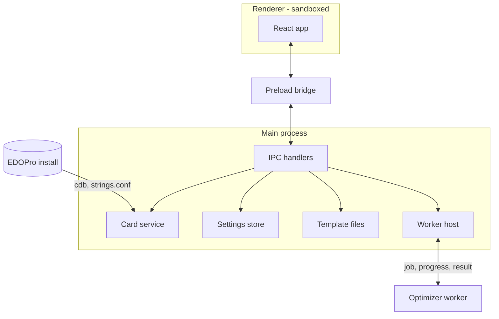

# TDD: ygo-deck-optimizer

| Status | Author | Date | Tracking | Related |
| --- | --- | --- | --- | --- |
| Draft | Andy (with Claude) | 2026-09-18 | [YGO-6](https://linear.app/ygo-deck-optimizer/issue/YGO-6/write-tdd-for-the-deck-ratio-optimizer) | [PRD](./PRD.md) |

## 1. Overview

This document specifies the technical design for the tool described in the [PRD](./PRD.md): the card-data layer, the description and criterion languages, the implication engine that is the tool's single matching relation, the hand matcher, the exact scorer, the optimizer, the Electron process architecture, storage, project layout, and testing. It is detailed for milestones M0–M2, design-level for M3, and gives pointers for M4.

Design principles, restated from the PRD:

1. **One matching relation.** A card matches a description — in a requirement or a limit — iff its line's description *logically implies* it (PRD §6). Nothing matches "because it might".
2. **Exact, not sampled.** Probabilities are exact rationals; Monte Carlo exists only as an independent test oracle (PRD §4.3).
3. **Everything that can be wrong lives in `core/`** — pure TypeScript with no Electron, Node, or DOM dependency — and is tested headlessly. The app around it is plumbing.
4. **No silent semantics.** Every rule the engine applies is surfaced by the analysis API (§9) so the UI can show it.
5. **The check is built before the thing it checks** (§15).

## 2. Stack

Lifted from [ygo-combo-solver-gui](https://github.com/96jonesa/ygo-combo-solver-gui) at the versions it runs today, minus everything that exists to drive a subprocess.

| Layer | Choice | Notes |
| --- | --- | --- |
| Shell | Electron 44 | macOS arm64 + Windows x64 |
| Language | TypeScript 7, `strict` + `noUncheckedIndexedAccess`, ESM (`"type": "module"`) | Node 22 pinned in CI (`import.meta.dirname`) |
| Build | electron-vite 5 / Vite 7 | Preload is forced to CommonJS (`format: 'cjs'`, `index.cjs`): a sandboxed preload emitted as `.mjs` fails to load *silently* — the sibling's rollup override and its `'../preload/index.cjs'` path are a pair and are lifted together |
| UI | React 18 + zustand 5, hand-written CSS | No component or CSS framework, as in the sibling |
| SQLite | sql.js (wasm) | No native module: `npmRebuild: false`, identical behavior under Electron and vitest, ubuntu-only CI for both platforms. It works with a bare `initSqlJs()` **only because it stays unbundled in the main process** (`externalizeDepsPlugin`); it is never imported from the renderer or a bundled worker |
| Tests | vitest 4, `environment: 'node'` | No jsdom; renderer logic worth testing lives in pure functions |
| Lint/format | eslint (typescript-eslint) + prettier, **run in CI** | The sibling promised these and never wired them; here eslint also enforces `core/` purity (§16) |
| CLI harness | `tsx` | Dev dependency only; not shipped |
| Packaging | electron-builder 26 | §17 |

No ORM, no app database, no telemetry, no network access at all in v1.

## 3. Process architecture



- **Renderer**: UI only — `contextIsolation: true`, `nodeIntegration: false`, `sandbox: true`, `setWindowOpenHandler` denying everything. It never touches the filesystem and never parses, compiles, or scores: every edit is sent to main and the returned `Analysis` (§9) is rendered.
- **Main** owns all Node capabilities. The **card service** holds the `CardIndex` and the setname table; parse, analyze and compile run here, synchronously — they are microseconds-to-milliseconds (no enumeration), so they do not need a worker.
- **Optimizer worker**: a Node `worker_threads` worker, created per run through electron-vite's `?nodeWorker` import. It receives a compiled `Problem` (§8) — plain numbers, no card data, no sql.js — runs §10–11, posts progress, and posts the result. Cancel is `worker.terminate()`. One run at a time; a new run cancels the previous one.

**Why `worker_threads` and not the alternatives.** A renderer Web Worker needs `worker-src`/`blob:` CSP exceptions that only fail in packaged builds, and would put engine code in the renderer; `utilityProcess` buys crash isolation that a pure-arithmetic job does not need. The worker bundle imports only `core/`, so it has no unbundled-dependency problem.

Deliberate departures from the sibling, each fixing something the survey found:

| Sibling behavior | Here |
| --- | --- |
| CSP applied only when `app.isPackaged`, so violations never show in `npm run dev` | CSP always applied; the dev variant adds only what Vite's react-refresh preamble needs (`script-src 'self' 'unsafe-inline'`), so every other violation fails in dev too |
| `registerIpc` runs per window with no `removeHandler`; a second window throws | Handlers registered once at app start |
| Card-index status is polled by the renderer | Pushed (`cards:status` event) whenever it changes |
| `search()` scans all ~14k entries per keystroke (its early exit counts prefix hits only) | Same ranking; prefix hits come from a binary-searched range of a name-sorted array, and the substring scan stops at `limit` |
| macOS auto-detect misses `~/Applications/ProjectIgnis` | Added to the candidates (it is where this machine's install lives) |

## 4. Card data

All facts in this section were read from pinned primary sources, not recalled: EDOPro client `edo9300/edopro@30935e8`, core `edo9300/ygopro-core@46779fb`, `ProjectIgnis/CardScripts@9d1d010` (`constant.lua`), `ProjectIgnis/BabelCDB@47fc046`, and a real install. Appendix A reproduces the constant tables, generated mechanically from those headers.

### 4.1 Reading a row

Schema (identical across every database examined): `datas(id, ot, alias, setcode, type, atk, def, level, race, attribute, category)` and `texts(id, name, desc, str1..str16)`, no constraints beyond the primary keys. EDOPro reads them with an **inner join** and silently skips anything malformed; so do we.

Three columns do not fit JavaScript's 32-bit bitwise operators — `setcode` (four 16-bit codes in an int64, values up to `0x1953008004110a4`), `race` (`uint64_t`; `RACE_YOKAI` is bit 62), and `type` (`TYPE_ARMOR` is bit 31). Rather than thread BigInt through the engine, **the unpacking is done in SQL**, where integers are 64-bit:

```sql
SELECT d.id, d.ot, d.alias, d.type & 0xffffffff, d.atk, d.def,
       d.level & 0xff, (d.level >> 24) & 0xff, (d.level >> 16) & 0xff,   -- level, lscale, rscale
       d.race & 0xffffffff, d.race >> 32, d.attribute,
       d.setcode & 0xffff, (d.setcode >> 16) & 0xffff, (d.setcode >> 32) & 0xffff, (d.setcode >> 48) & 0xffff,
       t.name
FROM datas d JOIN texts t ON t.id = d.id
```

Every value that reaches JavaScript is below $`2^{32}`$; bit tests are written `(x & BIT) !== 0` and masks are normalized with `>>> 0`.

| Field | Decoding | Source |
| --- | --- | --- |
| Level | `level & 0xff`; left scale `(level >> 24) & 0xff`, right scale `(level >> 16) & 0xff`; a negative raw value means `-(level & 0xff)` (code path exists, no real rows). Real data cannot catch a left/right swap — all 397 Pendulum rows are symmetric — so the byte order is pinned by a **synthetic** fixture row | `gframe/data_manager.cpp:137-153` |
| Rank / Link Rating | The same `level` column, distinguished only by `TYPE_XYZ` / `TYPE_LINK`. `evaluate` treats Level as undefined for those types even though they are outside the Main Deck population | `ocgcore/card.cpp:876-996` |
| Link `def` | Holds the link-marker mask, not DEF (EDOPro zeroes it). `evaluate` treats DEF as undefined for `TYPE_LINK` | `gframe/data_manager.cpp:140-144` |
| `?` ATK/DEF | Stored as `-2`; there is no named constant. EDOPro's numeric filters reject every negative, and so do ours — otherwise `ATK 1500 or less` returns Tragoedia | `gframe/deck_con.cpp:1204-1211` |
| Setcodes | Up to four non-zero 16-bit codes; zero slots are skipped, not terminators. **Read from the alias target when `alias != 0`**, as both client and core do — 31 alternate-art rows carry `setcode = 0` | `gframe/data_manager.cpp:127-136`, `gframe/deck_con.cpp:1325-1331`, `ocgcore/card.cpp:333` |
| Archetype match | `(q & 0xfff) == (c & 0xfff) && (q & c) == q` for query `q`, card code `c`: low 12 bits equal and the card's high nibble a **superset** of the query's — the nibble is a bitmask, not an enumerated sub-type (`0x3066` "Magnet Warrior" matches both `0x1066` and `0x2066`). Note the core's parameter order: `match_setcode(set_code, to_match)` takes the *query* first. EDOPro's own deck-editor search uses exact equality and therefore disagrees with the core; we follow the core | `ocgcore/card.h:185-187`, `ocgcore/libcard.cpp:641-645` |

### 4.2 Which rows are cards you can put in a Main Deck

A row is in the population iff all of:

- exactly one of `TYPE_MONSTER`, `TYPE_SPELL`, `TYPE_TRAP` is set (three real rows have none);
- none of `TYPE_TOKEN`, `TYPE_SKILL`, `TYPE_ACTION`;
- not Extra Deck: no `TYPE_FUSION | TYPE_SYNCHRO | TYPE_XYZ`, and not (`TYPE_LINK` and `TYPE_MONSTER`) — the source gates Link on Monster but not the others (`gframe/deck_manager.cpp:220,335-348`). Pendulum and Ritual monsters are Main Deck;
- scope: `ot != 0 && (ot & SCOPE_OFFICIAL) == ot`, where `SCOPE_OFFICIAL = OCG | TCG | PRERELEASE` is EDOPro's own definition. `ot` is a bitmask with gaps, and pre-release cards are `0x101`/`0x102`. **Pre-release cards are included by default** (a setting turns them off): theorycrafting new sets is a core use, and this is what EDOPro itself calls official. This refines the PRD's "official OCG/TCG only".

On BabelCDB@47fc046 this yields 12,252 rows before alias handling.

### 4.3 `alias` means three different things

| Kind | Real examples | Handling |
| --- | --- | --- |
| Alternate artwork | 372 non-token rows within ±10 of the target, plus **2 far ones the ±10 rule misses** (Dark Magician `36996508`, Polymerization `27847700`) | **Collapsed** onto the target. Rule: `alias != 0` and the target exists and (`\|id − alias\| < 10` — EDOPro's `CARD_ARTWORK_VERSIONS_OFFSET` — **or** same normalized name *and* identical `type/atk/def/level/race/attribute`). Checked against BabelCDB: both far rows are field-identical to their targets, and no near row differs from its target |
| Same name, different card | Black Luster Soldier `10000100`: Normal Monster, `ot = 1`, aliasing the Ritual `5405694` | **Kept** as its own record (it fails the identical-fields test), shown with a disambiguating typeline |
| "Always treated as" | 18 rows: Harpie Lady 1/2/3 and Cyber Harpie Lady → Harpie Lady; A Legendary Ocean → Umi; … | **Kept** as distinct cards with their own stats, but with `limitCode = alias`: EDOPro's 3-copy rule is `alias ? alias : code` with *no* threshold (`gframe/deck_manager.cpp:192-196`) |

`CardRecord.limitCode` is `alias || code`. Because lines are independent ranges, a joint "these lines share three copies" constraint is not expressible; `analyze` instead **rejects** a template in which lines sharing a `limitCode` have a combined `max` above 3, naming the lines. An alias whose target is missing keeps the row under its own code, as the sibling does.

### 4.4 Load order and layering

Databases are collected as the sibling does — non-empty `cards.cdb`, then `expansions/` and `repositories/` recursively, sorted — and later rows **replace** earlier rows with the same id. This matters more than it looks: one `cards.cdb` is not the card pool. On the examined install the base database is from 2025-04 and `cards.delta.cdb` replaces 879 of its rows and adds 1,027.

One documented deviation: EDOPro loads repositories in the order of its `configs.json`, we load them in sorted path order. The card service counts ids whose rows *differ* between two repositories and reports the count in its status, so a real conflict is visible rather than silent.

### 4.5 Archetype names

`strings.conf` is layered in the same order and by the same rule as EDOPro — `config/strings.conf`, then `expansions/strings.conf`, then each repository's — with later files overriding same-key entries (`gframe/data_handler.cpp:130-131`, `gframe/game.cpp:2652`). Layering is **required for correctness**, not polish: the delta repository reassigns `0x1066` from "Symphonic Warrior" to "Magnet" and `0x2066` from "Magnet Warrior" to "Warrior", so a base-only table resolves `"Magnet Warrior"` to the wrong code.

Line format, per the client's parser (`gframe/data_manager.cpp:229-266`): lines not starting with `!` are ignored; `!setname <hex> <rest of line>`, single-space delimited, name may contain spaces; malformed lines are skipped silently. A name may hold `|`-separated alternates (`!setname 0x46 Polymerization|Fusion`), each of which resolves to the code. A quoted archetype in a description resolves by normalized exact match over all alternates; no match, or a match to several codes, is a parse error listing candidates. If no `strings.conf` is found, archetype descriptions are unavailable and the status says so (PRD §11).

### 4.6 `CardRecord` and `CardIndex`

```ts
// src/core/cards/record.ts
export interface CardRecord {
  code: number; name: string; limitCode: number;
  ot: number; type: number;
  atk: number; def: number;            // -2 = "?"
  level: number; lscale: number; rscale: number;
  race: number; raceHi: number; attribute: number;
  setcodes: number[];                  // already resolved through the alias
}
```

`CardIndex.fromDatabases(SQL, bytes: Uint8Array[], opts)` lives in `core/` and takes an injected sql.js instance and raw file contents; the filesystem walk stays in main (`src/main/edopro/loader.ts`) and the CLI. It exposes `get(code)`, `search(query, limit)` (the sibling's diacritic/case-insensitive prefix-then-substring ranking), `count(desc)` / `sample(desc, n)` for the parse echo, and `status`.

Vocabulary tables (English names for Types, Attributes, sub-kinds, with synonyms) are hand-written beside the transcribed constants and tested for **totality**: every official `RACE_*` (bits 0–25, per `constant.lua`'s `RACE_ALL = 0x3ffffff`) and every `ATTRIBUTE_*` has exactly one canonical name. `race` is not a Type for `TYPE_SKILL` rows; those are outside the population.

## 5. Descriptions

### 5.1 Text grammar

Free text is an input method; the AST (§5.2) is the source of truth. Lexing is case-insensitive and treats hyphens and runs of spaces alike (`beast warrior` = `Beast-Warrior`, `quickplay` = `quick-play`). Multi-word vocabulary is matched longest-first (`Winged Beast` before `Beast`; `or lower` before `or`).

```
description := alternative ( "or" alternative )*
alternative := "(" description ")" | cardRef | groupRef | clause
clause      := qualifier* kindWord?              -- at least one of the two
kindWord    := "monster" | "spell" | "trap" | "card"
qualifier   := ["non-"] monsterFlag
             | ["non-"] valueList                -- attributes or Types
             | stSubkind
             | "level" levelSpec
             | statSpec
             | QUOTED                            -- archetype, e.g. "Sky Striker"
valueList   := VALUE ( "/" VALUE )*              -- FIRE/WATER, Warrior/Beast-Warrior
levelSpec   := INT ( "or lower" | "or higher" | "-" INT | ( "/" INT )+ )?
statSpec    := ("ATK"|"DEF") ( INT ( "or less" | "or more" )? | "?" )
             | INT ( "or less" | "or more" )? ("ATK"|"DEF")
cardRef     := "[" card name "]" | "#" PASSCODE
groupRef    := "{" group name "}"
```

Decisions:

- **`or` separates whole descriptions; `/` separates values inside one dimension.** `FIRE/WATER monster` is one clause; `level 4 or level 3 FIRE monster` is two clauses, the first of which says nothing about Attribute — and the parse echo shows exactly that. This removes the classic ambiguity without precedence rules.
- **Card names are always delimited.** Real names contain `or`, `and`, commas and digits (`Nibiru, the Primal Being`), so bare names are not parseable. In the app, cards and groups are inserted as chips through the picker and carry a passcode; the bracket forms exist for the CLI harness, tests, and pasted text. `[Name]` resolves by exact normalized-name match; zero or several matches is an error listing candidates.
- **Contextual words.** `normal`, `ritual` and `continuous` mean different things by kind. With a kind word they resolve (`normal spell` = a Spell with no sub-kind bits; `normal monster` = the Normal flag). Without one: `quick-play`, `equip`, `field` imply Spell; `counter` implies Trap; `continuous` means Spell-or-Trap; bare `normal` or `ritual` is an error asking "normal what?".
- **Negation is atomic only** — `non-tuner`, `non-FIRE`, `non-Warrior`, `non-effect`. There is no negation of whole descriptions, which keeps every description a finite union of boxes (§6.1).
- Not in the MVP vocabulary: Pendulum Scale, Link/Xyz/Synchro/Fusion anything (Extra Deck, out of scope), effect-text properties (unavailable; use groups).

### 5.2 AST

```ts
// src/core/desc/ast.ts
export type Description = { anyOf: Alternative[] };           // ≥ 1
export type Alternative =
  | { t: 'card'; passcode: number }
  | { t: 'group'; groupId: string }
  | { t: 'clause'; clause: Clause };

export interface Clause {
  kinds?: Kind[];                         // omitted = any
  flags?: Partial<Record<MonsterFlag, boolean>>; // true = required, false = "non-"
  stSubkinds?: StSubkind[];               // normal | quick-play | continuous | equip | field | ritual | counter
  attributes?: { in: Attribute[] } | { notIn: Attribute[] };
  races?: { in: Race[] } | { notIn: Race[] };
  level?: IntSet;                         // explicit set within 0..13
  atk?: Stat; def?: Stat;                 // { min, max } inclusive, or '?'; "?" (-2) never satisfies a range
  archetypes?: number[];                  // setcodes, all required
}
```

`print(parse(text))` is canonical; `parse(print(ast))` must equal `ast` (property test, §15). Template files store the AST plus the user's original text (§14).

### 5.3 Evaluating a description against a concrete card

`evaluate(desc, card: CardRecord, groups): boolean` is the obvious field test and is used for exactly three things: named-card lines (§6.3), the match count and samples shown in the parse echo, and the test oracles. Archetype membership uses the engine's own set-card comparison (§4). It is never used to decide what a *generic* line matches.

## 6. Implication

`implies(L, q)` is the single matching relation (principle 1). It is **logical** — a function of the two descriptions and fixed game-rule axioms, never of the card pool (PRD §6.2).

### 6.1 The model: a disjoint union of three product spaces

A Main Deck card is exactly one of:

| Kind | Dimensions |
| --- | --- |
| Monster | each `MonsterFlag` (bool) × Attribute × Type × Level × ATK × DEF × one bool per archetype mentioned in the problem |
| Spell | Spell sub-kind × archetype bools |
| Trap | Trap sub-kind × archetype bools |

A **box** is a product of per-dimension allowed sets within one kind. Every clause normalizes to at most three boxes (one per kind it admits), and every description to a finite union of boxes. Normalization is where the game-rule axioms live, and they are the *only* axioms:

1. A **positive** constraint on a monster-only dimension (flag required, Attribute, Type, Level, ATK, DEF) empties the clause's Spell and Trap boxes — "anything with a Level is a monster".
2. A **negative** constraint on a monster-only dimension (`non-tuner`, `non-FIRE`) leaves Spell and Trap boxes full — a Spell is trivially a non-Tuner.
3. A Spell/Trap sub-kind constraint empties the Monster box and the box of the other kind where the sub-kind does not exist (`counter` ⇒ Trap, `quick-play` ⇒ Spell).
4. Requiring a sub-archetype also requires its base archetype, per the set-card comparison of §4.
5. ATK and DEF domains are the non-negative integers plus the distinguished value `?`; a numeric range never contains `?`.

Modeling the universe as a *union* of kind-specific spaces, rather than one flat product, is what makes `spell ⇒ non-tuner` hold without a special case, and is the reason the relation is complete as well as sound for this vocabulary.

### 6.2 The algorithm: box subtraction

$`L \Rightarrow q`$ iff $`\mathrm{boxes}(L) \setminus \mathrm{boxes}(q) = \emptyset`$. Subtracting one box from another yields at most one box per dimension (the standard sweep: peel off the part of $`A`$ outside $`B`$ along dimension 1, restrict to $`B`$'s slice, continue along dimension 2, …). Subtract each box of $`q`$ in turn from the working set that starts as $`\mathrm{boxes}(L)`$; if the set empties, the implication holds. This is exact — it proves `level 1-6 monster ⇒ level 1-3 monster or level 4-6 monster`, which clause-by-clause containment would miss — and instances are tiny (≤ ~10 dimensions, a handful of boxes).

Cards and groups are points, not boxes, and are handled before the box machinery:

| $`L`$ | $`q`$ | $`L \Rightarrow q`$ |
| --- | --- | --- |
| card $`c`$ | anything | `evaluate(q, c)` — a named card is fully known (PRD §6.1.4) |
| group $`G`$ | anything | every member of $`G`$ satisfies `evaluate(q, ·)` |
| generic | card or group | never — a generic line means cards *other than* the template's named cards |
| mixed `anyOf` | — | every alternative of $`L`$ must imply $`q`$; an alternative implies $`q`$ if it implies the union of $`q`$'s alternatives (points checked pointwise, boxes by subtraction against $`q`$'s boxes) |

The remainder line is the full universe (three full boxes). It implies only descriptions that are themselves the full universe, i.e. `card`.

### 6.3 Why not decide it against the database

An extensional test ("every card in the pool matching $`L`$ also matches $`q`$") would be shorter to write and is deliberately rejected: it would let `level 12 LIGHT Fairy monster` fill `ATK 3000 or more` on the accident of today's card pool, and results would shift when the database updates (PRD §6.2). The database is instead the implication engine's **test oracle** (§15): a logical implication the card pool contradicts is a bug in an axiom.

## 7. Criteria

### 7.1 Text grammar and AST

```
criterion   := orExpr
orExpr      := andExpr ( "or" andExpr )*
andExpr     := term ( ( "and" | "," ) term )*
term        := "(" orExpr ")" | requirement | limit
requirement := COUNT description                 -- COUNT := INT "x"
limit       := "at most" COUNT description | "no" description
```

The two `or`s (PRD §5.3) are separated with one token of lookahead: after `or`, a `COUNT`, `at most`, `no`, or `(`-followed-by-one-of-those starts a new *term* (criterion-level); anything else continues the *description*. So `1x [C] or 2x [D]` is a criterion-level choice, `1x [C] or [E]` is one slot either card can fill, and `1x ([C] or [E])` says the latter explicitly. In the app the criterion structure is built from rows and groups, not typed; the text form is the canonical serialization used by the CLI harness, tests, and copy/paste.

```ts
// src/core/criteria/ast.ts
export type Expr =
  | { op: 'and' | 'or'; args: Expr[] }
  | { op: 'req'; n: number; desc: Description }
  | { op: 'atMost'; n: number; desc: Description };   // "no X" = atMost 0

export interface FlatCriterion { reqs: { n: number; desc: Description }[]; limits: { n: number; desc: Description }[] }
```

### 7.2 Expansion

`expand(expr): FlatCriterion[]` distributes `and` over `or` (PRD §5.3). The template's list of criteria is an `or` at the root, so the engine receives one list of flat criteria. Guards: a flat criterion whose requirement slots exceed the hand size is dropped as unsatisfiable (with a warning if *every* alternative is dropped); duplicate flat criteria are removed; expansion aborts with a clear error above **256** flat criteria.

Subsumption (PRD §8.3): flat criterion $`A`$ is subsumed by $`B`$ when any hand satisfying $`A`$ satisfies $`B`$. The tool detects the sufficient condition that is cheap and common — $`B`$'s requirements inject into $`A`$'s with each $`A`$-slot description implying its $`B`$-slot's, and every limit of $`B`$ is implied by a limit of $`A`$ — and reports it as a notice. Subsumed criteria are still evaluated; this is advice, not an optimization the results depend on.

## 8. From template to problem

`compile(template, cards, groups): Problem` resolves everything symbolic once, so that scoring never touches a description again.

```ts
// src/core/model/problem.ts
export interface Problem {
  deckSize: number;                 // N
  handSizes: { H: number; weight: number }[];   // [{5,1}] or a first/second blend
  classes: ClassInfo[];             // index 0 is always the blank class
  criteria: CompiledCriterion[];    // flat
}
export interface ClassInfo { lineIds: string[]; min: number; max: number }   // range of the class total
export interface CompiledCriterion {
  slots: number[];                  // one bitmask of classes per requirement slot (n× expanded to n slots)
  limits: { mask: number; n: number }[];
}
```

Steps:

1. **Match matrix.** For every line (plus the remainder) and every distinct description appearing in any flat criterion, compute `implies(line, desc)`.
2. **Classes.** Lines with identical rows in the match matrix are interchangeable for scoring and merge into one class whose count is the sum of theirs; the class range is the sum of the line ranges (integer intervals sum to an integer interval). Lines with an all-false row are *irrelevant* (PRD §5.6) and merge with the remainder into the **blank** class. Class count is capped at 30 so masks fit a 32-bit integer; exceeding it is a clear error.
3. **Slots and limits** become class bitmasks.

## 9. Analysis API

`analyze(template, cards, groups): Analysis` is what makes the semantics visible (principle 4). It is pure, fast (no enumeration), and re-run on every edit:

| Field | Content |
| --- | --- |
| per line | parse echo, database match count and samples, errors (unknown word, no matches, `max` above 3 for a named card, several lines sharing a name-alias group whose combined `max` exceeds 3) |
| per requirement | lines that fill it; **near misses** — lines whose description is *compatible* with the requirement but does not imply it, each with the first dimension that is unstated (`monster`: Level unstated), and the text of the line that would (`level 4 or lower monster`) for the one-click split (PRD §6.4) |
| per limit | lines it counts; under-specified lines it ignores, with their total range (the "ignores 13–33 unspecified cards" notice, PRD §6.3–6.4) |
| criteria | expansion preview, subsumption notices, never-satisfiable warnings, cards named in criteria but absent from the template |
| totals | derived read-only totals by kind; remainder range; an error if the ranges cannot sum to $`N`$ |
| work | number of raw ratios, number of scored class vectors, size of the success set, and an ETA from a calibrated per-term cost |

"Compatible" for near misses is box intersection being non-empty — the only place that relation is used, and only to produce advice.

## 10. Probability engine

### 10.1 Hand matcher

A hand is a composition $`h = (h_c)`$ over classes with $`\sum_c h_c = H`$. For a flat criterion with slot set $`S`$, where slot $`s`$ can be filled by the classes in $`F(s)`$:

- **Requirements** are a transportation-feasibility problem (class $`c`$ supplies $`h_c`$ cards, every slot demands one). By Hall's theorem it is feasible iff

```math
\forall\, T \subseteq S:\quad \sum_{c \,\in\, \bigcup_{s \in T} F(s)} h_c \;\ge\; |T|
```

  With $`|S| \le H \le 6`$ that is at most 64 subset checks of mask-and-popcount arithmetic — exact, branch-light, and trivially testable against brute-force assignment.
- **Limits** are counts over the whole hand: $`\sum_{c \in \text{mask}} h_c \le n`$.

The hand succeeds if any flat criterion has its requirements feasible and all its limits satisfied.

### 10.2 Success set

`successSet(problem, H): Composition[]` enumerates compositions of the **non-blank** classes with total $`\le H`$ (the blank count is the remainder), keeps the successful ones, and stores them as small integer arrays. There are $`\binom{H + k - 1}{H}`$ compositions for $`k`$ classes including blank (2,002 for $`k = 10,\ H = 5`$; 42,504 for $`k = 20`$). If the successful set is larger than its complement, the complement is stored instead and the scorer returns one minus the sum. This runs **once per problem and hand size**, never per deck (PRD §4.3).

### 10.3 Scorer

```math
P(n) = \frac{1}{\binom{N}{H}} \sum_{h \in \mathcal{S}} \prod_{c} \binom{n_c}{h_c}
```

- Binomials come from a table $`\binom{n}{r}`$ for $`n \le 60,\ r \le 6`$.
- **The numerator is an exact integer in a float64.** Each product is at most $`\binom{N}{H}`$ (it counts a subset of the hands), and the whole sum is at most $`\binom{N}{H} \le \binom{60}{6} = 50{,}063{,}860`$, far below $`2^{53}`$. So the scorer returns `{ num, den }` with no rounding anywhere and no BigInt; decimals are formatted only for display. Two ratios tie iff their numerators are equal — no epsilon comparisons in ranking.
- A first/second blend is $`w P_5 + (1-w) P_6`$ over the two exact fractions.
- Per-criterion probabilities use per-criterion success sets and are computed only for rows that are displayed.

### 10.4 Monte Carlo oracle

`src/core/prob/montecarlo.ts` builds a concrete deck of $`N`$ card objects tagged with their **line** (not class), draws hands by partial Fisher–Yates with a seeded PRNG, and decides success by brute-force assignment of cards to slots using the *match matrix rows of lines*. It deliberately shares no code with classes, masks, Hall's condition, the success set, or the binomial table. It is a test oracle and the future engine for non-hypergeometric features (PRD §9); it is not reachable from the app in v1.

## 11. Optimizer

### 11.1 Search space

Raw decisions are the line counts $`n_i \in [\min_i, \max_i]`$ with the remainder $`r = N - \sum_i n_i`$ inside its own range. The score depends only on **class totals**, so the optimizer enumerates class-total vectors $`t = (t_c)`$ with $`t_c`$ in the class range and $`\sum_c t_c = N`$, by depth-first search over the non-blank classes with the blank class absorbing the difference (pruned when the remaining classes cannot reach or must overshoot $`N`$). Every raw ratio that maps to the same $`t`$ is an exact tie and is never scored separately.

For the motivating example (taking card A to be a Level 4 monster and card B a Normal Spell, as in PRD §6.2): the 7 lines allow 4 · 4 · 1 · 2 · 4 · 8 · 4 = 4,096 raw ratios, but the criteria can only tell five classes apart — `card A`, `card B`, `level 4 monster`, {`monster`, `level 7 FIRE beast-warrior monster`} merged (both fill `1x monster` and nothing else), and blank (`spell`, `normal spell`, remainder). That is 4 · 4 · 2 · 4 = 128 scored vectors.

### 11.2 Outputs, all from one pass

| Output | How |
| --- | --- |
| Ranked table | Bounded max-heap of the top $`K`$ class vectors (default 200) by exact numerator |
| Plateau | All vectors within $`\delta`$ of the running best, in a side buffer pruned whenever the best improves; capped (default 10,000) with a "plateau truncated" flag |
| Sweep, others re-optimized | `best[line][count]` table: for each scored vector and each line $`i`$ in class $`c`$, the counts $`v`$ compatible with $`t_c`$ form the interval $`[\max(\min_i,\ t_c - \sum_{j \ne i} \max_j),\ \min(\max_i,\ t_c - \sum_{j \ne i} \min_j)]`$; update those cells. Every line's sweep is therefore free |
| Sweep, others held fixed | Direct scoring of at most four decks; no search |
| Expansion to line ratios | A class vector expands to its raw ratios on demand for display: "3 copies among `level 4 monster`, `level 4 FIRE monster` — any split", enumerated up to a cap |

### 11.3 Cost, progress, cancellation

Work is (scored vectors) × (success-set size) multiply-adds; `analyze` reports both before the run, with an ETA from a per-term cost calibrated once at startup. There is no hidden cap: the UI shows the estimate and lets the user run, narrow ranges, or cancel. The optimizer reports `{ done, total, elapsedMs, etaMs }` through a callback at most every 100 ms (the CLI harness prints it to stderr, flushed), and checks a cancellation flag at the same cadence. `total` is exact — the vector count is computed up front by a counting DP over class ranges.

The enumeration is shardable by the first class's value, so a multi-worker fan-out is a later drop-in; v1 runs one worker. A prefix-sharing trie over the success set (so partial products are reused across sibling vectors in the DFS) is the known next optimization; it is **not** built until measurement says it is needed.

## 12. IPC contract

Defined once in `src/shared/ipc.ts` as a channel-name constant plus a `RendererApi` interface that the preload implements and `window.api` exposes — the sibling's pattern, lifted as is. All payloads are structured-cloneable plain objects; the renderer never receives a path to write.

| Channel | Direction | Shape |
| --- | --- | --- |
| `settings:get` / `settings:set` | invoke | `Settings` (§13) |
| `workdir:probe` | invoke | `path → WorkdirHealth` |
| `dialog:pickDirectory` | invoke | `→ path \| null` |
| `cards:status` | invoke **and** main→renderer push | `{ state, databases, cards, setnames, conflicts, error? }` |
| `cards:reindex` | invoke | `→ void` (status follows by push) |
| `cards:search` | invoke | `{ query, limit } → CardHit[]` (`passcode, name, typeline`) |
| `cards:get` | invoke | `passcode[] → CardInfo[]` (display fields for chips and snapshots) |
| `desc:parse` | invoke | `text → { ok: true, desc, echo, count, samples } \| { ok: false, message, span }` |
| `template:analyze` | invoke | `Template → Analysis` (§9) |
| `run:start` / `run:cancel` | invoke | `{ template, options } → runId` / `runId → void` |
| `run:event` | main→renderer push | `{ runId, progress? , result?, error? }` |
| `template:open` / `template:save` | invoke | dialogs and file I/O in main; `→ Template \| null` / `Template → path \| null` |
| `results:export` | invoke | `{ runId, format: 'csv' \| 'json' } → path \| null` |

`template:analyze` is called on every edit (debounced ~150 ms in the renderer). Responses carry the request's sequence number and the renderer drops stale ones.

## 13. Settings

`settings.json` under `app.getPath('userData')`, versioned, written write-then-rename (the sibling's `SettingsStore`, lifted):

```json
{ "version": 1, "workdir": "/Users/me/Applications/ProjectIgnis", "includePrerelease": true, "plateauDelta": 0.005 }
```

There is no run history in v1: a run's inputs are the template file, and its outputs are exportable. Auto-detection tries `C:\ProjectIgnis`, `C:\Games\ProjectIgnis` on Windows and `~/ProjectIgnis`, `~/Applications/ProjectIgnis`, `/Applications/ProjectIgnis` on macOS before asking. The probe validates exactly what this tool needs — at least one non-empty `.cdb` — and *reports* (without failing on) a missing `strings.conf`; the sibling's script-root and executable checks are dropped.

## 14. Template file

Plain JSON, `version`ed, written only by the main process (§12).

```json
{
  "version": 1,
  "deckSize": 40,
  "hand": { "size": 5 },
  "groups": [
    { "id": "g1", "name": "starter", "cards": [{ "passcode": 14558127, "name": "Ash Blossom & Joyous Spring" }] }
  ],
  "lines": [
    { "id": "l1", "card": { "passcode": 14558127, "name": "Ash Blossom & Joyous Spring" }, "min": 0, "max": 3 },
    { "id": "l2", "text": "level 4 monster", "desc": { "anyOf": [] }, "min": 2, "max": 3 }
  ],
  "remainder": { "min": 0, "max": null },
  "criteria": [{ "id": "c1", "name": "full combo", "text": "1x [..] and 1x [..]", "expr": { "op": "and", "args": [] } }],
  "cardSnapshot": { "14558127": { "type": 4129, "attribute": 4, "race": 256, "level": 3, "atk": 0, "def": 1800, "setcodes": [] } }
}
```

- **The AST is authoritative; text is kept for editing.** On load, if re-parsing `text` no longer yields `desc` (the grammar evolved), the file still means what it meant, and the editor flags the line.
- **`cardSnapshot`** records the fields of every named card as they were when the file was saved. Results depend on the card database *only* through named cards, so this is what makes "a template file reproduces the same numbers on another machine" (PRD §14) checkable: on load, a named card that is missing from the local database or whose fields differ produces a notice, and the user chooses local data or the snapshot.
- Unknown `version` → refuse with a clear message; older versions migrate forward in `src/core/model/migrate.ts`.

## 15. Testing strategy

### 15.1 Oracles

Each novel layer gets an oracle that is independent of it, and the oracle is written first.

| Layer | Oracle |
| --- | --- |
| Constant tables | `constants.ts` is transcribed **whole** from the pinned headers (Appendix A), never from memory or from this document. A pin test asserts a handful of literals per table (`TYPE_LINK = 0x4000000`, `RACE_BEASTWARRIOR = 0x8000`, `RACE_ILLUSION = 0x2000000`, `ATTRIBUTE_DIVINE = 0x40`, `SCOPE_PRERELEASE = 0x100`) and the table sizes (26 core types, 7 attributes, 26 official races) |
| Row decoding | Synthetic fixture rows built to break each trap of §4.1: an **asymmetric** Pendulum (`lscale ≠ rscale` — real data cannot catch a swap), a four-setcode row with the high bit of the int64 set, an alt-art row with `setcode = 0`, a `?`-ATK monster, a Link monster whose `def` would satisfy `DEF 200 or less`, an Xyz whose Rank would satisfy `level 4`, a far alt-art, a same-name-different-card alias, a "treated as" alias, a pre-release row, a Rush row with a race above bit 31 |
| Parser and printer | Golden cases per vocabulary dimension and per contextual word; property test `parse(print(ast)) = ast` over generated ASTs |
| `evaluate` | Golden cases against the fixture; archetype matching pinned with the `0x1066 / 0x2066 / 0x3066` triple |
| Implication | (1) **Soundness against the database**: for generated pairs, whenever `implies(L, q)`, every fixture card satisfying `L` satisfies `q`. (2) **Completeness, tested as deliberately** (PRD §11 — a weak relation overstates limit-bearing criteria): hand-written must-imply cases for every dimension and combinator, including `spell ⇒ non-tuner`, the split-range case of §6.2, and sub-archetype ⇒ archetype. (3) Must-not-imply cases, headed by `monster ⇏ level 4 or lower monster` |
| Expansion | `expand` vs a direct recursive evaluator of the expression tree that tries every branch choice and every assignment, on generated expressions and hands |
| Hand matcher | Hall's condition vs brute-force assignment, exhaustively for small class counts |
| Scorer | Closed-form anchors (3 copies in 40, 5 drawn: $`1 - \binom{37}{5}/\binom{40}{5}`$, numerator exactly 222,111 of 658,008); **differential test against the Monte Carlo oracle** of §10.4 over generated problems, agreeing within 5 standard errors, with fixed seeds so the test is deterministic; complement storage must not change any numerator |
| Lower bound | PRD §10's property test, scoped as PRD §6.3 requires: limit-free criteria never report above the true odds of a concrete fill; an adversarial fill under a limit must come out lower |
| Optimizer | Class-vector enumeration vs naive score-every-raw-ratio on small templates: same best numerator, same tie sets, same sweep tables; the counting DP's `total` equals the number of vectors visited |
| Real data (opt-in) | When `EDOPRO_WORKDIR` or `BABELCDB_PATH` is set, integration tests assert the sanity facts of §4 (population count for the pinned BabelCDB commit, one race bit and one attribute bit per official monster, the four Pendulum decodings, the three alias kinds). Skipped in CI; run locally before touching `core/cards` |

### 15.2 Structure

Tests mirror sources in a parallel tree (`src/core/desc/implies.ts` → `tests/core/desc/implies.test.ts`). One top-level `describe` per exported class or free function, named after it; a method's tests nest inside its class's group; lifecycle tests and tests spanning several functions sit at class or file scope, never under one method's group; hierarchy comes from nesting, never from inheritance. Shared builders live at file scope or in `tests/helpers/`. Test databases are **built in-test with sql.js from a TypeScript table** (`tests/helpers/fixture-cards.ts`), as the sibling's `carddb.test.ts` does — reviewable in a diff, unlike a binary `.cdb`. Doubles are hand-written classes behind narrow injected interfaces.

## 16. Project structure

```
src/
  core/                       # pure TS: no electron, no node:, no DOM
    cards/    constants.ts  record.ts  index.ts  setnames.ts  vocabulary.ts
    desc/     ast.ts  lexer.ts  parser.ts  print.ts  evaluate.ts  boxes.ts  implies.ts
    criteria/ ast.ts  parser.ts  print.ts  expand.ts
    model/    template.ts  migrate.ts  problem.ts  compile.ts  analyze.ts
    prob/     binomial.ts  matcher.ts  success-set.ts  scorer.ts  montecarlo.ts
    opt/      enumerate.ts  optimizer.ts  progress.ts
  main/
    index.ts                  # lifecycle, window, CSP, IPC registration (once)
    edopro/   probe.ts  loader.ts          # fs walk -> bytes for core
    services/ cards.ts  runs.ts  templates.ts
    store/    settings.ts
  worker/     optimizer.worker.ts          # imports core only
  preload/    index.ts                     # emitted as index.cjs
  renderer/   index.html  src/{app.tsx, store.ts, views/*, styles.css}
  shared/     ipc.ts  types.ts
  cli/        index.ts                     # dev harness, not shipped
tests/        # mirrors src/
scripts/      check-licenses.mjs  third-party-notices.mjs
```

`core/` purity is enforced twice: its own `tsconfig.core.json` compiles with `lib: ["ES2022"]` and `types: []` (no DOM, no Node globals), and an eslint `no-restricted-imports` rule bans `electron`, `node:*`, and anything outside `core/` from inside it. sql.js reaches `core/cards/index.ts` as an injected instance, so `core/` never calls `initSqlJs()` itself.

## 17. Packaging, CI, licensing

- **electron-builder**: `files: [out/**, package.json, LICENSE, THIRD-PARTY-NOTICES.txt]`, `npmRebuild: false`, `publish: null`; mac `dmg` arm64, win `nsis` x64. No `extraResources` and no `asarUnpack` — sql.js's wasm is read transparently from inside the asar. An app icon is added (the sibling ships Electron's default).
- **Signing is new work, not a lift.** The sibling builds unsigned (`identity: null`; its notarization is an open issue), so the PRD's "sibling's signing setup" does not exist — corrected in the PRD by this change. Signing, notarization, and the distribution channel (F2, YGO-8) are all M4.
- **CI** (ubuntu, every PR and `main`): `npm ci` → lint → typecheck (all tsconfigs) → test → build → **license check**. Packaging runs on tags only (M4).
- **License check**: `scripts/check-licenses.mjs` walks the installed tree and fails on any license outside an **allowlist** (MIT, ISC, BSD-2/3-Clause, Apache-2.0, BlueOak-1.0.0, 0BSD, CC0-1.0, Python-2.0, CC-BY-4.0, WTFPL) — an allowlist, because a denylist passes anything it has not heard of. `third-party-notices.mjs` generates the notices file from production dependencies at package time (PRD §4.4). `package.json` is `"private": true`, `"license": "UNLICENSED"`.

## 18. Milestone slices

One PR per slice, stacked (a registered GitHub stack) where consecutive slices touch the same files. Each slice lands with its oracle from §15 and keeps the README current.

| Slice | Contents |
| --- | --- |
| M0a | Scaffold lift: electron-vite, tsconfigs incl. `tsconfig.core.json`, eslint + prettier, vitest, CI with license check, `LICENSE`, README, empty window |
| M0b | `core/cards`: constants (transcribed + pin tests), `CardRecord`, SQL-side decoding, population filter, alias handling, `CardIndex`, setnames, vocabulary; fixture-card helper; opt-in real-data tests |
| M0c | `core/desc`: lexer, parser, printer, `evaluate` |
| M0d | `core/desc`: boxes and `implies`, with the soundness and completeness oracles |
| M0e | `core/criteria`: parser, printer, `expand`, subsumption |
| M0f | `core/prob/montecarlo.ts` and a minimal `compile`; CLI `estimate` over the motivating example against a real install — the M0 exit criterion |
| M1a | `binomial`, `matcher`, `success-set`, `scorer`; closed-form anchors and the differential gate |
| M1b | `compile` in full (classes, masks) and `analyze` |
| M1c | `enumerate`, `optimizer`, progress and cancel; CLI `optimize`; optimizer-vs-naive oracle; lower-bound property test |
| M2a | Main: probe, loader, settings, card service, IPC registered once, CSP in dev and packaged |
| M2b | Worker host and `run:*` events |
| M2c | Renderer shell, first-run setup, card picker |
| M2d | Template editor: lines, groups, parse echo, remainder and totals |
| M2e | Criteria editor: rows, nested OR groups, expansion preview, filled-by / near-miss / limit readouts |
| M2f | Results: ranked table, plateau, sweep chart, per-criterion breakdown |
| M2g | Template open/save with `cardSnapshot`; CSV/JSON export |

M3 and M4 are sliced when M2 is in hand.

## 19. Risks and open items

| Item | Handling |
| --- | --- |
| Box model misses a game-rule axiom (implication too weak) | Completeness cases per dimension (§15.1); near-miss readout makes a missed implication visible to the user as "not specific enough" on a line that plainly is |
| An axiom is wrong (implication too strong) | Soundness oracle against the fixture and, opt-in, the real database |
| Repositories loaded in sorted rather than `configs.json` order | Conflict count surfaced in card status (§4.4); revisit if a real install shows a non-zero count |
| Normal/Effect and other monster flags treated as independent dimensions | Sound by construction (no axiom claimed); costs at most a missed implication nobody writes (`effect ⇒ non-normal`) |
| `?nodeWorker` bundling or asar path resolution for the worker | Proven in M2b before the UI depends on it; fallback is an explicit second rollup input for the worker |
| Scored-vector count explodes on very wide templates | Exact count and ETA shown before the run; cancel; shard-ready enumeration; prefix-sharing trie held in reserve (§11.3) |
| Class cap of 30 | A template with more than 30 *distinguishable* classes is far outside the use case; clear error rather than silent BigInt slow path |
| `strings.conf` alternates or overrides change a name's meaning between installs | Archetypes are stored in template files as setcodes, not names; the name is display only |

## Appendix A. Constant tables

Generated mechanically (`grep '^#define …'`) from `edo9300/edopro@30935e847165a9ef0e547fb51a43f36168fab7c7` and its `ocgcore` submodule `edo9300/ygopro-core@46779fbe40e6a9bd8967f5dc6a03f4eaa6550d57`. **Informative only**: `constants.ts` is transcribed from those files at those commits, not from this appendix.

Things the tables do not say on their own:

- `TYPE_SKILL` and `TYPE_ACTION` are defined by the client, not the core; `TYPE_PLUS`, `TYPE_MINUS`, `TYPE_ARMOR` (`0x20000000`–`0x80000000`) exist only in CardScripts' `constant.lua`. Bit `0x8` is unassigned, and `TYPE_TRAPMONSTER` never occurs in a card row.
- Official Types are `RACE_WARRIOR`…`RACE_ILLUSION` (bits 0–25); `RACE_CYBORG` onward are Rush or unofficial. The C `RACE_ALL` covers all of them, while `constant.lua` defines `RACE_ALL = 0x3ffffff` (official only) — the two sources disagree and we use neither constant.
- `SCOPE_*` is a bitmask with gaps (`0x80`, `0x800` unassigned); `SCOPE_LEGEND` and `SCOPE_HIDDEN` are flags OR'd onto other scopes.
- `LINK_MARKER_*` in the same header are **octal** literals (`0010` = 8). They are not needed here and are deliberately not transcribed.

```c
// ocgcore/ocgapi_constants.h — TYPE_*
#define TYPE_MONSTER     0x1
#define TYPE_SPELL       0x2
#define TYPE_TRAP        0x4
#define TYPE_NORMAL      0x10
#define TYPE_EFFECT      0x20
#define TYPE_FUSION      0x40
#define TYPE_RITUAL      0x80
#define TYPE_TRAPMONSTER 0x100
#define TYPE_SPIRIT      0x200
#define TYPE_UNION       0x400
#define TYPE_GEMINI      0x800
#define TYPE_TUNER       0x1000
#define TYPE_SYNCHRO     0x2000
#define TYPE_TOKEN       0x4000
#define TYPE_MAXIMUM     0x8000
#define TYPE_QUICKPLAY   0x10000
#define TYPE_CONTINUOUS  0x20000
#define TYPE_EQUIP       0x40000
#define TYPE_FIELD       0x80000
#define TYPE_COUNTER     0x100000
#define TYPE_FLIP        0x200000
#define TYPE_TOON        0x400000
#define TYPE_XYZ         0x800000
#define TYPE_PENDULUM    0x1000000
#define TYPE_SPSUMMON    0x2000000
#define TYPE_LINK        0x4000000
```

```c
// gframe/data_manager.h — TYPE_* defined by the client only
#define TYPE_SKILL       0x8000000
#define TYPE_ACTION      0x10000000
```

```c
// ocgcore/ocgapi_constants.h — ATTRIBUTE_*
#define ATTRIBUTE_EARTH  0x01
#define ATTRIBUTE_WATER  0x02
#define ATTRIBUTE_FIRE   0x04
#define ATTRIBUTE_WIND   0x08
#define ATTRIBUTE_LIGHT  0x10
#define ATTRIBUTE_DARK   0x20
#define ATTRIBUTE_DIVINE 0x40
#define ATTRIBUTE_ALL    (ATTRIBUTE_DARK | ATTRIBUTE_DIVINE | ATTRIBUTE_EARTH | ATTRIBUTE_FIRE | ATTRIBUTE_LIGHT | ATTRIBUTE_WATER | ATTRIBUTE_WIND)
```

```c
// ocgcore/ocgapi_constants.h — RACE_*
#define RACE_WARRIOR      0x1
#define RACE_SPELLCASTER  0x2
#define RACE_FAIRY        0x4
#define RACE_FIEND        0x8
#define RACE_ZOMBIE       0x10
#define RACE_MACHINE      0x20
#define RACE_AQUA         0x40
#define RACE_PYRO         0x80
#define RACE_ROCK         0x100
#define RACE_WINGEDBEAST  0x200
#define RACE_PLANT        0x400
#define RACE_INSECT       0x800
#define RACE_THUNDER      0x1000
#define RACE_DRAGON       0x2000
#define RACE_BEAST        0x4000
#define RACE_BEASTWARRIOR 0x8000
#define RACE_DINOSAUR     0x10000
#define RACE_FISH         0x20000
#define RACE_SEASERPENT   0x40000
#define RACE_REPTILE      0x80000
#define RACE_PSYCHIC      0x100000
#define RACE_DIVINE       0x200000
#define RACE_CREATORGOD   0x400000
#define RACE_WYRM         0x800000
#define RACE_CYBERSE      0x1000000
#define RACE_ILLUSION     0x2000000
#define RACE_CYBORG       0x4000000
#define RACE_MAGICALKNIGHT     0x8000000
#define RACE_HIGHDRAGON        0x10000000
#define RACE_OMEGAPSYCHIC      0x20000000
#define RACE_CELESTIALWARRIOR  0x40000000
#define RACE_GALAXY            0x80000000
#define RACE_YOKAI             0x4000000000000000
#define RACE_MAX               RACE_GALAXY
#define RACE_ALL               (((((uint64_t)RACE_MAX)<<1)-1)|RACE_YOKAI)
```

```c
// gframe/data_manager.h — SCOPE_* (the ot column)
#define SCOPE_OCG        0x1
#define SCOPE_TCG        0x2
#define SCOPE_ANIME      0x4
#define SCOPE_ILLEGAL    0x8
#define SCOPE_VIDEO_GAME 0x10
#define SCOPE_CUSTOM     0x20
#define SCOPE_SPEED      0x40
#define SCOPE_PRERELEASE 0x100
#define SCOPE_RUSH       0x200
#define SCOPE_LEGEND     0x400
#define SCOPE_HIDDEN     0x1000
#define SCOPE_OCG_TCG    (SCOPE_OCG | SCOPE_TCG)
#define SCOPE_OFFICIAL   (SCOPE_OCG | SCOPE_TCG | SCOPE_PRERELEASE)
```
